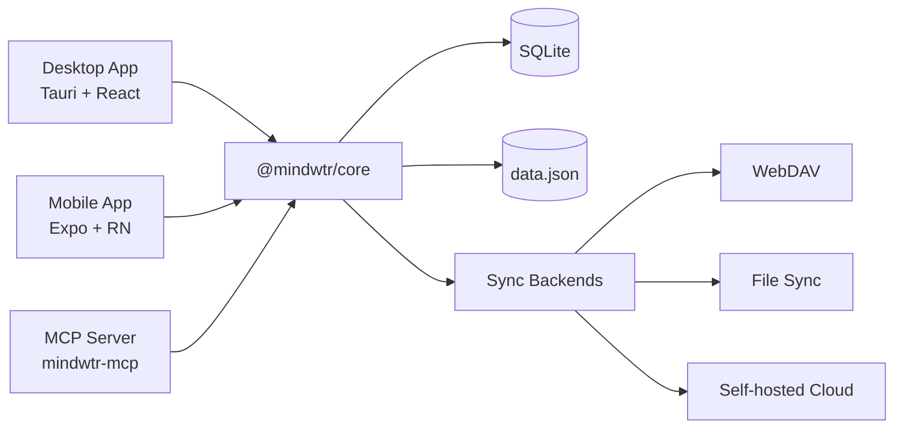

# Architektur

Technische Architektur und Designentscheidungen für Mindwtr.

---

## Überblick

Mindwtr ist eine plattformübergreifende GTD-Anwendung mit:

- **Desktop-App** — Tauri v2 (Rust + React)
- **App für Mobilgeräte** — React Native + Expo
- **MCP-Server** — lokale Model-Context-Protocol-Brücke für KI-Werkzeuge
- **Cloud-Synchronisierung** — Node.js-Synchronisierungsserver (Bun)
- **Gemeinsamer Core** — TypeScript-Paket mit Geschäftslogik

```
┌─────────────────────────────────────────────────────────┐
│                       User Interface                      │
├─────────────────────────────┬───────────────────────────┤
│      Desktop (Tauri)        │      Mobile (Expo)        │
│   React + Vite + Tailwind   │  React Native + NativeWind│
├─────────────────────────────┴───────────────────────────┤
│                     @mindwtr/core                        │
│ Zustand Store · Types · i18n Loader/Locales · Sync Core │
├─────────────────────────────┬───────────────────────────┤
│    Tauri FS (Rust)          │   SQLite + JSON backup    │
│    SQLite + JSON backup     │     App storage           │
└──────────────┬──────────────┴───────────────────────────┘
               │
┌──────────────▼──────────────┐
│        Cloud / Sync         │
│   WebDAV / Local / Server   │
└─────────────────────────────┘
```

## Designabwägungen

- **Die Cloud-Synchronisierung ist dateibasiert** und für selbst gehostete Bereitstellungen auf einem einzelnen Rechner optimiert.
- **SQLite-Fremdschlüssel werden durchgesetzt**, um die Integrität aktiver Datensätze zu gewährleisten; die Reparatur von vorläufigen Löschungen/Tombstones erfolgt weiterhin in der gemeinsamen Anwendungslogik.
- **Endgültige Löschungen sind selten, kommen aber vor**. `sections.projectId` verwendet `ON DELETE CASCADE`, während Aufgaben-/Projekt-/Bereichsreferenzen überwiegend `ON DELETE SET NULL` verwenden.

### Systemdiagramm (Mermaid)



---

## Monorepo-Struktur

Das Projekt verwendet ein Monorepo mit Bun-Workspaces:

```
Mindwtr/
├── apps/
│   ├── cloud/           # Sync server (Bun)
│   ├── desktop/         # Tauri app
│   ├── mcp-server/      # Local MCP server
│   └── mobile/          # Expo app
├── packages/
│   └── core/            # Shared business logic
└── package.json         # Workspace root
```

### Vorteile

- Gemeinsamer Code für mehrere Plattformen
- Einheitliche Version der Abhängigkeiten
- Einheitliche Tests und CI
- Einfacheres Refactoring

---

## Core-Paket (`@mindwtr/core`)

Das Core-Paket enthält die gesamte gemeinsame Geschäftslogik:

### Module

| Modul              | Zweck                                       |
| ------------------- | --------------------------------------------- |
| `store.ts`          | Zustand-State-Store mit allen Aktionen          |
| `types.ts`          | TypeScript-Schnittstellen (Task, Project usw.)   |
| `i18n/i18n-loader.ts` | Verzögertes Laden von Übersetzungen                    |
| `i18n/i18n-translate.ts` | Übersetzungshilfen zur Build-Zeit          |
| `i18n/locales/*.ts` | Englisches Basis-Gebietsschema plus sprachspezifische Überschreibungen |
| `contexts.ts`       | Voreingestellte Kontexte und Tags                      |
| `quick-add.ts`      | Parser für Aufgaben in natürlicher Sprache                  |
| `recurrence.ts`     | Logik für wiederkehrende Aufgaben (RFC 5545 teilweise)       |
| `sync.ts` + `sync-*.ts` | Core für die Synchronisierungszusammenführung plus gemeinsame Synchronisierungshilfen; siehe Modulliste unten |
| `date.ts`           | Hilfsfunktionen zur sicheren Datumsanalyse                   |
| `ai/`               | KI-Integration (Gemini/OpenAI/Anthropic)      |
| `sqlite-adapter.ts` | Schnittstelle des lokalen Speicheradapters               |
| `webdav.ts`         | WebDAV-Synchronisierungsclient                            |

Die aktuellen Synchronisierungsuntermodule teilen das Protokoll nach Verantwortungsbereich auf: `sync-run.ts` ist die gemeinsame Zustandsmaschine für Synchronisierungszyklen (Phasenreihenfolge, Prüfungen zum Überspringen unveränderter Daten, Anhangsphasen, Fehler-/Wiedereinreihungsbehandlung) hinter den Ports in `sync-run-ports.ts` — Desktop und Mobilgeräte stellen Transport-, Speicher- und Benachrichtigungsadapter bereit (ADR 0014); `sync-orchestrator.ts` serialisiert Zyklen und reiht Folgezyklen ein, `sync-normalization.ts` repariert die Form der Nutzdaten, `sync-signatures.ts` berechnet vergleichbare Inhaltssignaturen, `sync-merge-settings.ts` führt Einstellungsgruppen zusammen, `sync-tombstones.ts` übernimmt die Bereinigung nach Aufbewahrungsfristen, `sync-revision.ts` versieht Änderungen mit Revisionen und `sync-client-helpers.ts` / `sync-service-utils.ts` enthalten Hilfsfunktionen für Plattformdienste.

### Designprinzipien

1. **Plattformunabhängig** — Kein plattformspezifischer Code
2. **Speicheradaptermuster** — Speicher zur Laufzeit injizieren
3. **Reine Funktionen** — Hilfsfunktionen sind zustandslos
4. **Typsicherheit** — Vollständige TypeScript-Abdeckung

### Zustandsschichten

- Der **Core-Store** enthält die maßgeblichen Daten (`all tasks/projects`).
- **UI-Stores** enthalten ansichtsspezifische Filter und UI-Zustand.
- **Sichtbare Listen** werden aus Core-Daten + UI-Filtern abgeleitet, damit Persistenzbelange nicht mit der Darstellung vermischt werden.

---

## Desktop-Architektur (Tauri)

### Warum Tauri?

| Merkmal      | Tauri  | Electron         |
| ------------ | ------ | ---------------- |
| Binärgröße  | ~5 MB  | ~150 MB          |
| Speicherbedarf | ~50 MB | ~300 MB          |
| Backend      | Rust   | Node.js          |
| Webview      | System | Gebündeltes Chromium |

### Struktur

```
apps/desktop/
├── src/                         # React frontend
│   ├── App.tsx                  # Root component and app shell wiring
│   ├── main.tsx                 # Vite/Tauri webview entry
│   ├── components/
│   │   ├── Task/                # Task form, field, and editor components
│   │   ├── ui/                  # Shared primitive UI components
│   │   └── views/               # Feature views
│   │       ├── agenda/
│   │       ├── calendar/
│   │       ├── inbox/
│   │       ├── list/
│   │       ├── projects/
│   │       ├── review/
│   │       └── settings/
│   ├── config/                  # Desktop app constants/config
│   ├── contexts/                # React contexts
│   ├── hooks/                   # Shared React hooks
│   ├── lib/                     # Desktop services and Tauri bridges
│   ├── store/                   # UI-specific state
│   ├── test/                    # Desktop test utilities
│   └── utils/                   # Small shared utilities
│
├── src-tauri/                  # Rust backend
│   ├── src/main.rs             # Entry point
│   ├── src/platform.rs         # Native commands and path validation
│   ├── capabilities/           # Tauri command/plugin permissions
│   ├── Cargo.toml              # Rust dependencies
│   └── tauri.conf.json         # Tauri config
│
└── package.json
```

### Datenfluss

```
User Action → React Component → Zustand Store (@mindwtr/core) → Storage Adapter → SQLite + data.json
```

### Tauri-Befehle

Das Rust-Backend stellt Befehle bereit für:

- Das Öffnen von Dateien aus einer Positivliste sowie Anhangs-/Speichervorgänge
- Native Dialoge
- Systembenachrichtigungen

---

## Architektur für Mobilgeräte (Expo)

### Warum Expo?

- Der verwaltete Arbeitsablauf vereinfacht die Entwicklung
- Möglichkeit für OTA-Aktualisierungen
- Expo Router für dateibasierte Navigation
- Einfacher Build-Prozess (EAS)

### Struktur

```
apps/mobile/
├── app/                   # Expo Router pages
│   ├── (drawer)/         # Drawer navigation
│   │   ├── (tabs)/       # Tab navigation
│   │   │   ├── calendar-tab.tsx
│   │   │   ├── capture-quick.tsx
│   │   │   ├── inbox.tsx
│   │   │   ├── focus.tsx
│   │   │   ├── capture.tsx
│   │   │   ├── contexts-tab.tsx
│   │   │   ├── projects.tsx
│   │   │   ├── review-tab.tsx
│   │   │   └── menu.tsx
│   │   ├── calendar.tsx
│   │   ├── contexts.tsx
│   │   ├── saved-search/[id].tsx
│   │   ├── board.tsx
│   │   ├── waiting.tsx
│   │   ├── someday.tsx
│   │   ├── done.tsx
│   │   ├── trash.tsx
│   │   ├── archived.tsx
│   │   ├── reference.tsx
│   │   ├── projects-screen.tsx
│   │   └── settings.tsx
│   └── _layout.tsx       # Root layout
│
├── components/           # Shared components
├── contexts/             # Theme, Language
├── lib/                  # Storage, sync utilities
└── package.json
```

### Navigation

```
Drawer/Stack Layout
├── Tab Navigator
│   ├── Inbox
│   ├── Agenda
│   ├── Next Actions
│   ├── Projects
│   └── Menu (links to other views)
├── Other Screens (Stack)
│   ├── Board
│   ├── Calendar
│   ├── Review
│   ├── Contexts
│   ├── Waiting For
│   ├── Someday/Maybe
│   ├── Archived
│   └── Settings
```

---

## Zustandsverwaltung

### Zustand-Store

Der zentrale Store (`@mindwtr/core/src/store.ts`) verwaltet den gesamten Anwendungszustand:

```typescript
interface TaskStore {
    tasks: Task[];
    projects: Project[];
    areas: Area[];
    settings: AppData['settings'];

    // Actions
    fetchData: () => Promise<void>;
    addTask: (title: string, props?: Partial<Task>) => Promise<void>;
    updateTask: (id: string, updates: Partial<Task>) => Promise<void>;
    deleteTask: (id: string) => Promise<void>;
    // ... projects, areas, and settings actions
}
```

### Speicheradaptermuster

Der Store verwendet injizierte Speicheradapter:

```typescript
// Desktop: Tauri file system
setStorageAdapter(tauriStorage);

// Mobile: SQLite (with JSON backup fallback)
setStorageAdapter(mobileStorage);
```

### Persistenz

- **Zusammenfassen von Schreibvorgängen** — Änderungen werden sofort eingereiht, überlappende Schreibvorgänge werden beim nächsten Leeren der Warteschlange zusammengefasst
- **Leeren beim Beenden** — Ausstehende Speichervorgänge werden ausgeführt, wenn die App in den Hintergrund wechselt
- **Vorläufiges Löschen** — Elemente werden für die Synchronisierung mit `deletedAt` markiert

---

## Datenmodell

Die maßgebliche Typoberfläche befindet sich in der [Core-API](/de/developers/core-api) und in `packages/core/src/types.ts`.

- Verwenden Sie die [Core-API](/de/developers/core-api) für die aktuelle Dokumentation der einzelnen Felder von `Task`, `Project`, `Section`, `Area`, `Person`, `Attachment` und `AppData`.
- Synchronisierungsempfindliche Felder wie `rev`, `revBy`, `purgedAt`, `orderNum`, `mimeType`, `size`, `cloudKey` und `localStatus` ändern sich häufiger als dieser Architekturüberblick.
- Wenn die ausführliche Typauflistung auf einer einzigen Seite bleibt, kann die Architekturdokumentation nicht so leicht vom Code abweichen.

---

## Synchronisierungsstrategie

### Revisionsbewusstes LWW mit Tombstones

Die Datensynchronisierung beruht auf revisionsbewusstem Last-Write-Wins mit deterministischen Gleichstandsregeln.

### Zusammenführungslogik

1. **Auflösung**:
    - Wenn beide Seiten Revisionen haben, gewinnt vor dem Zeitstempelvergleich die höhere `rev`.
    - `rev` ist ein Bearbeitungszähler pro Entität und keine Vektoruhr. Daher kann eine Seite mit mehr Offlinebearbeitungen eine einzelne neuere Bearbeitung von einem anderen Gerät übertreffen.
    - Stimmen die Revisionen überein, wird `updatedAt` verglichen.
    - Stimmen auch die Zeitstempel überein, werden deterministische normalisierte Inhaltssignaturen verglichen, damit jedes Gerät denselben Gewinner auswählt.
    - Legacy-Entitäten ohne Revisionsmetadaten behandeln `updatedAt`-Werte innerhalb des Schwellenwerts von 5 Minuten für Uhrabweichungen als deterministischen Gleichstand; außerhalb dieses Fensters gewinnt der neuere `updatedAt`-Wert.
2. **Tombstones**:
    - Gelöschte Elemente behalten ihren Datensatz mit gesetztem `deletedAt`.
    - Verhindert die Wiederherstellung bei der Synchronisierung.
    - Ermöglicht eine ordnungsgemäße Zusammenführung zwischen Geräten.
    - Konflikte zwischen Löschen und aktivem Datensatz verwenden die Operationszeit (`max(updatedAt, deletedAt)` für Tombstones).
    - Wenn Lösch- und Aktivoperationen in das 30-sekündige Mehrdeutigkeitsfenster fallen, behält Mindwtr das aktive Element, statt es vorschnell zu löschen.
3. **Konflikte**:
    - Konflikte auf Metadatenebene werden automatisch gelöst.
    - Einstellungen werden nach Synchronisierungsgruppen (`appearance`, `language`, `gtd`, `externalCalendars`, `ai`, `savedFilters`) zusammengeführt, nicht anhand eines einzigen Zeitstempels für ein großes Objekt.
    - Konflikte zwischen zwei aktiven gespeicherten Filtern verwenden strikt den jeweiligen `updatedAt`-Wert des Filters; nur bei gleichen oder unbrauchbaren Zeitstempeln greift eine deterministische Ausweichregel.
    - Warnungen vor großer Uhrabweichung werden ausgelöst, wenn die Abweichung bei der Zusammenführung den aktuellen Schwellenwert von 5 Minuten überschreitet.

### Synchronisierungszyklus

```
1. Read Local Data
2. Read Remote Data (Cloud/WebDAV/File)
3. Merge (Memory) -> Generate Stats (conflicts, updates)
4. Write Local with pending-remote-write marker
5. Write Remote
6. Clear pending-remote-write marker locally
```

Wenn das entfernte Schreiben nach der lokalen Persistenz fehlschlägt, speichert Mindwtr Metadaten für den Wiederholungsversuch und verwendet vor der Wiederholung einen Backoff von 5 Sekunden bis zu 5 Minuten.

### Snapshot-Transport

Die Mindwtr-Synchronisierung überträgt derzeit bewusst vollständige Snapshots. Dies ist kein Platzhalter für ein fehlendes Delta-System.

- ADR 0003 und ADR 0007 definieren die revisionsbewussten Zusammenführungsregeln, die auf diesen Snapshots arbeiten.
- ADR 0008 hält die aktuelle Transportentscheidung fest: Snapshot-Zusammenführung beibehalten und vorerst kein Delta-Protokoll hinzufügen.
- Für aktuelle persönliche GTD-Arbeitslasten hält die Snapshot-Synchronisierung die Implementierung einfacher, bewahrt die Atomarität vollständiger Dateien und vermeidet zusätzlichen Zustand für Wiedergabe und Komprimierung.
- Sollte sich dies später ändern, sollte das Delta-Design das vorhandene Modell aus `rev` und `revBy` erweitern, statt es durch ein neues Sequenzsystem zu ersetzen.

Die Entscheidung über ein Delta-Protokoll sollte nur neu bewertet werden, wenn Snapshot-Dateien regelmäßig 5 MB überschreiten, Synchronisierungs-Roundtrips in typischen Netzwerken länger als 5 Sekunden dauern oder das Produkt Echtzeit-Streaming zwischen mehreren Geräten benötigt.

Testabdeckung und Release-Gates werden separat in der [Teststrategie](/de/developers/testing-strategy) erfasst, damit diese Seite auf die Laufzeitarchitektur ausgerichtet bleiben kann.

---

## Internationalisierung

### Struktur

Übersetzungen sind über den Ordner `packages/core/src/i18n/` verteilt:

```typescript
// packages/core/src/i18n/i18n-loader.ts
// packages/core/src/i18n/i18n-translations.ts
// packages/core/src/i18n/locales/*.ts
```

### Verwendung

Jede App hat einen Sprachkontext, der eine `t()`-Funktion bereitstellt.
