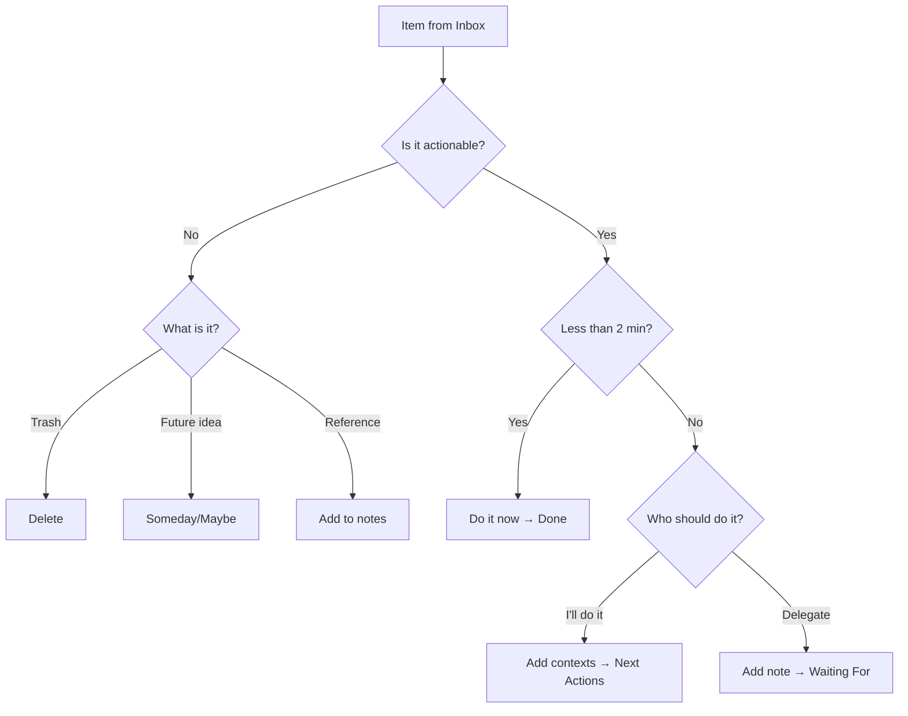

# GTD-Arbeitsablauf in Mindwtr

Diese Anleitung zeigt, wie Sie die GTD-Methode mit den Funktionen von Mindwtr umsetzen.

---

## Überblick

Mindwtr bildet GTD-Konzepte direkt ab:

| GTD-Konzept | Mindwtr-Funktion |
| ------------- | -------------------------------------- |
| Posteingang | Ansicht „Posteingang“ |
| Klären | Verarbeitungsassistent |
| Nächste Aktionen | Fokusansicht für verfügbare Aktionen; Kontexte/Projekte/Suche für den vollständigen Bestand |
| Projekte | Ansicht „Projekte“ |
| Warten | Ansicht „Warten“ (Status: `waiting`) |
| Irgendwann/Vielleicht | Ansicht „Irgendwann/Vielleicht“ (Status: `someday`) |
| Kalender | Kalenderansicht (Aufgaben mit Fälligkeitsdaten) |
| Wochenrückblick | Durchsichtsassistent |

---

## Muster

Mit diesen Mustern bleibt das System leicht:

- Formulieren Sie nächste Aktionen als sichtbare körperliche Schritte: „Versicherung anrufen“ ist besser als „Versicherung regeln“.
- Bewahren Sie Projektunterlagen in den Projektnotizen auf. Überladen Sie „Fokus“ nicht mit zukünftigen Aktionen, die noch nicht ausführbar sind.
- Teilen Sie große Aufgaben in Abschnitte oder Zeitfenster, etwa „30 Minuten Fotos sortieren“.
- Verwenden Sie Kontexte für Werkzeuge, Orte, Energie und Personen: `@phone`, `@errands`, `#focused`, `@Alex`.
- Legen Sie delegierte Arbeit mit einem Nachfassdatum oder Personenkontext unter „Warten“ ab.
- Reservieren Sie den Kalender für die harte Landschaft: Termine, Fristen und zeitgebundene Verpflichtungen.
- Wandeln Sie beim Wochenrückblick zukünftige Projektnotizen in echte nächste Aktionen um, sobald sie verfügbar werden.
- Wählen Sie für ein schlankes System eine nächste Aktion pro Projekt – oder mehrere nur dann, wenn sie wirklich parallel ausführbar sind.

---

## 1. Erfassen (Posteingang)

### Schnellerfassung

- **Desktop:** Geben Sie die Aufgabe im unteren Eingabefeld ein oder verwenden Sie das app-interne Kürzel `a`. Auch `o` öffnet „Aufgabe hinzufügen“.
- **Mobilgeräte:** Tippen Sie auf das Eingabefeld im Tab „Posteingang“.
- **Gedankensammlung:** Verwenden Sie geführte Fragen, wenn Sie offene Vorgänge aus Beruf, Zuhause, Personen, Besorgungen und Irgendwann-Ideen sammeln möchten.

### Syntax für „Schnell hinzufügen“

Erfassen Sie den Kontext sofort:
```
Call plumber @phone @home
Buy groceries @errands /due:saturday
Research topic #focused +WorkProject
Sort receipts /energy:low
```

### Die Regel

Erfassen Sie alles. Filtern, bewerten und organisieren Sie noch nicht. Holen Sie es aus Ihrem Kopf.

---

## 2. Klären (Verarbeitungsassistent)

### Verarbeitung beginnen

- **Desktop:** Klicken Sie auf „Posteingang verarbeiten“.
- **Mobilgeräte:** Tippen Sie auf „Posteingang verarbeiten“.

### Der Arbeitsablauf



### Entscheidungspunkte

**Ist eine Handlung erforderlich?**
- Nein → Löschen, nach „Irgendwann/Vielleicht“ verschieben oder als Referenz hinzufügen
- Ja → Fortfahren

**Mehr als ein Schritt?**
- Ja → Wandeln Sie die Erfassung in ein Projekt um: Benennen Sie es und legen Sie die nächste Aktion fest. Fügen Sie beliebig viele weitere Aktionen hinzu. Sie landen mit bereits zugewiesenem Projekt wieder im Posteingang, sodass jede ihren eigenen Klärungsdurchlauf erhält.
- Nein → Als einzelne Aktion fortfahren

**Dauert es weniger als 2 Minuten?**
- Ja → Sofort erledigen und als erledigt markieren
- Nein → Fortfahren

**Wer sollte es erledigen?**
- Ich → Kontexte auswählen und nach „Nächste Aktionen“ verschieben
- Delegieren → Wartenotiz hinzufügen und nach „Warten“ verschieben

**Einem Projekt zuweisen?** (Optional)
- Verknüpfen Sie zusammengehörige Aufgaben mit einem Projekt.

---

## 3. Organisieren

### Aufgabenstatus

| Status | Bedeutung | Ansicht |
| ---------- | ------------------ | ------------- |
| `inbox` | Noch nicht verarbeitet | Posteingang |
| `next` | Als Nächstes ausführbar | Fokus |
| `waiting` | Delegiert/blockiert | Warten |
| `someday` | Zukunft/vielleicht | Irgendwann/Vielleicht |
| `done` | Kürzlich abgeschlossen | Erledigt |
| `archived` | Abgeschlossen und abgelegt | Archiviert |

„Erledigt“ und „Archiviert“ sind beide abgeschlossene Zustände, dienen aber unterschiedlichen Zwecken:

- **Erledigt** ist das Protokoll der letzten Abschlüsse. Verwenden Sie es für Aufgaben, die Sie beim täglichen oder wöchentlichen Rückblick sehen möchten.
- **Archiviert** ist abgelegte Historie. Archivierte Aufgaben sind in normalen Aufgabenlisten ausgeblendet, bleiben aber in der Ansicht „Archiviert“ zum Suchen, Wiederherstellen oder endgültigen Löschen verfügbar. Die Ansicht „Archiviert“ zeigt hinter einem Umschalter „Aufgaben | Projekte“ auch archivierte Projekte, die sich dort wiederherstellen oder löschen lassen.
- **Automatisch archivieren** kann erledigte Aufgaben nach einer festgelegten Anzahl von Tagen nach „Archiviert“ verschieben. Wählen Sie **Nie**, wenn „Erledigt“ alle abgeschlossenen Aufgaben unbegrenzt behalten soll.

### Kontexte und Tags

Fügen Sie Kontexte hinzu, um danach zu filtern, wo Sie Aufgaben erledigen können:

**Ortskontexte (@):**
- `@home`, `@work`, `@errands`, `@anywhere`
- `@computer`, `@phone`, `@agendas`

**Tags (#):**
- `#focused`: Konzentrierte Arbeit
- `#lowenergy`: Einfache Aufgaben
- `#creative`: Brainstorming
- `#routine`: Wiederholte Aufgaben

### Personen

Verwenden Sie Personen für delegierte oder personenbezogene Arbeit. Die verantwortliche Person einer Aufgabe speist Listen unter „Warten“, Vorschläge und die Suche `assigned:`. In der Personenverwaltung können Sie wiederverwendbare Namen, Notizen und Referenzlinks pflegen, ohne jede Person in einen Kontext-Tag umzuwandeln. Beim Löschen einer Person bleiben ihre Aufgaben erhalten und die Zuweisung wird entfernt, statt die Arbeit zu löschen.

Erstellen Sie Personen im Feld **Zugewiesen an** oder unter **Einstellungen → Verwalten → Personen**. Erstellen Sie Bereiche in der Auswahl **Bereich** oder unter **Einstellungen → Verwalten → Bereiche**. Die genauen Pfade finden Sie unter [Bereiche und Personen](/de/use/areas-people).

### Projekte

Erstellen Sie Projekte für mehrstufige Ergebnisse:

1. Öffnen Sie die Ansicht „Projekte“.
2. Fügen Sie ein neues Projekt mit einem Namen hinzu und wählen Sie optional direkt im Formular seinen Bereich (standardmäßig den aktuell gefilterten Bereich).
3. Fügen Sie dem Projekt Aufgaben hinzu.
4. Erstellen Sie optional **Abschnitte**, um Aufgaben nach Phase oder Teilergebnis zu gruppieren.
5. Schalten Sie zwischen sequenziellem und parallelem Modus um:
   - **Sequenziell:** Nur die erste Aufgabe erscheint in „Fokus“.
   - **Parallel:** Alle Aufgaben erscheinen in „Fokus“.

Beim Löschen eines Projekts oder Bereichs bleiben dessen Aufgaben erhalten. Mindwtr hebt die Zuweisung der Arbeit auf, statt sie ebenfalls zu löschen.

#### Projektabschnitte

Projektabschnitte sind Unterteilungen innerhalb eines einzelnen Projekts. Verwenden Sie sie, wenn ein Projekt natürliche Phasen, Meilensteine oder Arbeitsstränge besitzt und eine flache Aufgabenliste schwer zu überblicken wäre.

Beispiel: **Website veröffentlichen** kann Abschnitte wie **Design**, **Entwicklung** und **Inhalt** enthalten. Das sind weder separate Projekte noch Unteraufgaben, sondern organisatorische Überschriften innerhalb eines Projektergebnisses.

Das Feld **Projektabschnitt** einer Aufgabe weist sie einem Abschnitt ihres Projekts zu. Es ist erst sinnvoll, nachdem die Aufgabe zu einem Projekt mit Abschnitten gehört. Lassen Sie es bei nicht zugewiesenen Aufgaben oder Projekten ohne Abschnitte leer.

Sequenzielle Projekte können projektweit oder abschnittsweise gelten. Verwenden Sie den Abschnittsumfang, wenn ein Projekt unabhängige Phasen oder Arbeitsstränge besitzt: Mindwtr zeigt dann die erste verfügbare Aufgabe jedes Abschnitts, statt das gesamte Projekt hinter einer Aufgabe zu blockieren.

### Fälligkeitsdaten und Erinnerungen

- Legen Sie das **Fälligkeitsdatum** für Fristen fest.
- Legen Sie das **Startdatum** für den Beginn fest.
- Legen Sie ein **Wiedervorlagedatum** (Tickler) für regelmäßige Prüfungen fest.

<a id="dates-vs-status"></a>

### Daten und Status

Mindwtr behandelt Aufgabenstatus und Aufgabendaten getrennt. Der Status ist der von Ihnen gewählte GTD-Zustand, etwa `inbox`, `next`, `waiting` oder `someday`. Daten steuern, wann und warum eine Aufgabe erscheint; das Erreichen eines Datums ändert den Aufgabenstatus nie von selbst.

Beim Bearbeiten gibt es eine bewusste Abkürzung: Wenn Sie einem **Posteingangs**eintrag ein Startdatum geben, gilt er als geklärt – Sie haben entschieden, wann Sie ihn bearbeiten können. Mindwtr verschiebt ihn daher beim Festlegen des Datums nach `next`, genau wie beim Markieren eines Posteingangseintrags mit einem Stern. Wählen Sie bei derselben Bearbeitung einen Status, hat Ihre Auswahl Vorrang. Aufgaben unter `someday` oder `waiting` behalten bei einer Datumszuweisung immer ihren Status: Ein datiertes Irgendwann ist eine Wiedervorlage, ein datiertes Warten eine Nachfass-Erinnerung.

- Das **Startdatum** ist eine Zurückstellungs-/Verfügbarkeitsschranke. Ein zukünftiger Start blendet die Aufgabe standardmäßig aus „Fokus“ aus. Wenn das Datum eintritt, erscheint die Aufgabe mit ihrem bisherigen Status wieder.
- Das **Wiedervorlagedatum** ist ein Tickler. Wenn das Datum eintritt, zeigt Mindwtr die Aufgabe in Ansichten mit fälligen Durchsichtspunkten an, damit Sie sie neu beurteilen können. Bis zu Ihrer Entscheidung ändert sich nichts.
- Das **Fälligkeitsdatum** ist eine Frist. Wenn sie näher rückt oder verstreicht, hebt Mindwtr die Aufgabe durch Darstellung, Erinnerungen und Sortierungsdruck hervor; der Status bleibt unverändert.

Einige Verarbeitungsaktionen setzen Status und Daten gemeinsam: Wenn Sie bei der Posteingangsverarbeitung **Später** wählen, wird der Eintrag nach `next` verschoben und erhält ein Startdatum. Das direkte Festlegen eines Startdatums für einen Posteingangseintrag bewirkt dasselbe. Danach steuern Daten nur noch die Sichtbarkeit und ändern nie wieder den Status.

### Relative Vorlaufzeit

Verwenden Sie **Startvorlaufzeit**, wenn das Startdatum an das Fälligkeitsdatum gekoppelt bleiben soll. Eine am Freitag fällige Aufgabe kann beispielsweise zwei Tage vorher beginnen, oder eine um 17:00 Uhr fällige Aufgabe drei Stunden vorher. Eine Vorlaufzeit von **0** bedeutet, dass die Aufgabe am Fälligkeitstag selbst beginnt. Das eignet sich für wiederkehrende Arbeiten, die erst am Fälligkeitstag erscheinen sollen.

Wenn eine Aufgabe ein Fälligkeitsdatum und eine Startvorlaufzeit besitzt, behandelt Mindwtr den Abstand als maßgeblich. Wird das Fälligkeitsdatum verschoben, berechnet Mindwtr das Startdatum mit demselben Abstand neu. Wiederkehrende Aufgaben behalten beim Erzeugen der nächsten Instanz dieselbe Vorlaufzeit.

Verwenden Sie stattdessen ein festes Startdatum, wenn die Arbeit unabhängig von einer Verschiebung der Frist an einem bestimmten Kalendertag beginnen soll.

---

## 4. Reflektieren (Wochenrückblick)

### Rückblick beginnen

- **Desktop:** Öffnen Sie „Wochenrückblick“ in der Seitenleiste.
- **Mobilgeräte:** Tippen Sie in der unteren Leiste auf den Tab „Durchsicht“.

### Die Schritte

1. **Posteingang verarbeiten**
   - Alle Posteingangseinträge klären
   - Ziel: Posteingang null
   - Mit der Aktion „Posteingang verarbeiten“ des Rückblicks den normalen Klärungsablauf innerhalb des Wochenrückblicks starten

2. **Kalender prüfen**
   - Zwei Wochen zurückblicken und verpasste Nachfassaktionen suchen
   - Zwei Wochen vorausschauen und Vorbereitungsbedarf erkennen

3. **Warten**
   - Delegierte Einträge prüfen
   - Bei Bedarf erinnern

4. **Projekte prüfen**
   - Sicherstellen, dass jedes Projekt eine nächste Aktion besitzt
   - Abgeschlossene Projekte als erledigt markieren

5. **Irgendwann/Vielleicht**
   - Geparkte Ideen prüfen
   - Einträge aktivieren oder löschen

### Bewährtes Verfahren

Planen Sie wöchentlich 30–90 Minuten zur selben Zeit am selben Ort ein.

---

### Erledigen

### Arbeit auswählen

In der Ansicht **Fokus** sehen Sie:
- heute fokussierte Aufgaben (mit Stern markierte Einträge)
- Nächste Aktionen (nach Kontext gefiltert oder allgemein)
- überfällige Einträge
- heute fällige Einträge

„Fokus“ ist keine vollständige Bestandsansicht. Zukünftig beginnende Aufgaben und spätere Aufgaben sequenzieller Projekte werden ausgeblendet, damit die Liste jetzt verfügbare Aktionen zeigt. Verwenden Sie **Kontexte**, **Projekte** oder die **Suche**, um alle nächsten Aktionen einschließlich zurückgestellter oder blockierter Einträge zu prüfen.

<a id="how-focus-sorts-available-actions"></a>

### So sortiert „Fokus“ verfügbare Aktionen

„Fokus“ bestimmt zuerst, ob eine Aufgabe verfügbar ist, und sortiert danach die sichtbaren Aktionen:

1. **Heutiger Fokus** zeigt Aufgaben, die Sie ausdrücklich für heute fokussiert haben. Sie können sie manuell in die geplante Reihenfolge bringen – auf dem Desktop am Griff ziehen oder auf Mobilgeräten den Umschalter zum Sortieren in der Abschnittsüberschrift verwenden. Die manuelle Reihenfolge gilt bei der Standardsortierung von „Fokus“, wird geräteübergreifend synchronisiert und bleibt erhalten, bis eine Aufgabe „Fokus“ verlässt.
2. **Heute / Terminplan** zeigt verfügbare `next`-Aufgaben, die überfällig oder heute fällig sind oder heute beginnen. Sortiert wird nach dem frühesten Fälligkeits-/Startzeitpunkt, dann – bei aktivierten Prioritäten – nach Priorität und schließlich nach dem ältesten Erstellungsdatum.
3. **Nächste Aktionen** zeigt die übrigen verfügbaren `next`-Aufgaben. Die Standardsortierung lautet:
   - bald fällige Aufgaben zuerst, mit dem frühesten Fälligkeitsdatum zuerst (derzeit innerhalb der nächsten 30 Tage fällig)
   - undatierte Aktionen danach
   - weit in der Zukunft fällige Aktionen zuletzt, mit dem frühesten Fälligkeitsdatum zuerst
   - innerhalb derselben Gruppe: Priorität (wenn aktiviert), dann Startzeit, ältestes Erstellungsdatum, Titel und ID
4. **Durchsicht fällig** zeigt Aufgaben mit fälligem Wiedervorlagedatum. Nach der Prüfung können Sie das Wiedervorlagedatum entfernen (**Als geprüft markieren**) oder mit **In 1 Woche prüfen** verschieben – auf dem Desktop im Schnellaktionsmenü der Aufgabe, auf Mobilgeräten durch langes Drücken der Zeile.

Das Startdatum ist das Zurückstellungs-/Planungsdatum von Mindwtr. „Fokus“ und die Liste „Nächste Aktionen“ blenden Aufgaben mit zukünftigem Start immer bis zu ihrem Starttag aus. Verwenden Sie **Projekte** oder die **Suche**, um vorauszublicken. Sequenzielle Projekte beschränken „Fokus“ außerdem auf die erste verfügbare Aktion des Projekts oder Abschnitts. Spätere Aktionen bleiben ausgeblendet, bis der vorherige Schritt sie nicht mehr blockiert.

Zeitschätzung und Energie sind Fokusfilter und Gruppierungsoptionen, keine Standardsortierschlüssel. Eine Gruppierung nach Kontext, Projekt, Bereich, Energie oder Priorität verändert die sichtbaren Gruppen; innerhalb dieser Gruppen behalten Aufgaben dieselbe Verfügbarkeits- und Nächste-Aktion-Sortierung.

### Kontextfilter

1. Öffnen Sie **Fokus** oder die Ansicht **Kontexte**.
2. Wählen Sie einen Kontext-Chip (z. B. @home).
3. Sehen Sie nur Aufgaben für diesen Kontext.

### Heutiger Fokus

Markieren Sie bis zu Ihrem festgelegten Fokuslimit Aufgaben mit einem Stern als heutige Prioritäten:
- **Desktop:** Klicken Sie auf das Sternsymbol.
- **Mobilgeräte:** Tippen Sie auf die Sternplakette.

---

## Täglicher Arbeitsablauf

### Morgens

1. Öffnen Sie „Fokus“, um die heutigen Prioritäten zu sehen.
2. Legen Sie bis zum festgelegten Fokuslimit Fokusaufgaben für den Tag fest.
3. Beginnen Sie mit der ersten (als Fokus markieren).

### Im Tagesverlauf

1. Erfassen Sie neue Einträge im Posteingang.
2. Prüfen Sie beim Ortswechsel kontextgefilterte Listen.
3. Markieren Sie abgeschlossene Aufgaben als erledigt.

### Tagesende

1. Überfliegen Sie den Posteingang (bei Zeit verarbeiten).
2. Prüfen Sie den morgigen Kalender.
3. Aktualisieren Sie laufende Aufgaben.

---

## Wiederkehrende Aufgaben

Richten Sie wiederkehrende Aufgaben im Feld **Wiederholung** des Aufgabeneditors ein. Wählen Sie tägliche, wöchentliche, monatliche oder jährliche Wiederholung und anschließend, ob die Aufgabe einem festen Zeitplan folgt oder nach dem Abschluss wiederholt wird.

Mindwtr hält eine aktive Instanz einer wiederkehrenden Aufgabe vor. Zukünftige Vorkommen werden nicht als echte Aufgaben vorab angelegt; die nächste Aufgabe erscheint beim Abschluss der aktuellen. Aktivieren Sie **Nächstes Vorkommen im Kalender anzeigen**, wenn Sie eine Planungsvorschau wünschen.

**Beispiele für wiederkehrende Aufgaben:**
- Wöchentlich: „Projektstatus prüfen“
- Täglich: „E-Mail prüfen @computer“
- Monatlich: „Abonnements prüfen“

Einrichtungsschritte und Einzelheiten zu den Optionen finden Sie unter [Wiederkehrende Aufgaben](/de/use/recurring-tasks).

---

## Tipps für den Erfolg

### Vertrauen Sie Ihrem System

- Erfassen Sie alles sofort.
- Verarbeiten Sie regelmäßig.
- Überspringen Sie Wochenrückblicke nicht.

### Halten Sie es einfach

- Organisieren Sie nicht übermäßig.
- Verwenden Sie Kontexte anfangs sparsam.
- Fügen Sie Komplexität nur bei Bedarf hinzu.

### Bauen Sie Gewohnheiten auf

- Wochenrückblick immer zur selben Zeit
- Regelmäßige Posteingangsverarbeitung
- Einheitliche Erfassungsmethode

---

## Siehe auch

- [GTD-Überblick](/de/use/gtd-overview)
- [Kontexte und Tags](/de/use/contexts-tags)
- [Wochenrückblick](/de/use/weekly-review)
