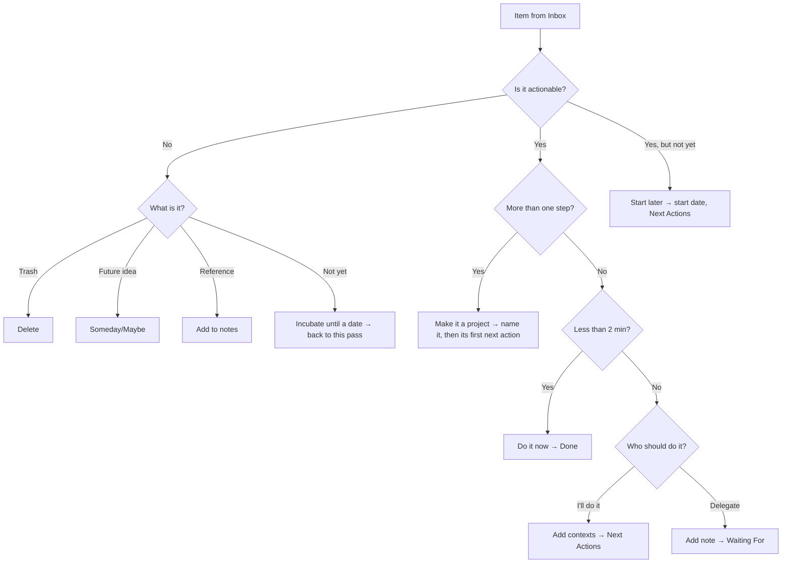

# GTD-Arbeitsablauf in Mindwtr

Diese Anleitung zeigt, wie Sie die GTD-Methode mit den Funktionen von Mindwtr umsetzen.

---

## Überblick

Mindwtr bildet GTD-Konzepte direkt ab:

| GTD-Konzept | Mindwtr-Funktion |
| ------------- | -------------------------------------- |
| Posteingang | Ansicht „Posteingang“ |
| Klären | Verarbeitungsassistent |
| Nächste Aktionen | Fokusansicht für verfügbare Aktionen; Kontexte/Projekte/Suche für den vollständigen Bestand |
| Projekte | Ansicht „Projekte“ |
| Warten | Ansicht „Warten“ (Status: `waiting`) |
| Irgendwann/Vielleicht | Ansicht „Irgendwann/Vielleicht“ (Status: `someday`) |
| Kalender | Kalenderansicht (Aufgaben mit Fälligkeitsdaten) |
| Wochenrückblick | Durchsichtsassistent |


[Interaktives Diagramm öffnen](/assets/diagrams/gtd-workflow.html)

---

## Muster

Mit diesen Mustern bleibt das System leicht:

- Formulieren Sie nächste Aktionen als sichtbare körperliche Schritte: „Versicherung anrufen“ ist besser als „Versicherung regeln“.
- Bewahren Sie Projektunterlagen in den Projektnotizen auf. Überladen Sie „Fokus“ nicht mit zukünftigen Aktionen, die noch nicht ausführbar sind.
- Teilen Sie große Aufgaben in Abschnitte oder Zeitfenster, etwa „30 Minuten Fotos sortieren“.
- Verwenden Sie Kontexte für Werkzeuge, Orte, Energie und Personen: `@phone`, `@errands`, `#focused`, `@Alex`.
- Legen Sie delegierte Arbeit mit einem Nachfassdatum oder Personenkontext unter „Warten“ ab.
- Reservieren Sie den Kalender für die harte Landschaft: Termine, Fristen und zeitgebundene Verpflichtungen.
- Wandeln Sie beim Wochenrückblick zukünftige Projektnotizen in echte nächste Aktionen um, sobald sie verfügbar werden.
- Wählen Sie für ein schlankes System eine nächste Aktion pro Projekt – oder mehrere nur dann, wenn sie wirklich parallel ausführbar sind.

---

## 1. Erfassen (Posteingang)

### Schnellerfassung

- **Desktop:** Geben Sie die Aufgabe im unteren Eingabefeld ein oder verwenden Sie das app-interne Kürzel `a`. Auch `o` öffnet „Aufgabe hinzufügen“.
- **Mobilgeräte:** Tippen Sie auf das Eingabefeld im Tab „Posteingang“.
- **Gedankensammlung:** Verwenden Sie geführte Fragen, wenn Sie offene Vorgänge aus Beruf, Zuhause, Personen, Besorgungen und Irgendwann-Ideen sammeln möchten.

### Syntax für „Schnell hinzufügen“

Erfassen Sie den Kontext sofort:
```
Call plumber @phone @home
Buy groceries @errands /due:saturday
Research topic #focused +WorkProject
Sort receipts /energy:low
```

### Die Regel

Erfassen Sie alles. Filtern, bewerten und organisieren Sie noch nicht. Holen Sie es aus Ihrem Kopf.

---

## 2. Klären (Verarbeitungsassistent)

### Verarbeitung beginnen

- **Desktop:** Klicken Sie auf „Posteingang verarbeiten“.
- **Mobilgeräte:** Tippen Sie auf „Posteingang verarbeiten“.

### Den Titel verfeinern

Der Titel bleibt in jedem Schritt des Assistenten bearbeitbar und versteht dieselbe Schnell-hinzufügen-Syntax wie die Erfassung:

- `@context`, `#tag`, `!Area`, `+Existing Project`, `%Person`
- `/energy:`, `/priority:`, `/start:`, `/due:`, `/review:`, `/note:`, `/link:`

Eingetippte Kontexte und Schlagwörter kommen zu den bereits ausgewählten hinzu, sie ersetzen sie nie. Ein Statusbefehl wie `/waiting` wird beim Klären ignoriert — über den Status entscheidet das Ziel, das Sie im Arbeitsablauf wählen. Ein `+Name`, zu dem es kein Projekt gibt, bleibt im Titel stehen; beim Klären entsteht aus einem Befehl nie ein Projekt.

Auf dem Desktop steht der Cursor beim Öffnen jedes Eintrags im Titel, am Ende des Textes, damit Ihr erster Tastendruck die Erfassung verfeinert statt sie zu ersetzen.

### Der Arbeitsablauf


```mermaid
flowchart TD
    A[Item from Inbox] --> B{Is it actionable?}
    B -->|No| C{What is it?}
    C -->|Trash| D[Delete]
    C -->|Future idea| E[Someday/Maybe]
    C -->|Reference| F[Add to notes]
    C -->|Not yet| N[Incubate until a date → back to this pass]
    B -->|Yes| P{More than one step?}
    B -->|Yes, but not yet| S[Start later → start date, Next Actions]
    P -->|Yes| Q[Make it a project → name it, then its first next action]
    P -->|No| G{Less than 2 min?}
    G -->|Yes| H[Do it now → Done]
    G -->|No| I{Who should do it?}
    I -->|I'll do it| J[Add contexts → Next Actions]
    I -->|Delegate| K[Add note → Waiting For]
```

### Entscheidungspunkte

**Ist eine Handlung erforderlich?**
- Nein → Löschen, als Referenz hinzufügen, nach „Irgendwann/Vielleicht“ verschieben oder **Inkubieren**: Wählen Sie ein Datum, an dem der Eintrag zu diesem Durchlauf zurückkehrt, damit Sie erneut entscheiden können
- Ja → Fortfahren oder **Später beginnen**, um einer bereits entschiedenen Aktion ein Startdatum zu geben und sie nach „Nächste Aktionen“ zu legen

**Mehr als ein Schritt?**
- Ja → Wandeln Sie die Erfassung in ein Projekt um: Benennen Sie es und legen Sie die nächste Aktion fest. Fügen Sie beliebig viele weitere Aktionen hinzu. Sie landen mit bereits zugewiesenem Projekt wieder im Posteingang, sodass jede ihren eigenen Klärungsdurchlauf erhält.
- Nein → Als einzelne Aktion fortfahren

**Dauert es weniger als 2 Minuten?**
- Ja → Sofort erledigen und als erledigt markieren
- Nein → Fortfahren

**Wer sollte es erledigen?**
- Ich → Kontexte auswählen und nach „Nächste Aktionen“ verschieben
- Delegieren → Wartenotiz hinzufügen und nach „Warten“ verschieben

**Einem Projekt zuweisen?** (Optional)
- Verknüpfen Sie zusammengehörige Aufgaben mit einem Projekt.

### Praxisbeispiel: Eine Besorgung in zwei Schritten

Für Ihr Auto trifft ein Rückrufschreiben ein. Sie erfassen **Rückruf für das Auto**, und der Eintrag landet im Posteingang. Die Erledigung besteht aus zwei Handlungen — beim Autohaus anrufen und später das Auto hinbringen —, deshalb wird daraus beim Verarbeiten ein Projekt statt einer einzelnen Aufgabe. Klicken Sie auf **Posteingang verarbeiten** und dann:

1. Zuerst erscheint **Die Aufgabe präzisieren**. Formulieren Sie die Erfassung um, falls sie unklar ist, und klicken Sie auf **Nächste**.
2. **Ist dies ausführbar?** Klicken Sie auf **Ja, es ist ausführbar**.
3. **Ist mehr als ein Schritt nötig?** Klicken Sie auf **Ja, erstelle ein Projekt**.
4. Benennen Sie das Projekt — *Rückruf für das Auto* — und tragen Sie unter **Nächste Aktion** die erste echte Handlung ein: *Beim Autohaus anrufen und Termin vereinbaren*.
5. Klicken Sie auf **Weitere Aktion hinzufügen** und tragen Sie den Folgeschritt ein: *Auto zum Rückruftermin bringen*.
6. Klicken Sie auf **Ein Projekt erstellen & Nächste Aktion hinzufügen**.

Mindwtr legt das Projekt an, macht Ihre Erfassung zu dessen erster nächster Aktion und schickt den Folgeschritt mit bereits zugewiesenem Projekt zurück in den Posteingang, sodass Sie ihn eigenständig klären — samt Termin, sobald Sie ihn kennen. Anschließend geht die Verarbeitung mit dem nächsten Posteingangseintrag weiter. Ist ein späterer Schritt heute noch nicht absehbar, lassen Sie ihn weg und erfassen ihn nach dem Anruf; das Projekt hält das Ergebnis sichtbar, bis nichts mehr zu tun ist.

---

## 3. Organisieren

### Aufgabenstatus

| Status | Bedeutung | Ansicht |
| ---------- | ------------------ | ------------- |
| `inbox` | Noch nicht verarbeitet | Posteingang |
| `next` | Als Nächstes ausführbar | Fokus |
| `waiting` | Delegiert/blockiert | Warten |
| `someday` | Zukunft/vielleicht | Irgendwann/Vielleicht |
| `done` | Kürzlich abgeschlossen | Erledigt |
| `archived` | Abgeschlossen und abgelegt | Archiviert |

„Erledigt“ und „Archiviert“ sind beide abgeschlossene Zustände, dienen aber unterschiedlichen Zwecken:

- **Erledigt** ist das Protokoll der letzten Abschlüsse. Verwenden Sie es für Aufgaben, die Sie beim täglichen oder wöchentlichen Rückblick sehen möchten.
- **Archiviert** ist abgelegte Historie. Archivierte Aufgaben sind in normalen Aufgabenlisten ausgeblendet, bleiben aber in der Ansicht „Archiviert“ zum Suchen, Wiederherstellen oder endgültigen Löschen verfügbar. Die Ansicht „Archiviert“ zeigt hinter einem Umschalter „Aufgaben | Projekte“ auch archivierte Projekte, die sich dort wiederherstellen oder löschen lassen.
- **Automatisch archivieren** kann erledigte Aufgaben nach einer festgelegten Anzahl von Tagen nach „Archiviert“ verschieben. Wählen Sie **Nie**, wenn „Erledigt“ alle abgeschlossenen Aufgaben unbegrenzt behalten soll.


[Interaktives Diagramm öffnen](/assets/diagrams/task-lifecycle.html)

### Abschnitte für Irgendwann/Vielleicht

Mit benannten Abschnitten gliedern Sie eine lange Irgendwann/Vielleicht-Liste nach Themen wie Reisen, Bücher oder Zuhause. Erstellen Sie einen Abschnitt beim Zuweisen einer Aufgabe oder verwalten Sie Namen und Reihenfolge unter **Einstellungen → Verwalten → Irgendwann-Abschnitte**. Der erste Abschnitt aktiviert die Gruppierung; spätere Gruppierungsentscheidungen bleiben erhalten. Das Löschen oder Umbenennen eines Abschnitts löscht keine Aufgaben, und die Zuordnungen werden mit unterstützten Geräten synchronisiert.

### Kontexte und Tags

Fügen Sie Kontexte hinzu, um danach zu filtern, wo Sie Aufgaben erledigen können:

**Ortskontexte (@):**
- `@home`, `@work`, `@errands`, `@anywhere`
- `@computer`, `@phone`, `@agendas`

**Tags (#):**
- `#focused`: Konzentrierte Arbeit
- `#lowenergy`: Einfache Aufgaben
- `#creative`: Brainstorming
- `#routine`: Wiederholte Aufgaben

### Personen

Verwenden Sie Personen für delegierte oder personenbezogene Arbeit. Die verantwortliche Person einer Aufgabe speist Listen unter „Warten“, Vorschläge und die Suche `assigned:`. In der Personenverwaltung können Sie wiederverwendbare Namen, Notizen und Referenzlinks pflegen, ohne jede Person in einen Kontext-Tag umzuwandeln. Beim Löschen einer Person bleiben ihre Aufgaben erhalten und die Zuweisung wird entfernt, statt die Arbeit zu löschen.

Erstellen Sie Personen im Feld **Zugewiesen an** oder unter **Einstellungen → Verwalten → Personen**. Erstellen Sie Bereiche in der Auswahl **Bereich** oder unter **Einstellungen → Verwalten → Bereiche**. Die genauen Pfade finden Sie unter [Bereiche und Personen](/de/use/areas-people).

### Projekte

Erstellen Sie Projekte für mehrstufige Ergebnisse:

1. Öffnen Sie die Ansicht „Projekte“.
2. Fügen Sie ein neues Projekt mit einem Namen hinzu und wählen Sie optional direkt im Formular seinen Bereich (standardmäßig den aktuell gefilterten Bereich).
3. Fügen Sie dem Projekt Aufgaben hinzu.
4. Erstellen Sie optional **Abschnitte**, um Aufgaben nach Phase oder Teilergebnis zu gruppieren.
5. Schalten Sie zwischen sequenziellem und parallelem Modus um:
   - **Sequenziell:** Nur die erste Aufgabe erscheint in „Fokus“.
   - **Parallel:** Alle Aufgaben erscheinen in „Fokus“.

Beim Löschen eines Projekts oder Bereichs bleiben dessen Aufgaben erhalten. Mindwtr hebt die Zuweisung der Arbeit auf, statt sie ebenfalls zu löschen.


[Interaktives Diagramm öffnen](/assets/diagrams/project-lifecycle.html)

#### Projektabschnitte

Projektabschnitte sind Unterteilungen innerhalb eines einzelnen Projekts. Verwenden Sie sie, wenn ein Projekt natürliche Phasen, Meilensteine oder Arbeitsstränge besitzt und eine flache Aufgabenliste schwer zu überblicken wäre.

Beispiel: **Website veröffentlichen** kann Abschnitte wie **Design**, **Entwicklung** und **Inhalt** enthalten. Das sind weder separate Projekte noch Unteraufgaben, sondern organisatorische Überschriften innerhalb eines Projektergebnisses.

Das Feld **Projektabschnitt** einer Aufgabe weist sie einem Abschnitt ihres Projekts zu. Es ist erst sinnvoll, nachdem die Aufgabe zu einem Projekt mit Abschnitten gehört. Lassen Sie es bei nicht zugewiesenen Aufgaben oder Projekten ohne Abschnitte leer.

Sequenzielle Projekte können projektweit oder abschnittsweise gelten. Verwenden Sie den Abschnittsumfang, wenn ein Projekt unabhängige Phasen oder Arbeitsstränge besitzt: Mindwtr zeigt dann die erste verfügbare Aufgabe jedes Abschnitts, statt das gesamte Projekt hinter einer Aufgabe zu blockieren. Beim Abschnittsumfang fragt Mindwtr nach Abschluss der letzten nächsten Aktion eines Abschnitts „Was ist die nächste Aktion?“ für diesen Abschnitt, genau wie nach der letzten Aktion des gesamten Projekts.

### Fälligkeitsdaten und Erinnerungen

- Legen Sie das **Fälligkeitsdatum** für Fristen fest.
- Legen Sie das **Startdatum** für den Beginn fest.
- Legen Sie ein **Wiedervorlagedatum** (Tickler) für regelmäßige Prüfungen fest.

Für Aufgaben mit Fälligkeitszeit können Sie die **Erinnerung wiederholen** nach 5, 10, 15, 30 oder 60 Minuten. Bei Aufgaben mit einer Startzeit oder einem Fälligkeitsdatum deaktiviert **Erinnerungen überspringen** die Start- und Fälligkeitserinnerungen, ohne die Aufgabe aus „Fokus“ oder anderen Listen zu entfernen.

<a id="dates-vs-status"></a>

### Daten und Status

Mindwtr behandelt Aufgabenstatus und Aufgabendaten getrennt. Der Status ist der von Ihnen gewählte GTD-Zustand, etwa `inbox`, `next`, `waiting` oder `someday`. Daten steuern, wann und warum eine Aufgabe erscheint; das Erreichen eines Datums ändert den Aufgabenstatus nie von selbst.

Beim Bearbeiten gibt es eine bewusste Abkürzung: Wenn Sie einem **Posteingangs**eintrag ein Startdatum geben, gilt er als geklärt – Sie haben entschieden, wann Sie ihn bearbeiten können. Mindwtr verschiebt ihn daher beim Festlegen des Datums nach `next`, genau wie beim Markieren eines Posteingangseintrags mit einem Stern. Wählen Sie bei derselben Bearbeitung einen Status, hat Ihre Auswahl Vorrang. Aufgaben unter `someday` oder `waiting` behalten bei einer Datumszuweisung immer ihren Status: Ein datiertes Irgendwann ist eine Wiedervorlage, ein datiertes Warten eine Nachfass-Erinnerung.

- Das **Startdatum** ist eine Zurückstellungs-/Verfügbarkeitsschranke. Ein zukünftiger Start blendet die Aufgabe standardmäßig aus „Fokus“ aus. Wenn das Datum eintritt, erscheint die Aufgabe mit ihrem bisherigen Status wieder. Hat der Start eine konkrete Uhrzeit, bleibt die Aufgabe in den nächsten Aktionen bis zu dieser Uhrzeit verborgen – eine ab 17:00 Uhr startbare Aufgabe belegt also nicht schon morgens die Liste; der Abschnitt **Heute** führt sie trotzdem auf, nach Uhrzeit sortiert. Starts an einem anderen Tag innerhalb der nächsten 7 Tage erscheinen weiterhin im Abschnitt **Anstehend** von „Fokus“, sodass eine Zurückstellung nie unangekündigt eintrifft.
- Das **Wiedervorlagedatum** ist ein Tickler. Wenn das Datum eintritt, zeigt Mindwtr die Aufgabe in Ansichten mit fälligen Durchsichtspunkten an, damit Sie sie neu beurteilen können. Bis zu Ihrer Entscheidung ändert sich nichts.
- Das **Fälligkeitsdatum** ist eine Frist. Wenn sie näher rückt oder verstreicht, hebt Mindwtr die Aufgabe durch Darstellung, Erinnerungen und Sortierungsdruck hervor; der Status bleibt unverändert.

Einige Verarbeitungsaktionen setzen Status und Daten gemeinsam: Wenn Sie bei der Posteingangsverarbeitung **Später** wählen, wird der Eintrag nach `next` verschoben und erhält ein Startdatum. Das direkte Festlegen eines Startdatums für einen Posteingangseintrag bewirkt dasselbe. Danach steuern Daten nur noch die Sichtbarkeit und ändern nie wieder den Status.

### Geplant, aber noch nicht machbar

Manche Arbeit ist fest zugesagt, lässt sich aber noch nicht beginnen. Mindwtr gibt ihr bewusst keinen eigenen Status: „noch nicht“ ist eine Aussage über Reihenfolge oder Zeitpunkt, kein weiterer GTD-Zustand.

Wartet die Aufgabe auf frühere Schritte desselben Projekts, belassen Sie sie auf `next` und stellen Sie das Projekt auf den sequenziellen Modus um. Nur die erste offene Aufgabe erreicht „Fokus“ und die nächsten Aktionen; die übrigen bleiben in der Projektansicht mit **Später in der Sequenz** gekennzeichnet. So bleibt die ganze Kette dokumentiert, ohne Ihre Aktionslisten zu überfüllen. Bei Projekten mit unabhängigen Arbeitssträngen leistet der Abschnittsbereich dasselbe je Phase.

Wartet die Aufgabe dagegen auf ein Datum, geben Sie ihr ein Startdatum. Sie bleibt bis zu diesem Tag aus „Fokus“ und den nächsten Aktionen ausgeblendet und erscheint dann mit ihrem bisherigen Status wieder. Das ist Verfügbarkeit, keine Frist – vergeben Sie ein Fälligkeitsdatum nur, wenn die Arbeit wirklich eine Frist hat. Behalten Sie die benachbarten Status für das, was sie tatsächlich bedeuten: `someday` ist Arbeit, zu der Sie sich nicht verpflichtet haben, und `waiting` ist Arbeit, die auf eine andere Person wartet.

### Relative Vorlaufzeit

Verwenden Sie **Startvorlaufzeit**, wenn das Startdatum an das Fälligkeitsdatum gekoppelt bleiben soll. Eine am Freitag fällige Aufgabe kann beispielsweise zwei Tage vorher beginnen, oder eine um 17:00 Uhr fällige Aufgabe drei Stunden vorher. Eine Vorlaufzeit von **0** bedeutet, dass die Aufgabe am Fälligkeitstag selbst beginnt. Das eignet sich für wiederkehrende Arbeiten, die erst am Fälligkeitstag erscheinen sollen.

Wenn eine Aufgabe ein Fälligkeitsdatum und eine Startvorlaufzeit besitzt, behandelt Mindwtr den Abstand als maßgeblich. Wird das Fälligkeitsdatum verschoben, berechnet Mindwtr das Startdatum mit demselben Abstand neu. Wiederkehrende Aufgaben behalten beim Erzeugen der nächsten Instanz dieselbe Vorlaufzeit.

Verwenden Sie stattdessen ein festes Startdatum, wenn die Arbeit unabhängig von einer Verschiebung der Frist an einem bestimmten Kalendertag beginnen soll.

---

## 4. Reflektieren (Wochenrückblick)

### Rückblick beginnen

- **Desktop:** Öffnen Sie „Wochenrückblick“ in der Seitenleiste.
- **Mobilgeräte:** Tippen Sie in der unteren Leiste auf den Tab „Durchsicht“.

### Die Schritte

1. **Posteingang verarbeiten**
   - Alle Posteingangseinträge klären
   - Ziel: Posteingang null
   - Mit der Aktion „Posteingang verarbeiten“ des Rückblicks den normalen Klärungsablauf innerhalb des Wochenrückblicks starten

2. **Kalender prüfen**
   - Zwei Wochen zurückblicken und verpasste Nachfassaktionen suchen
   - Zwei Wochen vorausschauen und Vorbereitungsbedarf erkennen

3. **Warten**
   - Delegierte Einträge prüfen
   - Bei Bedarf erinnern

4. **Projekte prüfen**
   - Sicherstellen, dass jedes Projekt eine nächste Aktion besitzt
   - Abgeschlossene Projekte als erledigt markieren

5. **Irgendwann/Vielleicht**
   - Geparkte Ideen prüfen
   - Einträge aktivieren oder löschen

### Bewährtes Verfahren

Planen Sie wöchentlich 30–90 Minuten zur selben Zeit am selben Ort ein.

---

### Erledigen

### Arbeit auswählen

In der Ansicht **Fokus** sehen Sie:
- heute fokussierte Aufgaben (mit Stern markierte Einträge)
- Nächste Aktionen (nach Kontext gefiltert oder allgemein)
- überfällige Einträge
- heute fällige Einträge
- anstehende nächste Aktionen, die innerhalb der nächsten 7 Tage starten oder wiederkehren

„Fokus“ ist keine vollständige Bestandsansicht. Zukünftig beginnende Aufgaben und spätere Aufgaben sequenzieller Projekte bleiben aus den ausführbaren Listen heraus, damit diese jetzt verfügbare Aktionen zeigen. Verwenden Sie **Kontexte**, **Projekte** oder die **Suche**, um alle nächsten Aktionen einschließlich zurückgestellter oder blockierter Einträge zu prüfen.

<a id="how-focus-sorts-available-actions"></a>

### So sortiert „Fokus“ verfügbare Aktionen

„Fokus“ bestimmt zuerst, ob eine Aufgabe verfügbar ist, und sortiert danach die sichtbaren Aktionen:

1. **Heutiger Fokus** zeigt Aufgaben, die Sie ausdrücklich für heute fokussiert haben. Sie können sie manuell in die geplante Reihenfolge bringen – auf dem Desktop am Griff ziehen oder auf Mobilgeräten den Umschalter zum Sortieren in der Abschnittsüberschrift verwenden. Die manuelle Reihenfolge gilt bei der Standardsortierung von „Fokus“, wird geräteübergreifend synchronisiert und bleibt erhalten, bis eine Aufgabe „Fokus“ verlässt.
2. **Heute / Terminplan** zeigt verfügbare `next`-Aufgaben, die überfällig oder heute fällig sind oder heute beginnen – auch mit einer Startzeit später am Tag, wobei diese Zeilen ihre Startzeit anzeigen, bis diese erreicht ist. Sortiert wird nach dem frühesten Fälligkeits-/Startzeitpunkt, dann – bei aktivierten Prioritäten – nach Priorität und schließlich nach dem ältesten Erstellungsdatum.
3. **Nächste Aktionen** zeigt die übrigen verfügbaren `next`-Aufgaben. Die Standardsortierung lautet:
   - bald fällige Aufgaben zuerst, mit dem frühesten Fälligkeitsdatum zuerst (derzeit innerhalb der nächsten 30 Tage fällig)
   - undatierte Aktionen danach
   - weit in der Zukunft fällige Aktionen zuletzt, mit dem frühesten Fälligkeitsdatum zuerst
   - innerhalb derselben Gruppe: Priorität (wenn aktiviert), dann Startzeit, ältestes Erstellungsdatum, Titel und ID
4. **Anstehend** zeigt eine Vorschau auf `next`-Aufgaben, die die Zurückstellung derzeit auf einen anderen Tag zurückhält, die aber innerhalb der nächsten 7 Tage auftauchen – ein zukünftiges Startdatum oder eine wiederkehrende Aufgabe, die auf ihr nächstes Fälligkeits- oder Wiedervorlagedatum wartet. Die Zeilen sind nach dem Tag sortiert, an dem sie erscheinen, und zeigen dieses Datum. Sie sind reine Vorschau, lassen sich also nicht in den heutigen Fokus stern-markieren, und der Abschnitt verschwindet, wenn nichts ansteht.
5. **Durchsicht fällig** zeigt Aufgaben mit fälligem Wiedervorlagedatum. Nach der Prüfung können Sie das Wiedervorlagedatum entfernen (**Als geprüft markieren**) oder mit **In 1 Woche prüfen** verschieben – auf dem Desktop im Schnellaktionsmenü der Aufgabe, auf Mobilgeräten durch langes Drücken der Zeile.

Das Startdatum ist das Zurückstellungs-/Planungsdatum von Mindwtr. Eine Aufgabe mit zukünftigem Start bleibt bis zu ihrem Starttag aus den ausführbaren Listen heraus. Der Abschnitt **Anstehend** ist der eingebaute Blick auf die kommende Woche; **Projekte** oder die **Suche** zeigen weiter entfernte Zurückstellungen. Sequenzielle Projekte beschränken „Fokus“ außerdem auf die erste verfügbare Aktion des Projekts oder Abschnitts. Spätere Aktionen bleiben ausgeblendet, bis der vorherige Schritt sie nicht mehr blockiert.

Zeitschätzung und Energie sind Fokusfilter und Gruppierungsoptionen, keine Standardsortierschlüssel. Eine Gruppierung nach Kontext, Projekt, Bereich, Energie oder Priorität verändert die sichtbaren Gruppen; innerhalb dieser Gruppen behalten Aufgaben dieselbe Verfügbarkeits- und Nächste-Aktion-Sortierung.

### Kontextfilter

1. Öffnen Sie **Fokus** oder die Ansicht **Kontexte**.
2. Wählen Sie einen Kontext-Chip (z. B. @home).
3. Sehen Sie nur Aufgaben für diesen Kontext.

### Heutiger Fokus

Markieren Sie bis zu Ihrem festgelegten Fokuslimit Aufgaben mit einem Stern als heutige Prioritäten:
- **Desktop:** Klicken Sie auf das Sternsymbol.
- **Mobilgeräte:** Tippen Sie auf die Sternplakette.

Der heutige Fokus zeigt jede mit Stern markierte Aufgabe Ihrer Sammlung, auch solche, die die aktuelle Ansicht sonst ausblenden würde: Aufgaben aus einem anderen Bereich, Aufgaben in einem pausierten Projekt oder einem Projekt unter „Irgendwann/Vielleicht“ und Aufgaben, deren Startdatum noch in der Zukunft liegt. Das Fokuslimit zählt jede markierte Aufgabe mit, deshalb würde eine ausgeblendete Aufgabe einen Platz belegen, den Sie weder sehen noch freigeben könnten. Gespeicherte Filter, die Filter-Chips und das Suchfeld schränken diese Liste weiterhin ein, denn sie sind auf dem Bildschirm sichtbar und lassen sich leicht rückgängig machen.

---

## Täglicher Arbeitsablauf

### Morgens

1. Öffnen Sie „Fokus“, um die heutigen Prioritäten zu sehen.
2. Legen Sie bis zum festgelegten Fokuslimit Fokusaufgaben für den Tag fest.
3. Beginnen Sie mit der ersten (als Fokus markieren).

### Im Tagesverlauf

1. Erfassen Sie neue Einträge im Posteingang.
2. Prüfen Sie beim Ortswechsel kontextgefilterte Listen.
3. Markieren Sie abgeschlossene Aufgaben als erledigt.

### Tagesende

1. Überfliegen Sie den Posteingang (bei Zeit verarbeiten).
2. Prüfen Sie den morgigen Kalender.
3. Aktualisieren Sie laufende Aufgaben.

---

## Wiederkehrende Aufgaben

Richten Sie wiederkehrende Aufgaben im Feld **Wiederholung** des Aufgabeneditors ein. Wählen Sie tägliche, wöchentliche, monatliche oder jährliche Wiederholung und anschließend, ob die Aufgabe einem festen Zeitplan folgt oder nach dem Abschluss wiederholt wird.

Mindwtr hält eine aktive Instanz einer wiederkehrenden Aufgabe vor. Zukünftige Vorkommen werden nicht als echte Aufgaben vorab angelegt; die nächste Aufgabe erscheint beim Abschluss der aktuellen. Aktivieren Sie **Künftige Wiederholungen im Kalender anzeigen**, wenn Sie eine Planungsvorschau wünschen.

**Beispiele für wiederkehrende Aufgaben:**
- Wöchentlich: „Projektstatus prüfen“
- Täglich: „E-Mail prüfen @computer“
- Monatlich: „Abonnements prüfen“

Einrichtungsschritte und Einzelheiten zu den Optionen finden Sie unter [Wiederkehrende Aufgaben](/de/use/recurring-tasks).

---

## Tipps für den Erfolg

### Vertrauen Sie Ihrem System

- Erfassen Sie alles sofort.
- Verarbeiten Sie regelmäßig.
- Überspringen Sie Wochenrückblicke nicht.

### Halten Sie es einfach

- Organisieren Sie nicht übermäßig.
- Verwenden Sie Kontexte anfangs sparsam.
- Fügen Sie Komplexität nur bei Bedarf hinzu.

### Bauen Sie Gewohnheiten auf

- Wochenrückblick immer zur selben Zeit
- Regelmäßige Posteingangsverarbeitung
- Einheitliche Erfassungsmethode

---

## Siehe auch

- [GTD-Überblick](/de/use/gtd-overview)
- [Kontexte und Tags](/de/use/contexts-tags)
- [Wochenrückblick](/de/use/weekly-review)
