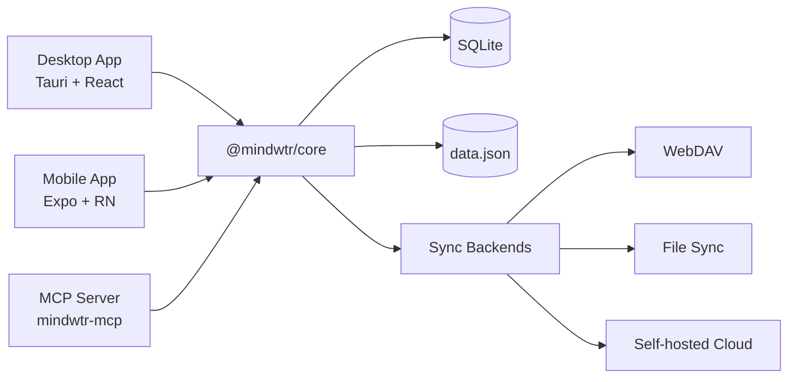

# Arquitectura

Arquitectura técnica y decisiones de diseño de Mindwtr.

---

## Descripción general

Mindwtr es una aplicación GTD multiplataforma con:

- **Aplicación de escritorio** — Tauri v2 (Rust + React)
- **Aplicación móvil** — React Native + Expo
- **Servidor MCP** — puente local del Model Context Protocol para herramientas de IA
- **Sincronización en la nube** — servidor de sincronización Node.js (Bun)
- **Núcleo compartido** — paquete de lógica de negocio en TypeScript

```
┌─────────────────────────────────────────────────────────┐
│                       User Interface                      │
├─────────────────────────────┬───────────────────────────┤
│      Desktop (Tauri)        │      Mobile (Expo)        │
│   React + Vite + Tailwind   │  React Native + NativeWind│
├─────────────────────────────┴───────────────────────────┤
│                     @mindwtr/core                        │
│ Zustand Store · Types · i18n Loader/Locales · Sync Core │
├─────────────────────────────┬───────────────────────────┤
│    Tauri FS (Rust)          │   SQLite + JSON backup    │
│    SQLite + JSON backup     │     App storage           │
└──────────────┬──────────────┴───────────────────────────┘
               │
┌──────────────▼──────────────┐
│        Cloud / Sync         │
│   WebDAV / Local / Server   │
└─────────────────────────────┘
```

## Decisiones de diseño y sus implicaciones

- **La sincronización en la nube se basa en archivos** y está optimizada para el autoalojamiento en una sola máquina.
- **Las claves foráneas de SQLite se aplican** para garantizar la integridad de los registros activos, mientras que la reparación de eliminaciones lógicas y registros de eliminación se sigue realizando en la lógica compartida de la aplicación.
- **Las eliminaciones definitivas son poco frecuentes, pero existen**. `sections.projectId` usa `ON DELETE CASCADE`, mientras que las referencias de tareas, proyectos y áreas usan principalmente `ON DELETE SET NULL`.

### Diagrama del sistema (Mermaid)



---

## Estructura del monorepo

El proyecto usa un monorepo con espacios de trabajo de Bun:

```
Mindwtr/
├── apps/
│   ├── cloud/           # Sync server (Bun)
│   ├── desktop/         # Tauri app
│   ├── mcp-server/      # Local MCP server
│   └── mobile/          # Expo app
├── packages/
│   └── core/            # Shared business logic
└── package.json         # Workspace root
```

### Ventajas

- Código compartido entre plataformas
- Una sola versión de las dependencias
- Pruebas e integración continua unificadas
- Refactorización más sencilla

---

## Paquete principal (`@mindwtr/core`)

El paquete principal contiene toda la lógica de negocio compartida:

### Módulos

| Módulo              | Propósito                                       |
| ------------------- | ----------------------------------------------- |
| `store.ts`          | Almacén de estado Zustand con todas las acciones |
| `types.ts`          | Interfaces TypeScript (Task, Project, etc.)     |
| `i18n/i18n-loader.ts` | Carga diferida de traducciones                |
| `i18n/i18n-translate.ts` | Funciones auxiliares de traducción en tiempo de compilación |
| `i18n/locales/*.ts` | Configuración regional base en inglés y sobrescrituras por idioma |
| `contexts.ts`       | Contextos y etiquetas predefinidos              |
| `quick-add.ts`      | Analizador de tareas en lenguaje natural        |
| `recurrence.ts`     | Lógica de tareas recurrentes (RFC 5545 parcial) |
| `sync.ts` + `sync-*.ts` | Núcleo de fusión de sincronización y funciones auxiliares compartidas; consulta la lista de módulos a continuación |
| `date.ts`           | Funciones para el análisis seguro de fechas     |
| `ai/`               | Integración con IA (Gemini/OpenAI/Anthropic)    |
| `sqlite-adapter.ts` | Interfaz del adaptador de almacenamiento local  |
| `webdav.ts`         | Cliente de sincronización WebDAV                |

Los submódulos de sincronización actuales dividen el protocolo por responsabilidad: `sync-run.ts` es la máquina de estados compartida del ciclo de sincronización (secuencia de fases, comprobaciones para omitir datos sin cambios, fases de adjuntos, gestión de errores y de volver a poner en cola) que se encuentra detrás de los puertos de `sync-run-ports.ts`; las aplicaciones de escritorio y móvil proporcionan adaptadores de transporte, almacenamiento y notificaciones (ADR 0014). `sync-orchestrator.ts` serializa los ciclos y pone en cola los posteriores, `sync-normalization.ts` repara la forma de la carga útil, `sync-signatures.ts` calcula firmas de contenido comparables, `sync-merge-settings.ts` fusiona grupos de ajustes, `sync-tombstones.ts` gestiona la limpieza según la retención, `sync-revision.ts` asigna revisiones y `sync-client-helpers.ts` / `sync-service-utils.ts` contienen funciones auxiliares de los servicios de plataforma.

### Principios de diseño

1. **Independiente de la plataforma** — Sin código específico de una plataforma
2. **Patrón de adaptador de almacenamiento** — Inyección del almacenamiento en tiempo de ejecución
3. **Funciones puras** — Las utilidades no tienen estado
4. **Seguridad de tipos** — Cobertura completa de TypeScript

### Capas del estado

- **El almacén principal** conserva los datos canónicos (`all tasks/projects`).
- **Los almacenes de la interfaz** contienen filtros específicos de cada vista y el estado de la interfaz.
- **Las listas visibles** se derivan de los datos principales y los filtros de la interfaz para evitar mezclar las responsabilidades de persistencia con la presentación.

---

## Arquitectura de escritorio (Tauri)

### ¿Por qué Tauri?

| Característica | Tauri  | Electron         |
| -------------- | ------ | ---------------- |
| Tamaño del binario | ~5 MB  | ~150 MB      |
| Uso de memoria | ~50 MB | ~300 MB          |
| Backend        | Rust   | Node.js          |
| Vista web      | Sistema | Chromium incluido |

### Estructura

```
apps/desktop/
├── src/                         # React frontend
│   ├── App.tsx                  # Root component and app shell wiring
│   ├── main.tsx                 # Vite/Tauri webview entry
│   ├── components/
│   │   ├── Task/                # Task form, field, and editor components
│   │   ├── ui/                  # Shared primitive UI components
│   │   └── views/               # Feature views
│   │       ├── agenda/
│   │       ├── calendar/
│   │       ├── inbox/
│   │       ├── list/
│   │       ├── projects/
│   │       ├── review/
│   │       └── settings/
│   ├── config/                  # Desktop app constants/config
│   ├── contexts/                # React contexts
│   ├── hooks/                   # Shared React hooks
│   ├── lib/                     # Desktop services and Tauri bridges
│   ├── store/                   # UI-specific state
│   ├── test/                    # Desktop test utilities
│   └── utils/                   # Small shared utilities
│
├── src-tauri/                  # Rust backend
│   ├── src/main.rs             # Entry point
│   ├── src/platform.rs         # Native commands and path validation
│   ├── capabilities/           # Tauri command/plugin permissions
│   ├── Cargo.toml              # Rust dependencies
│   └── tauri.conf.json         # Tauri config
│
└── package.json
```

### Flujo de datos

```
User Action → React Component → Zustand Store (@mindwtr/core) → Storage Adapter → SQLite + data.json
```

### Comandos de Tauri

El backend en Rust expone comandos para:
- Abrir archivos permitidos y realizar operaciones con adjuntos y almacenamiento
- Diálogos nativos
- Notificaciones del sistema

---

## Arquitectura móvil (Expo)

### ¿Por qué Expo?

- El flujo de trabajo gestionado simplifica el desarrollo
- Capacidad para actualizaciones OTA
- Expo Router para navegación basada en archivos
- Proceso de compilación sencillo (EAS)

### Estructura

```
apps/mobile/
├── app/                   # Expo Router pages
│   ├── (drawer)/         # Drawer navigation
│   │   ├── (tabs)/       # Tab navigation
│   │   │   ├── calendar-tab.tsx
│   │   │   ├── capture-quick.tsx
│   │   │   ├── inbox.tsx
│   │   │   ├── focus.tsx
│   │   │   ├── capture.tsx
│   │   │   ├── contexts-tab.tsx
│   │   │   ├── projects.tsx
│   │   │   ├── review-tab.tsx
│   │   │   └── menu.tsx
│   │   ├── calendar.tsx
│   │   ├── contexts.tsx
│   │   ├── saved-search/[id].tsx
│   │   ├── board.tsx
│   │   ├── waiting.tsx
│   │   ├── someday.tsx
│   │   ├── done.tsx
│   │   ├── trash.tsx
│   │   ├── archived.tsx
│   │   ├── reference.tsx
│   │   ├── projects-screen.tsx
│   │   └── settings.tsx
│   └── _layout.tsx       # Root layout
│
├── components/           # Shared components
├── contexts/             # Theme, Language
├── lib/                  # Storage, sync utilities
└── package.json
```

### Navegación

```
Drawer/Stack Layout
├── Tab Navigator
│   ├── Inbox
│   ├── Agenda
│   ├── Next Actions
│   ├── Projects
│   └── Menu (links to other views)
├── Other Screens (Stack)
│   ├── Board
│   ├── Calendar
│   ├── Review
│   ├── Contexts
│   ├── Waiting For
│   ├── Someday/Maybe
│   ├── Archived
│   └── Settings
```

---

## Gestión del estado

### Almacén Zustand

El almacén central (`@mindwtr/core/src/store.ts`) gestiona todo el estado de la aplicación:

```typescript
interface TaskStore {
    tasks: Task[];
    projects: Project[];
    areas: Area[];
    settings: AppData['settings'];

    // Actions
    fetchData: () => Promise<void>;
    addTask: (title: string, props?: Partial<Task>) => Promise<void>;
    updateTask: (id: string, updates: Partial<Task>) => Promise<void>;
    deleteTask: (id: string) => Promise<void>;
    // ... projects, areas, and settings actions
}
```

### Patrón de adaptador de almacenamiento

El almacén usa adaptadores de almacenamiento inyectados:

```typescript
// Desktop: Tauri file system
setStorageAdapter(tauriStorage);

// Mobile: SQLite (with JSON backup fallback)
setStorageAdapter(mobileStorage);
```

### Persistencia

- **Agrupación de escrituras** — Los cambios se ponen en cola de inmediato y las escrituras superpuestas se agrupan en el siguiente volcado
- **Volcado al salir** — Los guardados pendientes se vuelcan cuando la aplicación pasa a segundo plano
- **Eliminaciones lógicas** — Los elementos se marcan con `deletedAt` para la sincronización

---

## Modelo de datos

La superficie de tipos canónica se encuentra en la [API principal](/es/developers/core-api) y en `packages/core/src/types.ts`.

- Consulta la [API principal](/es/developers/core-api) para ver la documentación actual de cada campo de `Task`, `Project`, `Section`, `Area`, `Person`, `Attachment` y `AppData`.
- Los campos sensibles a la sincronización, como `rev`, `revBy`, `purgedAt`, `orderNum`, `mimeType`, `size`, `cloudKey` y `localStatus`, evolucionan con más frecuencia que esta descripción general de la arquitectura.
- Mantener el volcado detallado de tipos en una sola página evita que la documentación de arquitectura se desvíe del código.

---

## Estrategia de sincronización

### LWW consciente de revisiones con registros de eliminación

La sincronización de datos se basa en «última escritura gana» con reconocimiento de revisiones y criterios deterministas para deshacer empates.

### Lógica de fusión

1. **Resolución**:
    - Si ambos lados tienen revisiones, gana el `rev` más alto antes de recurrir a las marcas de tiempo.
    - `rev` es un contador de ediciones por entidad, no un reloj vectorial, por lo que un lado con más ediciones sin conexión puede imponerse a una única edición más reciente de otro dispositivo.
    - Si las revisiones empatan, se compara `updatedAt`.
    - Si las marcas de tiempo también empatan, se comparan firmas deterministas del contenido normalizado para que todos los dispositivos elijan al mismo ganador.
    - Las entidades heredadas sin metadatos de revisión tratan los valores de `updatedAt` dentro del umbral de 5 minutos de desfase del reloj como un empate determinista; fuera de esa ventana, gana el `updatedAt` más reciente.
2. **Registros de eliminación**:
    - Los elementos eliminados conservan su registro con `deletedAt` establecido.
    - Evita que reaparezcan durante la sincronización.
    - Permite una fusión correcta entre dispositivos.
    - Los conflictos entre eliminación y registro activo usan el momento de la operación (`max(updatedAt, deletedAt)` para los registros de eliminación).
    - Si las operaciones de eliminación y registro activo tienen lugar dentro de la ventana de ambigüedad de 30 segundos, Mindwtr conserva el elemento activo en lugar de eliminarlo inmediatamente.
3. **Conflictos**:
    - Los conflictos de metadatos se resuelven automáticamente.
    - Los ajustes se fusionan por grupos de sincronización (`appearance`, `language`, `gtd`, `externalCalendars`, `ai`, `savedFilters`) en lugar de usar una única marca de tiempo para un objeto enorme.
    - Los conflictos entre filtros guardados activos usan estrictamente el `updatedAt` de cada filtro, con una alternativa determinista solo cuando las marcas de tiempo son iguales o inutilizables.
    - Las advertencias de gran desfase del reloj se activan cuando la diferencia de fusión supera el umbral actual de 5 minutos.

### Ciclo de sincronización

```
1. Read Local Data
2. Read Remote Data (Cloud/WebDAV/File)
3. Merge (Memory) -> Generate Stats (conflicts, updates)
4. Write Local with pending-remote-write marker
5. Write Remote
6. Clear pending-remote-write marker locally
```

Si la escritura remota falla después de la persistencia local, Mindwtr guarda metadatos de reintento y aumenta progresivamente la espera desde 5 segundos hasta 5 minutos antes de volver a intentarlo.

### Transporte de instantáneas

Actualmente, la sincronización de Mindwtr transporta instantáneas completas de forma intencionada. No se trata de un sustituto provisional de un sistema de deltas ausente.

- Los ADR 0003 y ADR 0007 definen las reglas de fusión conscientes de revisiones que se aplican a esas instantáneas.
- El ADR 0008 registra la decisión de transporte actual: mantener la fusión de instantáneas y no añadir todavía un registro de deltas.
- Para las cargas de trabajo actuales de GTD personal, la sincronización mediante instantáneas simplifica la implementación, conserva la atomicidad de todo el archivo y evita estados adicionales de reproducción y compactación.
- Si esto cambia en el futuro, el diseño de deltas debe ampliar el modelo existente de `rev` y `revBy` en lugar de sustituirlo por un nuevo sistema de secuencias.

La decisión sobre el registro de deltas solo debe revisarse si los archivos de instantáneas superan habitualmente los 5 MB, los ciclos completos de sincronización tardan más de 5 segundos en redes habituales o el producto necesita transmisión multidispositivo en tiempo real.

La cobertura de pruebas y las condiciones de publicación se registran por separado en [Estrategia de pruebas](/es/developers/testing-strategy) para que esta página pueda centrarse en la arquitectura en tiempo de ejecución.

---

## Internacionalización

### Estructura

Las traducciones se distribuyen dentro de la carpeta `packages/core/src/i18n/`:

```typescript
// packages/core/src/i18n/i18n-loader.ts
// packages/core/src/i18n/i18n-translations.ts
// packages/core/src/i18n/locales/*.ts
```

### Uso

Cada aplicación tiene un contexto de idioma que proporciona una función `t()`.
