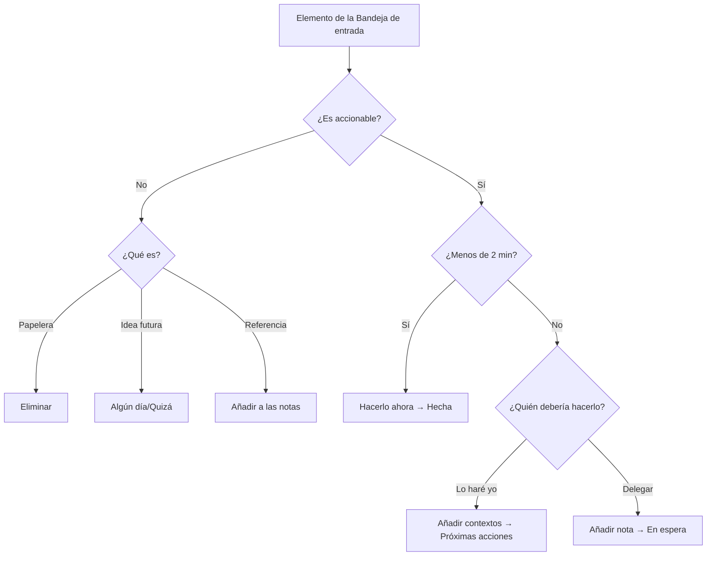

# Flujo de trabajo GTD en Mindwtr

Esta guía muestra cómo implementar la metodología GTD usando las funciones de Mindwtr.

---

## Resumen

Mindwtr se corresponde directamente con los conceptos de GTD:

| Concepto de GTD   | Función de Mindwtr                        |
| ------------- | -------------------------------------- |
| Bandeja de entrada         | Vista Bandeja de entrada                             |
| Aclarar       | Asistente de procesamiento                      |
| Próximas acciones  | Vista Enfoque para las acciones disponibles; Contextos/Proyectos/Búsqueda para el inventario completo |
| Proyectos      | Vista Proyectos                          |
| En espera   | Vista En espera (estado: `waiting`)   |
| Algún día/Quizá | Vista Algún día/Quizá (estado: `someday`) |
| Calendario      | Vista Calendario (tareas con fechas límite)   |
| Revisión semanal | Asistente de revisión                          |

---

## Patrones

Usa estos patrones para mantener el sistema ligero:

- Escribe las próximas acciones como pasos físicos visibles: «Llamar al seguro» es mejor que «Encargarse del seguro».
- Guarda el material de apoyo de los proyectos en las notas del proyecto. No llenes Enfoque con acciones futuras que todavía no se pueden realizar.
- Divide las tareas grandes en partes o bloques de tiempo, como «Dedicar 30 minutos a ordenar fotos».
- Usa contextos para herramientas, lugares, energía y personas: `@phone`, `@errands`, `#focused`, `@Alex`.
- Pon el trabajo delegado en En espera con una fecha de seguimiento o un contexto de persona.
- Reserva el calendario para el panorama rígido: citas, fechas límite y compromisos ligados a una hora concreta.
- Durante la Revisión semanal, convierte las futuras notas de proyecto en próximas acciones reales cuando estén disponibles.
- Elige una próxima acción por proyecto para un sistema sencillo, o varias solo cuando sean verdaderamente paralelas.

---

## 1. Capturar (Bandeja de entrada)

### Captura rápida

- **Escritorio:** escribe en el campo de entrada inferior o usa el atajo `a` cuando la aplicación tenga el foco. `o` también abre la creación de tareas.
- **Móvil:** toca el campo de entrada en la pestaña Bandeja de entrada
- **Barrido mental:** usa indicaciones guiadas cuando necesites recopilar asuntos pendientes del trabajo, el hogar, las personas, los recados y las ideas para algún día.

### Sintaxis de adición rápida

Captura inmediatamente con contexto:
```
Llamar al fontanero @phone @home
Comprar alimentos @errands /due:saturday
Investigar un tema #focused +WorkProject
Ordenar recibos /energy:low
```

### La regla

Captúralo todo. No filtres, juzgues ni organices. Sácalo de tu cabeza.

---

## 2. Aclarar (Asistente de procesamiento)

### Iniciar el proceso

- **Escritorio:** haz clic en el botón "Procesar bandeja de entrada"
- **Móvil:** toca el botón "Procesar bandeja de entrada"

### El flujo de trabajo



### Puntos de decisión

**¿Es accionable?**
- No → Eliminar, mover a Algún día/Quizá o añadir como referencia
- Sí → Continuar

**¿Requiere más de un paso?**
- Sí → Convierte la captura en un proyecto: ponle un nombre y define su próxima acción. Añade tantas acciones posteriores como necesites. Volverán a la Bandeja de entrada con el proyecto ya asociado, de modo que cada una tenga su propia fase de aclaración
- No → Continuar como una única acción

**¿Tardará menos de 2 minutos?**
- Sí → Hazlo inmediatamente y marca como Hecha
- No → Continuar

**¿Quién debería hacerlo?**
- Lo haré yo → Seleccionar contextos y mover a Próximas acciones
- Delegar → Añadir una nota de espera y mover a En espera

**¿Asignar un proyecto?** (Opcional)
- Vincula las tareas relacionadas a un proyecto

---

## 3. Organizar

### Estados de las tareas

| Estado     | Significado            | Vista          |
| ---------- | ------------------ | ------------- |
| `inbox`    | Aún no procesada  | Bandeja de entrada         |
| `next`     | Lista para hacer a continuación   | Enfoque         |
| `waiting`  | Delegada/bloqueada  | En espera   |
| `someday`  | Futura/quizá       | Algún día/Quizá |
| `done`     | Completada recientemente | Hechas          |
| `archived` | Completada y archivada | Archivadas      |

Hechas y Archivadas son estados cerrados, pero cumplen funciones distintas:

- **Hechas** es el registro de finalizaciones recientes. Úsalo para las tareas que quizá quieras ver durante la revisión diaria o semanal.
- **Archivadas** es el historial guardado. Las tareas archivadas se ocultan de las listas de tareas normales, pero siguen disponibles en la vista Archivadas para buscar, restaurar o eliminar permanentemente.
- **Archivado automático** puede mover tareas de Hechas a Archivadas después de un número determinado de días. Configúralo como **Nunca** si quieres que Hechas conserve todas las tareas completadas indefinidamente.

### Contextos y etiquetas

Añade contextos para filtrar según dónde puedas realizar las tareas:

**Contextos de ubicación (@):**
- `@home`, `@work`, `@errands`, `@anywhere`
- `@computer`, `@phone`, `@agendas`

**Etiquetas (#):**
- `#focused`: Trabajo profundo
- `#lowenergy`: Tareas sencillas
- `#creative`: Lluvia de ideas
- `#routine`: Tareas repetitivas

### Personas

Usa Personas para el trabajo delegado o centrado en personas. La persona asignada a una tarea alimenta las listas En espera, las sugerencias y la búsqueda `assigned:`; el gestor de Personas te permite conservar nombres, notas y enlaces de referencia reutilizables sin convertir a cada persona en una etiqueta de contexto. Eliminar una persona conserva sus tareas y borra la asignación en lugar de eliminar el trabajo.

Crea Personas desde el campo **Asignado a** o en **Ajustes -> Gestionar -> Personas**. Crea Áreas desde el selector **Área** o en **Ajustes -> Gestionar -> Áreas**. Consulta [Áreas y personas](/es/use/areas-people) para conocer las rutas exactas.

### Proyectos

Crea proyectos para resultados que requieren varios pasos:

1. Ve a la vista Proyectos
2. Añade un proyecto nuevo con un nombre y, opcionalmente, elige su Área directamente en el formulario de creación (de forma predeterminada, usa el Área por la que estás filtrando)
3. Añade tareas al proyecto
4. (Opcional) Crea **Secciones** para agrupar las tareas por fase o resultado parcial
5. Alterna entre el modo Secuencial y Paralelo:
   - **Secuencial:** solo la primera tarea aparece en la vista Enfoque
   - **Paralelo:** todas las tareas aparecen en la vista Enfoque

Eliminar un proyecto o un área conserva sus tareas. Mindwtr desvincula ese trabajo y lo deja sin asignar en lugar de eliminarlo en cascada.

#### Secciones de proyectos

Las Secciones de proyectos son subdivisiones dentro de un único proyecto. Úsalas cuando un proyecto tenga fases, hitos o líneas de trabajo naturales y una lista plana de tareas resulte difícil de revisar.

Ejemplo: **Lanzar el sitio web** puede tener secciones como **Diseño**, **Desarrollo** y **Contenido**. No son proyectos separados ni subtareas. Son encabezados organizativos dentro de un único resultado de proyecto.

El campo **Sección del proyecto** de una tarea asigna esa tarea a una de las secciones de su proyecto. Solo resulta útil después de que la tarea pertenezca a un proyecto que tenga secciones. Para las tareas sin asignar o los proyectos sin secciones, deja el campo vacío.

Los proyectos secuenciales pueden usar un ámbito para todo el proyecto o un ámbito por sección. Usa el ámbito por sección cuando un proyecto tenga fases o líneas de trabajo independientes: Mindwtr muestra la primera tarea disponible de cada sección en lugar de bloquear todo el proyecto detrás de una única tarea.

### Fechas límite y recordatorios

- Establece una **fecha límite** para los plazos
- Establece una **fecha de inicio** para indicar cuándo comenzar
- Establece una **fecha de revisión** (recordatorio) para las comprobaciones periódicas

### Fechas frente a estado

Mindwtr mantiene separados el estado y las fechas de las tareas. El estado es la fase de GTD que eliges, como `inbox`, `next`, `waiting` o `someday`. Las fechas controlan cuándo y por qué aparece una tarea; la llegada de una fecha nunca cambia por sí sola el estado de una tarea.

Hay un atajo deliberado al editar: asignar una fecha de inicio a un elemento de la **Bandeja de entrada** cuenta como aclararlo —has decidido cuándo puedes actuar sobre él—, por lo que Mindwtr lo mueve a `next` en cuanto estableces la fecha, igual que al destacar un elemento de la Bandeja de entrada. Si eliges un estado en la misma edición, prevalece tu elección, y las tareas `someday` o `waiting` siempre conservan su estado cuando les asignas una fecha: un elemento con fecha de algún día es un recordatorio y un elemento en espera con fecha es un recordatorio de seguimiento.

- La **fecha de inicio** es una barrera de aplazamiento/disponibilidad. De forma predeterminada, un inicio futuro oculta la tarea de Enfoque. Cuando llega la fecha, la tarea vuelve a aparecer con el estado que ya tenía.
- La **fecha de revisión** es un recordatorio. Cuando llega la fecha, Mindwtr muestra la tarea donde la vista admite elementos cuya revisión ha vencido para que puedas reconsiderarla; nada cambia hasta que tú lo decidas.
- La **fecha límite** es un plazo. A medida que se acerca o pasa, Mindwtr resalta el plazo de la tarea mediante la visualización, los recordatorios y la presión de ordenación; el estado no cambia.

Algunas acciones de procesamiento establecen a la vez el estado y las fechas: elegir **Más tarde** al procesar la Bandeja de entrada mueve el elemento a `next` y establece una fecha de inicio, y establecer directamente una fecha de inicio en un elemento de la Bandeja de entrada hace lo mismo. Después de eso, las fechas solo controlan la visibilidad; nunca vuelven a cambiar el estado.

### Tiempo de antelación relativo para el inicio

Usa **Tiempo de antelación para el inicio** cuando la fecha de inicio deba permanecer vinculada a la fecha límite. Por ejemplo, una tarea que vence el viernes puede comenzar dos días antes de la fecha límite, o una tarea que vence a las 5:00 p. m. puede comenzar tres horas antes. Un tiempo de antelación de **0** significa que la tarea comienza el propio día de la fecha límite, lo cual resulta apropiado para tareas recurrentes que no deberían aparecer hasta el día en que vencen.

Cuando una tarea tiene una fecha límite y un tiempo de antelación para el inicio, Mindwtr trata el desplazamiento como fuente de verdad. Mover la fecha límite recalcula la fecha de inicio con el mismo desplazamiento, y las tareas recurrentes conservan el mismo tiempo de antelación cuando se genera la siguiente instancia.

Usa en su lugar una fecha de inicio fija cuando el trabajo deba comenzar en una fecha concreta del calendario independientemente de cuándo se mueva el plazo.

---

## 4. Reflexionar (Revisión semanal)

### Iniciar la revisión

- **Escritorio:** ve a Revisión semanal en la barra lateral
- **Móvil:** toca la pestaña Revisión en la barra inferior

### Los pasos

1. **Procesar la Bandeja de entrada**
   - Aclara todos los elementos de la bandeja de entrada
   - Objetivo: Bandeja de entrada a cero
   - Usa la acción Procesar bandeja de entrada de la revisión para ejecutar el flujo de aclaración normal desde la Revisión semanal

2. **Revisar el calendario**
   - Mira las 2 semanas anteriores en busca de seguimientos omitidos
   - Mira las 2 semanas siguientes para detectar necesidades de preparación

3. **En espera**
   - Revisa los elementos delegados
   - Envía recordatorios si es necesario

4. **Revisar proyectos**
   - Asegúrate de que cada proyecto tenga una próxima acción
   - Marca los proyectos completados como hechos

5. **Algún día/Quizá**
   - Revisa las ideas en incubación
   - Activa o elimina elementos

### Práctica recomendada

Reserva entre 30 y 90 minutos cada semana, a la misma hora y en el mismo lugar.

---

### Ejecutar

### Elegir en qué trabajar

Usa la vista **Enfoque** para ver:
- Las tareas prioritarias de hoy (elementos destacados)
- Próximas acciones (filtradas por contexto o generales)
- Elementos vencidos
- Elementos que vencen hoy

Enfoque no es una vista de inventario completo. Oculta las tareas con fecha de inicio futura y las tareas posteriores de proyectos secuenciales para que la lista refleje las acciones disponibles ahora. Usa **Contextos**, **Proyectos** o **Búsqueda** cuando necesites consultar todas las próximas acciones, incluidos los elementos aplazados o bloqueados.

### Cómo ordena Enfoque las acciones disponibles

Enfoque determina primero si una tarea está disponible y después ordena las acciones visibles:

1. **Enfoque de hoy** muestra las tareas que has seleccionado explícitamente para hoy. Puedes organizarlas manualmente en el orden en que piensas trabajar: arrastra el controlador en el escritorio o usa el interruptor de reordenación del encabezado de la sección en el móvil. El orden manual se aplica mientras la ordenación de Enfoque esté en su valor predeterminado, se sincroniza entre dispositivos y una tarea conserva su lugar hasta que sale de Enfoque.
2. **Hoy / Agenda** muestra las tareas `next` disponibles que están vencidas, vencen hoy o comienzan hoy. Se ordenan por la fecha/hora de vencimiento o inicio más próxima, después por prioridad cuando las prioridades están activadas y, a continuación, por la fecha de creación más antigua.
3. **Próximas acciones** muestra las demás tareas `next` disponibles. El orden predeterminado es:
   - primero las que vencen pronto, empezando por la fecha límite más próxima (actualmente, las que vencen en los próximos 30 días)
   - después las acciones sin fecha
   - al final las acciones con fecha límite en un futuro lejano, empezando por la fecha límite más próxima
   - dentro del mismo grupo: prioridad cuando esté activada, después hora de inicio, fecha de creación más antigua, título e id
4. **Revisión vencida** muestra las tareas cuya fecha de revisión ha llegado. Después de revisar un elemento, puedes borrar su fecha de revisión (**Marcar como revisado**) o aplazarla mediante **Revisar en 1 semana**: en el escritorio, desde el menú de acciones rápidas de la tarea; en el móvil, manteniendo pulsada la fila.

La fecha de inicio es el campo de aplazamiento/fecha planificada de Mindwtr. Enfoque siempre oculta las tareas con inicio futuro hasta su día de inicio; la lista Próximas acciones las cuenta en un aviso de «ocultas (inicio futuro)» con un interruptor **Mostrar** para cuando quieras echar un vistazo. Los proyectos secuenciales también limitan Enfoque a la primera acción disponible para ese proyecto o sección, por lo que las acciones posteriores no aparecen en Enfoque hasta que el paso anterior deja de bloquearlas.

La estimación de tiempo y la energía son filtros y opciones de agrupación de Enfoque, no claves de ordenación predeterminadas. Agrupar por contexto, proyecto, área, energía o prioridad cambia los grupos visuales; las tareas de esos grupos conservan la misma disponibilidad y ordenación de próximas acciones.

### Filtrar por contexto

1. Ve a la vista **Enfoque** o **Contextos**
2. Selecciona una ficha de contexto (por ejemplo, @home)
3. Consulta solo las tareas de ese contexto

### Enfoque de hoy

Destaca tareas como prioridades de hoy hasta alcanzar el límite de Enfoque configurado:
- **Escritorio:** haz clic en el icono de estrella
- **Móvil:** toca la insignia de estrella

---

## Flujo de trabajo diario

### Por la mañana

1. Abre la vista **Enfoque** para ver las prioridades de hoy
2. Establece las tareas prioritarias del día hasta alcanzar el límite de Enfoque configurado
3. Empieza a trabajar en la primera (márcala como prioritaria)

### A lo largo del día

1. Captura nuevos elementos en la Bandeja de entrada
2. Consulta listas filtradas por contexto al cambiar de ubicación
3. Marca como Hechas las tareas completadas

### Al final del día

1. Revisa rápidamente la Bandeja de entrada (procésala si tienes tiempo)
2. Revisa el calendario de mañana
3. Actualiza las tareas en curso

---

## Tareas recurrentes

Configura las tareas recurrentes desde el campo **Recurrencia** del editor de tareas. Elige una recurrencia diaria, semanal, mensual o anual y, después, elige si la tarea mantiene una programación fija o se repite después de completarla.

Mindwtr conserva una instancia activa de cada tarea recurrente. Las repeticiones futuras no se crean de antemano como tareas reales; la siguiente tarea aparece cuando completas la actual. Puedes activar **Mostrar la próxima repetición en el Calendario** cuando quieras una vista previa de planificación.

**Ejemplos de tareas recurrentes:**
- Semanal: "Revisar el estado del proyecto"
- Diaria: "Comprobar el correo electrónico @computer"
- Mensual: "Revisar las suscripciones"

Para conocer los pasos de configuración y los detalles de las opciones, consulta [Tareas recurrentes](/es/use/recurring-tasks).

---

## Consejos para lograrlo

### Confía en tu sistema

- Captúralo todo inmediatamente
- Procesa con regularidad
- No te saltes las revisiones semanales

### Mantén la sencillez

- No organices en exceso
- Al principio, usa los contextos con moderación
- Añade complejidad solo cuando sea necesario

### Crea hábitos

- Misma hora para la revisión semanal
- Procesamiento periódico de la bandeja de entrada
- Método de captura coherente

---

## Consulta también

- [Resumen de GTD](/es/use/gtd-overview)
- [Contextos y etiquetas](/es/use/contexts-tags)
- [Revisión semanal](/es/use/weekly-review)
