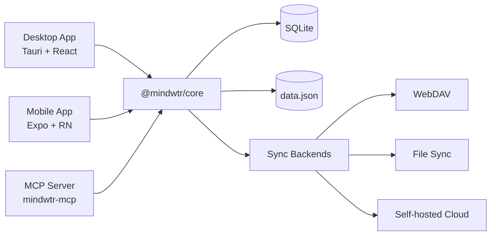

# Architecture

Architecture technique et décisions de conception de Mindwtr.

---

## Vue d’ensemble

Mindwtr est une application GTD multiplateforme comprenant :

- **Application pour ordinateur** — Tauri v2 (Rust + React)
- **Application mobile** — React Native + Expo
- **Serveur MCP** — passerelle locale Model Context Protocol pour les outils d’IA
- **Synchronisation Cloud** — serveur de synchronisation Node.js (Bun)
- **Cœur partagé** — package de logique métier TypeScript

```
┌─────────────────────────────────────────────────────────┐
│                       User Interface                      │
├─────────────────────────────┬───────────────────────────┤
│      Desktop (Tauri)        │      Mobile (Expo)        │
│   React + Vite + Tailwind   │  React Native + NativeWind│
├─────────────────────────────┴───────────────────────────┤
│                     @mindwtr/core                        │
│ Zustand Store · Types · i18n Loader/Locales · Sync Core │
├─────────────────────────────┬───────────────────────────┤
│    Tauri FS (Rust)          │   SQLite + JSON backup    │
│    SQLite + JSON backup     │     App storage           │
└──────────────┬──────────────┴───────────────────────────┘
               │
┌──────────────▼──────────────┐
│        Cloud / Sync         │
│   WebDAV / Local / Server   │
└─────────────────────────────┘
```

## Compromis de conception

- **La synchronisation cloud repose sur des fichiers** et est optimisée pour l’auto-hébergement sur une seule machine.
- **Les clés étrangères SQLite sont appliquées** pour garantir l’intégrité des enregistrements actifs, tandis que la réparation des suppressions réversibles et des pierres tombales reste effectuée dans la logique partagée de l’application.
- **Les suppressions définitives sont rares, mais réelles**. `sections.projectId` utilise `ON DELETE CASCADE`, tandis que les références des tâches, projets et domaines utilisent principalement `ON DELETE SET NULL`.

### Diagramme du système (Mermaid)



---

## Structure du monorepo

Le projet utilise un monorepo avec les espaces de travail Bun :

```
Mindwtr/
├── apps/
│   ├── cloud/           # Sync server (Bun)
│   ├── desktop/         # Tauri app
│   ├── mcp-server/      # Local MCP server
│   └── mobile/          # Expo app
├── packages/
│   └── core/            # Shared business logic
└── package.json         # Workspace root
```

### Avantages

- Code partagé entre les plateformes
- Version unique des dépendances
- Tests et CI unifiés
- Refactorisation facilitée

---

## Package du cœur (`@mindwtr/core`)

Le package du cœur contient toute la logique métier partagée :

### Modules

| Module              | Rôle                                       |
| ------------------- | --------------------------------------------- |
| `store.ts`          | Store d’état Zustand avec toutes les actions          |
| `types.ts`          | Interfaces TypeScript (Task, Project, etc.)   |
| `i18n/i18n-loader.ts` | Chargement différé des traductions                    |
| `i18n/i18n-translate.ts` | Utilitaires de traduction au moment du build          |
| `i18n/locales/*.ts` | Locale anglaise de base et surcharges propres à chaque langue |
| `contexts.ts`       | Contextes et étiquettes prédéfinis                      |
| `quick-add.ts`      | Analyseur de tâches en langage naturel                  |
| `recurrence.ts`     | Logique des tâches récurrentes (RFC 5545 partiel)       |
| `sync.ts` + `sync-*.ts` | Cœur de fusion de synchronisation et utilitaires partagés ; voir la liste des modules ci-dessous |
| `date.ts`           | Utilitaires sûrs d’analyse des dates                   |
| `ai/`               | Intégration de l’IA (Gemini/OpenAI/Anthropic)      |
| `sqlite-adapter.ts` | Interface de l’adaptateur de stockage local               |
| `webdav.ts`         | Client de synchronisation WebDAV                            |

Les sous-modules de synchronisation actuels répartissent le protocole par responsabilité : `sync-run.ts` est la machine à états du cycle de synchronisation partagé (séquencement des phases, contrôles permettant d’ignorer les données inchangées, phases des pièces jointes, gestion des erreurs et de la remise en file) derrière les ports de `sync-run-ports.ts` — les applications pour ordinateur et mobile fournissent des adaptateurs de transport, de stockage et de notification (ADR 0014) ; `sync-orchestrator.ts` sérialise les cycles et met en file les exécutions suivantes, `sync-normalization.ts` répare la structure de la charge utile, `sync-signatures.ts` calcule des signatures de contenu comparables, `sync-merge-settings.ts` fusionne les groupes de réglages, `sync-tombstones.ts` gère le nettoyage selon la durée de conservation, `sync-revision.ts` appose les révisions, et `sync-client-helpers.ts` / `sync-service-utils.ts` contiennent les utilitaires des services de plateforme.

### Principes de conception

1. **Indépendance vis-à-vis des plateformes** — Aucun code propre à une plateforme
2. **Modèle de l’adaptateur de stockage** — Injection du stockage à l’exécution
3. **Fonctions pures** — Les utilitaires sont sans état
4. **Sûreté des types** — Couverture TypeScript complète

### Couches d’état

- **Le store du cœur** conserve les données canoniques (`all tasks/projects`).
- **Les stores de l’interface** contiennent les filtres propres aux vues et l’état de l’interface.
- **Les listes visibles** sont dérivées des données du cœur et des filtres de l’interface afin de ne pas mélanger les préoccupations de persistance et de présentation.

---

## Architecture pour ordinateur (Tauri)

### Pourquoi Tauri ?

| Caractéristique      | Tauri  | Electron         |
| ------------ | ------ | ---------------- |
| Taille du binaire  | ~5 MB  | ~150 MB          |
| Utilisation de la mémoire | ~50 MB | ~300 MB          |
| Backend      | Rust   | Node.js          |
| Webview      | Système | Chromium intégré |

### Structure

```
apps/desktop/
├── src/                         # React frontend
│   ├── App.tsx                  # Root component and app shell wiring
│   ├── main.tsx                 # Vite/Tauri webview entry
│   ├── components/
│   │   ├── Task/                # Task form, field, and editor components
│   │   ├── ui/                  # Shared primitive UI components
│   │   └── views/               # Feature views
│   │       ├── agenda/
│   │       ├── calendar/
│   │       ├── inbox/
│   │       ├── list/
│   │       ├── projects/
│   │       ├── review/
│   │       └── settings/
│   ├── config/                  # Desktop app constants/config
│   ├── contexts/                # React contexts
│   ├── hooks/                   # Shared React hooks
│   ├── lib/                     # Desktop services and Tauri bridges
│   ├── store/                   # UI-specific state
│   ├── test/                    # Desktop test utilities
│   └── utils/                   # Small shared utilities
│
├── src-tauri/                  # Rust backend
│   ├── src/main.rs             # Entry point
│   ├── src/platform.rs         # Native commands and path validation
│   ├── capabilities/           # Tauri command/plugin permissions
│   ├── Cargo.toml              # Rust dependencies
│   └── tauri.conf.json         # Tauri config
│
└── package.json
```

### Flux de données

```
User Action → React Component → Zustand Store (@mindwtr/core) → Storage Adapter → SQLite + data.json
```

### Commandes Tauri

Le backend Rust expose des commandes pour :
- L’ouverture de fichiers autorisés et les opérations sur les pièces jointes/le stockage
- Les boîtes de dialogue natives
- Les notifications système

---

## Architecture mobile (Expo)

### Pourquoi Expo ?

- Le workflow géré simplifie le développement
- Possibilité de mises à jour OTA
- Expo Router pour la navigation basée sur les fichiers
- Processus de build simple (EAS)

### Structure

```
apps/mobile/
├── app/                   # Expo Router pages
│   ├── (drawer)/         # Drawer navigation
│   │   ├── (tabs)/       # Tab navigation
│   │   │   ├── calendar-tab.tsx
│   │   │   ├── capture-quick.tsx
│   │   │   ├── inbox.tsx
│   │   │   ├── focus.tsx
│   │   │   ├── capture.tsx
│   │   │   ├── contexts-tab.tsx
│   │   │   ├── projects.tsx
│   │   │   ├── review-tab.tsx
│   │   │   └── menu.tsx
│   │   ├── calendar.tsx
│   │   ├── contexts.tsx
│   │   ├── saved-search/[id].tsx
│   │   ├── board.tsx
│   │   ├── waiting.tsx
│   │   ├── someday.tsx
│   │   ├── done.tsx
│   │   ├── trash.tsx
│   │   ├── archived.tsx
│   │   ├── reference.tsx
│   │   ├── projects-screen.tsx
│   │   └── settings.tsx
│   └── _layout.tsx       # Root layout
│
├── components/           # Shared components
├── contexts/             # Theme, Language
├── lib/                  # Storage, sync utilities
└── package.json
```

### Navigation

```
Drawer/Stack Layout
├── Tab Navigator
│   ├── Inbox
│   ├── Agenda
│   ├── Next Actions
│   ├── Projects
│   └── Menu (links to other views)
├── Other Screens (Stack)
│   ├── Board
│   ├── Calendar
│   ├── Review
│   ├── Contexts
│   ├── Waiting For
│   ├── Someday/Maybe
│   ├── Archived
│   └── Settings
```

---

## Gestion de l’état

### Store Zustand

Le store central (`@mindwtr/core/src/store.ts`) gère tout l’état de l’application :

```typescript
interface TaskStore {
    tasks: Task[];
    projects: Project[];
    areas: Area[];
    settings: AppData['settings'];

    // Actions
    fetchData: () => Promise<void>;
    addTask: (title: string, props?: Partial<Task>) => Promise<void>;
    updateTask: (id: string, updates: Partial<Task>) => Promise<void>;
    deleteTask: (id: string) => Promise<void>;
    // ... projects, areas, and settings actions
}
```

### Modèle de l’adaptateur de stockage

Le store utilise des adaptateurs de stockage injectés :

```typescript
// Desktop: Tauri file system
setStorageAdapter(tauriStorage);

// Mobile: SQLite (with JSON backup fallback)
setStorageAdapter(mobileStorage);
```

### Persistance

- **Regroupement des écritures** — Les modifications sont immédiatement mises en file et les écritures qui se chevauchent sont regroupées lors du prochain vidage
- **Vidage à la fermeture** — Les enregistrements en attente sont vidés lorsque l’application passe en arrière-plan
- **Suppressions réversibles** — Les éléments sont marqués avec `deletedAt` pour la synchronisation

---

## Modèle de données

La surface de types canonique se trouve dans l’[API du cœur](/fr/developers/core-api) et `packages/core/src/types.ts`.

- Utilisez l’[API du cœur](/fr/developers/core-api) pour la documentation actuelle, champ par champ, de `Task`, `Project`, `Section`, `Area`, `Person`, `Attachment` et `AppData`.
- Les champs sensibles à la synchronisation tels que `rev`, `revBy`, `purgedAt`, `orderNum`, `mimeType`, `size`, `cloudKey` et `localStatus` évoluent plus souvent que cette vue d’ensemble de l’architecture.
- Conserver la description détaillée des types sur une seule page évite que la documentation de l’architecture ne diverge du code.

---

## Stratégie de synchronisation

### LWW tenant compte des révisions, avec pierres tombales

La synchronisation des données repose sur une stratégie de dernière écriture gagnante tenant compte des révisions, avec des départages déterministes.

### Logique de fusion

1. **Résolution** :
    - Si les deux côtés possèdent des révisions, la valeur `rev` la plus élevée l’emporte avant le départage par horodatage.
    - `rev` est un compteur de modifications par entité, et non une horloge vectorielle ; un côté ayant davantage de modifications hors ligne peut donc l’emporter sur une modification unique plus récente provenant d’un autre appareil.
    - Si les révisions sont égales, comparez `updatedAt`.
    - Si les horodatages sont encore égaux, comparez les signatures de contenu normalisées et déterministes afin que tous les appareils choisissent le même gagnant.
    - Les entités anciennes sans métadonnées de révision considèrent les valeurs `updatedAt` situées dans le seuil de cinq minutes de décalage de l’horloge comme une égalité déterministe ; au-delà de cette fenêtre, la valeur `updatedAt` la plus récente l’emporte.
2. **Pierres tombales** :
    - Les éléments supprimés conservent leur enregistrement avec `deletedAt` défini.
    - Empêche leur résurrection lors de la synchronisation.
    - Permet une fusion correcte entre les appareils.
    - Les conflits suppression/élément actif utilisent l’heure de l’opération (`max(updatedAt, deletedAt)` pour les pierres tombales).
    - Si les opérations de suppression et de conservation surviennent dans la fenêtre d’ambiguïté de 30 secondes, Mindwtr conserve l’élément actif au lieu de le supprimer trop rapidement.
3. **Conflits** :
    - Les conflits au niveau des métadonnées sont résolus automatiquement.
    - Les réglages sont fusionnés par groupes de synchronisation (`appearance`, `language`, `gtd`, `externalCalendars`, `ai`, `savedFilters`) plutôt que selon un seul horodatage pour l’ensemble de l’objet.
    - Les conflits actif/actif des filtres enregistrés utilisent strictement l’`updatedAt` de chaque filtre, avec un repli déterministe uniquement pour les horodatages égaux ou inutilisables.
    - Des avertissements de décalage important de l’horloge apparaissent lorsque l’écart de fusion dépasse le seuil actuel de cinq minutes.

### Cycle de synchronisation

```
1. Read Local Data
2. Read Remote Data (Cloud/WebDAV/File)
3. Merge (Memory) -> Generate Stats (conflicts, updates)
4. Write Local with pending-remote-write marker
5. Write Remote
6. Clear pending-remote-write marker locally
```

Si l’écriture distante échoue après la persistance locale, Mindwtr stocke les métadonnées de nouvelle tentative et applique une temporisation progressive allant de 5 secondes à 5 minutes avant de réessayer.

### Transport par instantanés

La synchronisation de Mindwtr transporte actuellement des instantanés complets de manière intentionnelle. Il ne s’agit pas d’une solution temporaire en attendant un système différentiel manquant.

- Les ADR 0003 et ADR 0007 définissent les règles de fusion tenant compte des révisions qui opèrent sur ces instantanés.
- L’ADR 0008 consigne la décision actuelle concernant le transport : conserver la fusion d’instantanés et ne pas encore ajouter de journal différentiel.
- Pour les charges de travail GTD personnelles actuelles, la synchronisation par instantanés simplifie l’implémentation, préserve l’atomicité du fichier complet et évite les états supplémentaires de relecture et de compactage.
- Si cela change ultérieurement, la conception différentielle devra étendre le modèle `rev` et `revBy` existant plutôt que de le remplacer par un nouveau système de séquence.

La décision concernant le journal différentiel ne doit être réexaminée que si les fichiers d’instantanés dépassent régulièrement 5 MB, si les allers-retours de synchronisation dépassent 5 secondes sur les réseaux habituels, ou si le produit nécessite une diffusion en temps réel entre plusieurs appareils.

La couverture des tests et les barrières de publication sont suivies séparément dans la [Stratégie de test](/fr/developers/testing-strategy), afin que cette page reste centrée sur l’architecture à l’exécution.

---

## Internationalisation

### Structure

Les traductions sont réparties dans le dossier `packages/core/src/i18n/` :

```typescript
// packages/core/src/i18n/i18n-loader.ts
// packages/core/src/i18n/i18n-translations.ts
// packages/core/src/i18n/locales/*.ts
```

### Utilisation

Chaque application possède un contexte de langue qui fournit une fonction `t()`.
