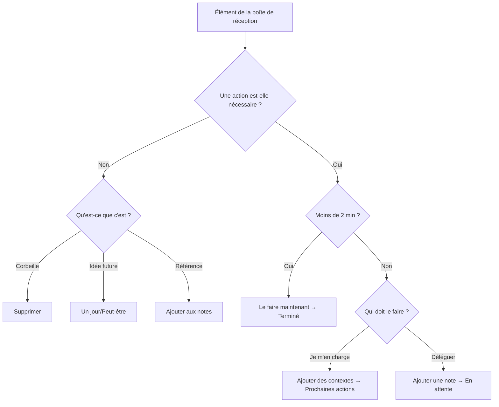

# Flux GTD dans Mindwtr

Ce guide montre comment mettre en œuvre la méthode GTD à l’aide des fonctionnalités de Mindwtr.

---

## Vue d’ensemble

Mindwtr correspond directement aux concepts de GTD :

| Concept GTD | Fonctionnalité Mindwtr |
| ------------- | -------------------------------------- |
| Boîte de réception | Vue Boîte de réception |
| Clarifier | Assistant de traitement |
| Prochaines actions | Vue Focus pour les actions disponibles ; Contextes/Projets/Recherche pour l’inventaire complet |
| Projets | Vue Projets |
| En attente | Vue En attente (statut : `waiting`) |
| Un jour/Peut-être | Vue Un jour/Peut-être (statut : `someday`) |
| Calendrier | Vue Calendrier (tâches ayant des dates d’échéance) |
| Revue hebdomadaire | Assistant de revue |

---

## Modèles

Utilisez ces modèles pour garder un système léger :

- Formulez les prochaines actions comme des gestes physiques visibles : « Appeler l’assurance » est préférable à « Gérer l’assurance ».
- Conservez les documents de soutien d’un projet dans ses notes. N’encombrez pas Focus avec des actions futures qui ne peuvent pas encore être effectuées.
- Divisez les tâches importantes en blocs ou en créneaux, par exemple « Passer 30 minutes à trier les photos ».
- Utilisez les contextes pour les outils, les lieux, l’énergie et les personnes : `@phone`, `@errands`, `#focused`, `@Alex`.
- Placez le travail délégué dans En attente avec une date de suivi ou un contexte de personne.
- Réservez le calendrier au paysage fixe : rendez-vous, échéances et engagements liés à une heure précise.
- Pendant la Revue hebdomadaire, transformez les futures notes de projet en véritables prochaines actions lorsqu’elles deviennent disponibles.
- Choisissez une prochaine action par projet pour un système épuré, ou plusieurs uniquement lorsqu’elles sont réellement parallèles.

---

## 1. Capturer (Boîte de réception)

### Capture rapide

- **Ordinateur :** saisissez dans le champ inférieur ou utilisez le raccourci `a` lorsque l’application est active. `o` ouvre également l’ajout d’une tâche.
- **Mobile :** touchez le champ de saisie dans l’onglet Boîte de réception
- **Balayage mental :** utilisez les invites guidées lorsque vous devez recueillir les boucles ouvertes liées au travail, à la maison, aux personnes, aux courses et aux idées pour un jour.

### Syntaxe d’ajout rapide

Ajoutez immédiatement un contexte lors de la capture :
```
Appeler le plombier @phone @home
Acheter des provisions @errands /due:saturday
Rechercher le sujet #focused +WorkProject
Trier les reçus /energy:low
```

### La règle

Capturez tout. Ne filtrez, ne jugez et n’organisez rien. Sortez-le de votre tête.

---

## 2. Clarifier (assistant de traitement)

### Commencer le traitement

- **Ordinateur :** cliquez sur le bouton « Traiter la boîte de réception »
- **Mobile :** touchez le bouton « Traiter la boîte de réception »

### Le flux



### Points de décision

**Une action est-elle nécessaire ?**
- Non → Supprimez, déplacez vers Un jour/Peut-être ou ajoutez comme référence
- Oui → Continuez

**Faut-il plus d’une étape ?**
- Oui → Transformez la capture en projet : nommez-le et définissez sa prochaine action. Ajoutez autant d’actions supplémentaires que nécessaire. Elles reviennent dans la Boîte de réception avec le projet déjà associé, afin que chacune passe par sa propre clarification
- Non → Continuez comme une action unique

**Cela prendra-t-il moins de 2 minutes ?**
- Oui → Faites-le immédiatement et marquez comme Terminé
- Non → Continuez

**Qui doit s’en charger ?**
- Je m’en charge → Sélectionnez les contextes et déplacez vers Prochaines actions
- Déléguer → Ajoutez une note d’attente et déplacez vers En attente

**Associer un projet ?** (Facultatif)
- Associez les tâches liées à un projet

---

## 3. Organiser

### Statuts des tâches

| Statut | Signification | Vue |
| ---------- | ------------------ | ------------- |
| `inbox` | Pas encore traité | Boîte de réception |
| `next` | Prêt à être effectué | Focus |
| `waiting` | Délégué/bloqué | En attente |
| `someday` | Futur/peut-être | Un jour/Peut-être |
| `done` | Récemment terminé | Terminées |
| `archived` | Terminé et classé | Archivées |

Terminées et Archivées sont deux états fermés, mais ils remplissent des rôles différents :

- **Terminées** est le journal des achèvements récents. Utilisez-le pour les tâches que vous pourriez vouloir voir pendant une revue quotidienne ou hebdomadaire.
- **Archivées** est l’historique classé. Les tâches archivées sont masquées dans les listes de tâches normales, mais restent disponibles dans la vue Archivées pour être recherchées, restaurées ou supprimées définitivement.
- **Archivage automatique** peut déplacer les tâches Terminées vers Archivées après un nombre de jours défini. Réglez-le sur **Jamais** si vous souhaitez que Terminées conserve indéfiniment toutes les tâches achevées.

### Contextes et tags

Ajoutez des contextes pour filtrer selon l’endroit où vous pouvez effectuer les tâches :

**Contextes de lieu (@) :**
- `@home`, `@work`, `@errands`, `@anywhere`
- `@computer`, `@phone`, `@agendas`

**Tags (#) :**
- `#focused` : travail approfondi
- `#lowenergy` : tâches simples
- `#creative` : génération d’idées
- `#routine` : tâches répétitives

### Personnes

Utilisez les Personnes pour le travail délégué ou centré sur une personne. La personne assignée à une tâche alimente les listes En attente, les suggestions et la recherche `assigned:` ; le gestionnaire de Personnes permet de conserver des noms, des notes et des liens de référence réutilisables sans transformer chaque personne en tag de contexte. Supprimer une personne conserve ses tâches et efface l’assignation au lieu de supprimer le travail.

Créez des Personnes depuis le champ **Assigné à** ou dans **Paramètres -> Gérer -> Personnes**. Créez des Domaines depuis le sélecteur **Domaine** ou dans **Paramètres -> Gérer -> Domaines**. Consultez [Domaines et personnes](/fr/use/areas-people) pour connaître les chemins exacts.

### Projets

Créez des projets pour les résultats en plusieurs étapes :

1. Accédez à la vue Projets
2. Ajoutez un nouveau projet avec un nom et, si vous le souhaitez, choisissez son Domaine directement dans le formulaire de création (le Domaine utilisé comme filtre est sélectionné par défaut)
3. Ajoutez des tâches au projet
4. (Facultatif) Créez des **Sections** pour regrouper les tâches par phase ou sous-résultat
5. Basculez entre les modes Séquentiel et Parallèle :
   - **Séquentiel :** seule la première tâche apparaît dans la vue Focus
   - **Parallèle :** toutes les tâches apparaissent dans la vue Focus

La suppression d’un projet ou d’un domaine conserve ses tâches. Mindwtr détache ce travail et le laisse sans attribution au lieu d’effectuer une suppression en cascade.

#### Sections de projet

Les sections de projet sont des subdivisions d’un même projet. Utilisez-les lorsqu’un projet comporte des phases, des jalons ou des flux de travail naturels et qu’une liste de tâches à plat serait difficile à parcourir.

Exemple : **Lancer le site web** peut comporter des sections telles que **Design**, **Développement** et **Contenu**. Il ne s’agit ni de projets distincts ni de sous-tâches. Ce sont des titres d’organisation à l’intérieur d’un seul résultat de projet.

Le champ **Section de projet** d’une tâche l’associe à l’une des sections de son projet. Il n’est utile qu’une fois la tâche rattachée à un projet qui possède des sections. Pour les tâches sans attribution ou les projets sans sections, laissez ce champ vide.

Les projets séquentiels peuvent utiliser une portée au niveau du projet ou de la section. Utilisez la portée de section lorsqu’un projet comporte des phases ou des flux de travail indépendants : Mindwtr affiche la première tâche disponible de chaque section au lieu de bloquer tout le projet derrière une seule tâche.

### Dates d’échéance et rappels

- Définissez une **date d’échéance** pour les délais
- Définissez une **date de début** pour le moment où commencer
- Définissez une **date de revue** (pense-bête) pour les vérifications périodiques

### Dates et statut

Mindwtr sépare le statut et les dates d’une tâche. Le statut est l’état GTD que vous choisissez, comme `inbox`, `next`, `waiting` ou `someday`. Les dates déterminent quand et pourquoi une tâche apparaît ; l’arrivée d’une date ne change jamais d’elle-même le statut d’une tâche.

Il existe un raccourci délibéré au moment de la modification : donner une date de début à un élément de la **Boîte de réception** revient à le clarifier — vous avez décidé quand vous pourrez agir — donc Mindwtr le déplace vers `next` dès que vous définissez la date, comme lorsque vous marquez un élément de la Boîte de réception d’une étoile. Si vous choisissez un statut lors de la même modification, votre choix l’emporte, et les tâches `someday` ou `waiting` conservent toujours leur statut lorsque vous leur attribuez une date : une tâche Un jour datée est un pense-bête, et une tâche En attente datée est un rappel de suivi.

- La **date de début** est un seuil de report/disponibilité. Par défaut, une date de début future masque la tâche dans Focus. Lorsque cette date arrive, la tâche réapparaît avec le statut qu’elle avait déjà.
- La **date de revue** est un pense-bête. Lorsque cette date arrive, Mindwtr fait apparaître la tâche dans les vues qui prennent en charge les éléments à revoir afin que vous puissiez la réexaminer ; rien ne change avant votre décision.
- La **date d’échéance** est un délai. À mesure qu’elle approche ou qu’elle est dépassée, Mindwtr souligne l’échéance de la tâche dans l’affichage, les rappels et l’ordre de tri ; son statut ne change pas.

Certaines actions de traitement définissent à la fois le statut et les dates : choisir **Plus tard** pendant le traitement de la Boîte de réception déplace l’élément vers `next` et définit une date de début, tout comme le fait de définir directement une date de début sur un élément de la Boîte de réception. Ensuite, les dates ne contrôlent plus que la visibilité ; elles ne changent plus jamais le statut.

### Délai relatif avant le début

Utilisez **Délai avant le début** lorsque la date de début doit rester liée à la date d’échéance. Par exemple, une tâche due vendredi peut commencer deux jours avant son échéance, ou une tâche due à 17 h peut commencer trois heures avant. Un délai de **0** signifie que la tâche commence le jour même de son échéance, ce qui convient aux tâches récurrentes qui ne doivent pas apparaître avant le jour où elles sont dues.

Lorsqu’une tâche possède une date d’échéance et un délai avant le début, Mindwtr considère ce décalage comme la source de vérité. Le déplacement de la date d’échéance recalcule la date de début avec le même décalage, et les tâches récurrentes conservent le même délai lorsque l’instance suivante est générée.

Utilisez plutôt une date de début fixe lorsque le travail doit commencer à une date précise du calendrier, quel que soit le déplacement de l’échéance.

---

## 4. Réfléchir (revue hebdomadaire)

### Commencer la revue

- **Ordinateur :** accédez à Revue hebdomadaire dans la barre latérale
- **Mobile :** touchez l’onglet Revue dans la barre inférieure

### Les étapes

1. **Traiter la boîte de réception**
   - Clarifiez tous les éléments de la boîte de réception
   - Objectif : boîte de réception vide
   - Utilisez l’action Traiter la boîte de réception de la revue pour exécuter le flux normal de clarification depuis la Revue hebdomadaire

2. **Examiner le calendrier**
   - Remontez deux semaines en arrière pour repérer les suivis oubliés
   - Regardez deux semaines à l’avance pour déterminer les préparatifs nécessaires

3. **En attente**
   - Examinez les éléments délégués
   - Envoyez des rappels si nécessaire

4. **Examiner les projets**
   - Vérifiez que chaque projet possède une prochaine action
   - Marquez les projets achevés comme terminés

5. **Un jour/Peut-être**
   - Examinez les idées mises en attente
   - Activez ou supprimez des éléments

### Bonne pratique

Planifiez 30 à 90 minutes chaque semaine, au même moment et au même endroit.

---

### Agir

### Choisir sur quoi travailler

Utilisez la vue **Focus** pour voir :
- les tâches sur lesquelles vous vous concentrez aujourd’hui (éléments marqués d’une étoile)
- les Prochaines actions (filtrées par contexte ou générales)
- les éléments en retard
- les éléments dus aujourd’hui

Focus n’est pas une vue d’inventaire complète. Elle masque les tâches dont la date de début est future et les tâches ultérieures des projets séquentiels afin que la liste reflète les actions disponibles maintenant. Utilisez **Contextes**, **Projets** ou **Recherche** pour examiner toutes les prochaines actions, y compris les éléments reportés ou bloqués.

### Comment Focus trie les actions disponibles

Focus détermine d’abord si une tâche est disponible, puis trie les actions visibles :

1. **Focus du jour** affiche les tâches que vous avez explicitement choisies pour aujourd’hui. Vous pouvez les classer manuellement dans l’ordre où vous prévoyez de travailler : faites glisser la poignée sur ordinateur, ou utilisez le bouton de réorganisation dans l’en-tête de la section sur mobile. L’ordre manuel s’applique lorsque le tri de Focus est réglé sur sa valeur par défaut, se synchronise entre les appareils et conserve la place d’une tâche jusqu’à ce qu’elle quitte Focus.
2. **Aujourd’hui/Planning** affiche les tâches `next` disponibles qui sont en retard, dues aujourd’hui ou qui commencent aujourd’hui. Elles sont classées selon l’heure de début/d’échéance la plus proche, puis selon la priorité lorsque les priorités sont activées, puis selon la date de création la plus ancienne.
3. **Prochaines actions** affiche les autres tâches `next` disponibles. L’ordre par défaut est :
   - d’abord les échéances proches, de la date d’échéance la plus proche à la plus lointaine (actuellement celles des 30 prochains jours)
   - ensuite les actions sans date
   - enfin les actions dont l’échéance est plus éloignée, de la date d’échéance la plus proche à la plus lointaine
   - au sein d’une même catégorie : la priorité lorsqu’elle est activée, puis l’heure de début, la date de création la plus ancienne, le titre et l’identifiant
4. **À revoir** affiche les tâches dont la date de revue est arrivée. Après avoir examiné un élément, vous pouvez effacer sa date de revue (**Marquer comme examiné**) ou la reporter avec **Revoir dans 1 semaine**, sur ordinateur depuis le menu d’actions rapides de la tâche et sur mobile en appuyant longuement sur la ligne.

La date de début est le champ de report/date planifiée de Mindwtr. Focus masque toujours les tâches dont la date de début est future jusqu’au jour de leur début ; la liste Prochaines actions les comptabilise dans un avis « masquées (début futur) » avec un bouton **Afficher** pour regarder en avance. Les projets séquentiels limitent également Focus à la première action disponible du projet ou de la section, de sorte que les actions suivantes restent hors de Focus jusqu’à ce que l’étape précédente cesse de les bloquer.

L’estimation du temps et l’énergie sont des filtres et des options de regroupement dans Focus, pas des clés de tri par défaut. Le regroupement par contexte, projet, domaine, énergie ou priorité modifie les groupes visuels ; les tâches au sein de ces groupes conservent le même ordre de disponibilité et de prochaines actions.

### Filtrer par contexte

1. Accédez à la vue **Focus** ou **Contextes**
2. Sélectionnez une pastille de contexte (par exemple, @home)
3. Affichez uniquement les tâches de ce contexte

### Focus du jour

Marquez d’une étoile les tâches prioritaires du jour jusqu’à la limite Focus configurée :
- **Ordinateur :** cliquez sur l’icône en forme d’étoile
- **Mobile :** touchez le badge en forme d’étoile

---

## Flux quotidien

### Matin

1. Ouvrez la vue **Focus** pour voir les priorités du jour
2. Définissez les tâches Focus de la journée jusqu’à la limite configurée
3. Commencez à travailler sur la première (marquez-la comme Focus)

### Au fil de la journée

1. Capturez les nouveaux éléments dans la Boîte de réception
2. Consultez les listes filtrées par contexte lorsque vous changez de lieu
3. Marquez les tâches achevées comme Terminées

### Fin de journée

1. Parcourez rapidement la Boîte de réception (traitez-la si vous avez le temps)
2. Consultez le calendrier de demain
3. Mettez à jour les tâches en cours

---

## Tâches récurrentes

Configurez les tâches récurrentes depuis le champ **Récurrence** de l’éditeur de tâche. Choisissez une récurrence quotidienne, hebdomadaire, mensuelle ou annuelle, puis indiquez si la tâche doit conserver un calendrier fixe ou se répéter après son achèvement.

Mindwtr conserve une seule instance active d’une tâche récurrente. Les occurrences futures ne sont pas préremplies sous forme de véritables tâches ; la tâche suivante apparaît lorsque vous terminez la tâche actuelle. Vous pouvez activer **Afficher la prochaine occurrence dans le calendrier** si vous souhaitez un aperçu de planification.

**Exemples de tâches récurrentes :**
- Hebdomadaire : « Examiner l’état du projet »
- Quotidienne : « Consulter les e-mails @computer »
- Mensuelle : « Examiner les abonnements »

Pour connaître les étapes de configuration et le détail des options, consultez [Tâches récurrentes](/fr/use/recurring-tasks).

---

## Conseils pour réussir

### Faire confiance à votre système

- Capturez tout immédiatement
- Traitez régulièrement
- Ne sautez pas les revues hebdomadaires

### Rester simple

- N’organisez pas excessivement
- Utilisez d’abord les contextes avec parcimonie
- N’ajoutez de la complexité que lorsque c’est nécessaire

### Créer des habitudes

- Effectuez la revue hebdomadaire toujours au même moment
- Traitez régulièrement la boîte de réception
- Utilisez une méthode de capture cohérente

---

## Voir aussi

- [Présentation de GTD](/fr/use/gtd-overview)
- [Contextes et tags](/fr/use/contexts-tags)
- [Revue hebdomadaire](/fr/use/weekly-review)
