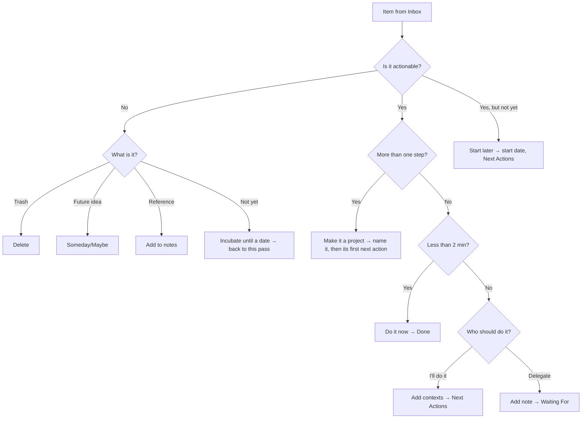

# GTD Workflow in Mindwtr

This guide shows how to implement the GTD methodology using Mindwtr's features.

---

## Overview

Mindwtr maps directly to GTD concepts:

| GTD Concept   | Mindwtr Feature                        |
| ------------- | -------------------------------------- |
| Inbox         | Inbox view                             |
| Clarify       | Processing wizard                      |
| Next Actions  | Focus view for available actions; Contexts/Projects/Search for full inventory |
| Projects      | Projects view                          |
| Waiting For   | Waiting For view (status: `waiting`)   |
| Someday/Maybe | Someday/Maybe view (status: `someday`) |
| Calendar      | Calendar view (tasks with due dates)   |
| Weekly Review | Review wizard                          |


[Open the interactive diagram](/assets/diagrams/gtd-workflow.html)

---

## Patterns

Use these patterns to keep the system light:

- Write next actions as visible physical steps: "Call insurance" beats "Handle insurance."
- Keep project support material in project notes. Do not flood Focus with future actions that cannot be done yet.
- Break large tasks into chunks or time boxes, such as "Spend 30 minutes sorting photos."
- Use contexts for tools, places, energy, and people: `@phone`, `@errands`, `#focused`, `@Alex`.
- Put delegated work in Waiting For with a follow-up date or person context.
- Keep the calendar for hard landscape: appointments, deadlines, and time-specific commitments.
- During Weekly Review, promote future project notes into real next actions when they become available.
- Choose one next action per project for a lean system, or multiple only when they are truly parallel.

---

## 1. Capture (Inbox)

### Quick Capture

- **Desktop:** Type in the bottom input field or use the app-focused `a` shortcut. `o` also opens add task.
- **Mobile:** Tap the input field on the Inbox tab
- **Mind Sweep:** Use guided prompts when you need to collect open loops across work, home, people, errands, and someday ideas.

### Quick-Add Syntax

Capture with context immediately:
```
Call plumber @phone @home
Buy groceries @errands /due:saturday
Research topic #focused +WorkProject
Sort receipts /energy:low
```

### The Rule

Capture everything. Don't filter, judge, or organize. Get it out of your head.

---

## 2. Clarify (Processing Wizard)

### Starting the Process

- **Desktop:** Click "Process Inbox" button
- **Mobile:** Tap "Process Inbox" button

### Refining the Title

The title stays editable through every step of the wizard, and it reads the same quick-add syntax as capture:

- `@context`, `#tag`, `!Area`, `+Existing Project`, `%Person`
- `/energy:`, `/priority:`, `/start:`, `/due:`, `/review:`, `/note:`, `/link:`

Typed contexts and tags are added to the ones you already picked, never swapped for them. A status token such as `/waiting` is ignored while clarifying — the destination you choose in the workflow decides the status. A `+Name` that matches no existing project stays in the title; clarifying never creates a project from a token.

On desktop the cursor starts in the title as each item opens, placed at the end of the text, so your first keystroke refines the capture instead of replacing it.

### The Workflow



### Decision Points

**Is it actionable?**
- No → Delete, add as reference, move to Someday/Maybe, or **Incubate**: pick a date and the item returns to this pass so you can decide again
- Yes → Continue, or **Start later** to give an action you have already decided on a start date and file it under Next Actions

**More than one step?**
- Yes → Turn the capture into a project: name it and define its next action. Add as many further actions as you need. They land back in the Inbox with the project already attached, so each gets its own clarify pass
- No → Continue as a single action

**Will it take less than 2 minutes?**
- Yes → Do it immediately, mark Done
- No → Continue

**Who should do it?**
- I'll do it → Select contexts, move to Next Actions
- Delegate → Add waiting note, move to Waiting For

**Assign a project?** (Optional)
- Link related tasks to a project

### Worked Example: A Two-Step Errand

A safety recall notice arrives for your car. You capture **Car safety recall notice**, which lands in the Inbox. Handling it takes two actions — call the dealer, then take the car in — so during processing it becomes a project rather than a single task. Click **Process Inbox**, then:

1. **Refine the task** is the first screen. Reword the capture if it is vague, then click **Next**.
2. **Is this actionable?** Click **Yes, it's actionable**.
3. **More than one step?** Click **Yes, make it a project**.
4. Name the project — *Car safety recall* — and type the first real action under **Next action**: *Call the dealer to book the recall appointment*.
5. Click **+ Add another action** and type the follow-up step: *Take the car in for the recall*.
6. Click **Create project & add next action**.

Mindwtr creates the project, turns your capture into its first next action, and sends the follow-up step back to the Inbox with the project already attached, so you clarify it on its own — including the appointment date once you have it. Processing then continues with the next inbox item. If a later step is unknowable today, leave it out and capture it after the call; the project keeps the outcome visible until nothing is left to do.

---

## 3. Organize

### Task Statuses

| Status     | Meaning            | View          |
| ---------- | ------------------ | ------------- |
| `inbox`    | Not yet processed  | Inbox         |
| `next`     | Ready to do next   | Focus         |
| `waiting`  | Delegated/blocked  | Waiting For   |
| `someday`  | Future/maybe       | Someday/Maybe |
| `done`     | Recently completed | Done          |
| `archived` | Completed and filed away | Archived      |

Done and Archived are both closed states, but they serve different jobs:

- **Done** is the recent completion log. Use it for tasks you may want to see during daily or weekly review.
- **Archived** is filed history. Archived tasks are hidden from normal task lists, but stay available in the Archived view for search, restore, or permanent deletion. The Archived view also lists archived projects behind a Tasks | Projects switch, where they can be restored or deleted.
- **Auto-Archive** can move Done tasks to Archived after a set number of days. Set it to **Never** if you want Done to keep all completed tasks indefinitely.


[Open the interactive diagram](/assets/diagrams/task-lifecycle.html)

### Someday/Maybe sections

Use named sections to break a long Someday/Maybe list into themes such as Trips, Books, or Home. Create a section while assigning a Someday task, or manage names and order under **Settings → Manage → Someday sections**. The first section turns grouping on; later grouping choices remain yours. Deleting or renaming a section does not delete its tasks, and the section assignments sync with supported devices.

### Contexts and Tags

Add contexts to filter by where you can do tasks:

**Location contexts (@):**
- `@home`, `@work`, `@errands`, `@anywhere`
- `@computer`, `@phone`, `@agendas`

**Tags (#):**
- `#focused`: Deep work
- `#lowenergy`: Simple tasks
- `#creative`: Brainstorming
- `#routine`: Repetitive tasks

### People

Use People for delegated or person-centered work. A task's assignee powers Waiting For lists, suggestions, and `assigned:` search; the People manager lets you keep reusable names, notes, and reference links without turning every person into a context tag. Deleting a person keeps their tasks and clears the assignee instead of deleting the work.

Create People from the **Assigned to** field or in **Settings -> Manage -> People**. Create Areas from the **Area** picker or **Settings -> Manage -> Areas**. See [Areas and People](/use/areas-people) for the exact paths.

### Projects

Create projects for multi-step outcomes:

1. Go to Projects view
2. Add a new project with a name, and optionally pick its Area right in the create form (it defaults to the Area you are filtering by)
3. Add tasks to the project
4. (Optional) Create **Sections** to group tasks by phase or sub‑outcome
5. Toggle Sequential/Parallel mode:
   - **Sequential:** Only first task shows in Focus view
   - **Parallel:** All tasks show in Focus view

Deleting a project or area keeps its tasks. Mindwtr detaches that work to unassigned instead of cascading deletion.


[Open the interactive diagram](/assets/diagrams/project-lifecycle.html)

#### Project Sections

Project Sections are subdivisions inside a single project. Use them when a project has natural phases, milestones, or workstreams and a flat task list would be hard to scan.

Example: **Launch website** can have sections such as **Design**, **Development**, and **Content**. These are not separate projects and not subtasks. They are organizational headings inside one project outcome.

The **Project Section** field on a task assigns that task to one of its project's sections. It is useful only after the task belongs to a project that has sections. For unassigned tasks, or projects without sections, leave the field blank.

Sequential projects can use a project-wide scope or a section scope. Use section scope when a project has independent phases or workstreams: Mindwtr shows the first available task in each section instead of blocking the whole project behind one task. With section scope, completing a section's last next action asks "What's the next action?" for that section, just as finishing a project's last action does for the whole project.

### Due Dates and Reminders

- Set **due date** for deadlines
- Set **start date** for when to begin
- Set **review date** (tickler) for periodic check-ins

For tasks with a due time, set **Repeat reminder** to 5, 10, 15, 30, or 60 minutes. For tasks with a timed start or due date, **Skip reminders** disables start and due reminders without removing the task from Focus or other lists.

### Dates vs. Status

Mindwtr keeps task status and task dates separate. Status is the GTD state you choose, such as `inbox`, `next`, `waiting`, or `someday`. Dates control when and why a task appears; a date arriving never changes a task's status on its own.

There is one deliberate shortcut at edit time: giving an **Inbox** item a start date counts as clarifying it — you have decided when you can act on it — so Mindwtr moves it to `next` the moment you set the date, the same way starring an Inbox item does. If you pick a status in the same edit, your choice wins, and `someday` or `waiting` tasks always keep their status when you date them: a dated someday is a tickler, a dated waiting-for is a follow-up reminder.

- **Start date** is a defer/availability gate. A future start hides the task from Focus by default. When the date arrives, the task appears again with whatever status it already has. If the start has a specific time, Next Actions keeps the task hidden until that time of day, so a task startable at 5:00 PM does not clutter the morning's list; the **Today** section still lists it, in time order. Starts on another day within the next 7 days are still previewed in the Focus **Upcoming** section, so a deferral never lands unannounced.
- **Review date** is a tickler. When the date arrives, Mindwtr surfaces the task where that view supports review-due items so you can reconsider it; nothing changes until you decide.
- **Due date** is a deadline. As it approaches or passes, Mindwtr gives the task deadline emphasis through display, reminders, and sorting pressure; status stays unchanged.

Some processing actions set status and dates together — choosing **Later** while processing the Inbox moves the item to `next` and sets a start date, and setting a start date on an Inbox item directly does the same. After that, dates only control visibility; they never change status again.

### Planned but Not Yet Actionable

Some work is fully committed but cannot be started yet. Mindwtr gives it no status of its own, and that is deliberate: "not yet" is a fact about sequence or timing, not another GTD state.

If the task waits on earlier steps in the same project, leave it as `next` and put the project in Sequential mode. Only the first open task reaches Focus and Next actions; the rest stay in the project view marked **Later in sequence**, so the whole chain is on record without crowding your action lists. Section scope does the same thing per phase when a project has independent workstreams.

If the task waits on a date instead, give it a start date. It stays out of Focus and Next actions until that day and then reappears with the status it already had, which is availability rather than a deadline — add a due date only when the work truly has one. Keep the neighbouring statuses for what they actually mean: `someday` is work you have not committed to, and `waiting` is work blocked on another person.

### Relative Start Lead Time

Use **Start lead time** when the start date should stay tied to the due date. For example, a task due Friday can start two days before due, or a task due at 5:00 PM can start three hours before due. A lead time of **0** means the task starts on the due date itself, which suits recurring chores that shouldn't appear until the day they're due.

When a task has a due date and a start lead time, Mindwtr treats the offset as the source of truth. Moving the due date recalculates the start date from the same offset, and recurring tasks keep the same lead time when the next instance is generated.

Use a fixed start date instead when the work should begin on a specific calendar date regardless of when the deadline moves.

---

## 4. Reflect (Weekly Review)

### Starting the Review

- **Desktop:** Go to Weekly Review in sidebar
- **Mobile:** Tap the Review tab in the bottom bar

### The Steps

1. **Process Inbox**
   - Clear all inbox items
   - Goal: Inbox Zero
   - Use the review's Process Inbox action to run the normal clarify workflow from inside Weekly Review

2. **Review Calendar**
   - Look back 2 weeks for missed follow-ups
   - Look ahead 2 weeks for preparation needs

3. **Waiting For**
   - Review delegated items
   - Send reminders if needed

4. **Review Projects**
   - Ensure each project has a next action
   - Mark completed projects as done

5. **Someday/Maybe**
   - Review incubated ideas
   - Activate or delete items

### Best Practice

Schedule 30-90 minutes weekly, same time, same place.

---

### Engage

### Choosing What to Work On

Use the **Focus** view to see:
- Today's focused tasks (starred items)
- Next Actions (context-filtered or general)
- Overdue items
- Due today
- Upcoming next actions that start or recur within the next 7 days

Focus is not a full inventory view. It keeps future-start tasks and later tasks in sequential projects out of the actionable lists so they reflect actions that are available now. Use **Contexts**, **Projects**, or **Search** when you need to inspect all next actions, including deferred or blocked items.

### How Focus sorts available actions

Focus first decides whether a task is available, then sorts the visible actions:

1. **Today's Focus** shows tasks you explicitly focused for today. You can arrange them by hand into the order you plan to work them — drag the grip handle on desktop, or use the reorder toggle on the section header on mobile. The manual order applies while the Focus sort is at its default, syncs across devices, and a task keeps its place until it leaves Focus.
2. **Today / Schedule** shows available `next` tasks that are overdue, due today, or start today, including a start timed for later today, with those rows showing their start time until it arrives. These are ordered by the earliest due/start time, then priority when priorities are enabled, then oldest creation date.
3. **Next Actions** shows the remaining available `next` tasks. The default order is:
   - due soon first, earliest due date first (currently due within the next 30 days)
   - undated actions next
   - far-future due actions last, earliest due date first
   - within the same bucket: priority when enabled, then start time, oldest creation date, title, and id
4. **Upcoming** previews `next` tasks the deferral currently holds back until another day but which surface within the next 7 days — a future start date, or a recurring task waiting for its next due or review date. Rows are sorted by the day they will appear and show that date; they are a preview only, so they cannot be starred into Today's Focus, and the section disappears when nothing is coming.
5. **Review Due** shows tasks whose review date is due. After looking an item over, you can clear its review date (**Mark reviewed**) or push it out with **Review in 1 week**, on desktop from the task's quick-action menu, on mobile by long-pressing the row.

Start date is Mindwtr's defer/planned-date field. A future-start task stays out of the actionable lists until its start day; the **Upcoming** section is the built-in peek ahead for the coming week, and **Projects** or **Search** show deferrals further out. Sequential projects also limit Focus to the first available action for that project or section, so later actions stay out of Focus until the previous step is no longer blocking them.

Time estimate and energy are Focus filters and grouping options, not default sort keys. Grouping by context, project, area, energy, or priority changes the visual groups; tasks inside those groups keep the same availability and next-action ordering.

### Context Filtering

1. Go to **Focus** or **Contexts** view
2. Select a context chip (e.g., @home)
3. See only tasks for that context

### Today's Focus

Star tasks as today's priorities up to your configured Focus limit:
- **Desktop:** Click the star icon
- **Mobile:** Tap the star badge

---

## Daily Workflow

### Morning

1. Open **Focus** view to see today's priorities
2. Set focus tasks for the day up to your configured Focus limit
3. Start working on the first one (mark as Focus)

### Throughout the Day

1. Capture new items to Inbox
2. Check context-filtered lists when switching locations
3. Mark completed tasks as Done

### End of Day

1. Quick scan of Inbox (process if time)
2. Review tomorrow's calendar
3. Update any in-progress tasks

---

## Recurring Tasks

Set up recurring tasks from the task editor's **Recurrence** field. Choose daily, weekly, monthly, or yearly recurrence, then choose whether the task stays on a fixed schedule or repeats after completion.

Mindwtr keeps one active instance of a recurring task. Future occurrences are not pre-populated as real tasks; the next task appears when you complete the current one. You can turn on **Show future occurrences in Calendar** when you want a planning preview.

**Example recurring tasks:**
- Weekly: "Review project status"
- Daily: "Check email @computer"
- Monthly: "Review subscriptions"

For setup steps and option details, see [Recurring Tasks](/use/recurring-tasks).

---

## Tips for Success

### Trust Your System

- Capture everything immediately
- Process regularly
- Don't skip weekly reviews

### Keep It Simple

- Don't over-organize
- Use contexts sparingly at first
- Add complexity only when needed

### Build Habits

- Same time for weekly review
- Regular inbox processing
- Consistent capture method

---

## See Also

- [GTD Overview](/use/gtd-overview)
- [Contexts and Tags](/use/contexts-tags)
- [Weekly Review](/use/weekly-review)
