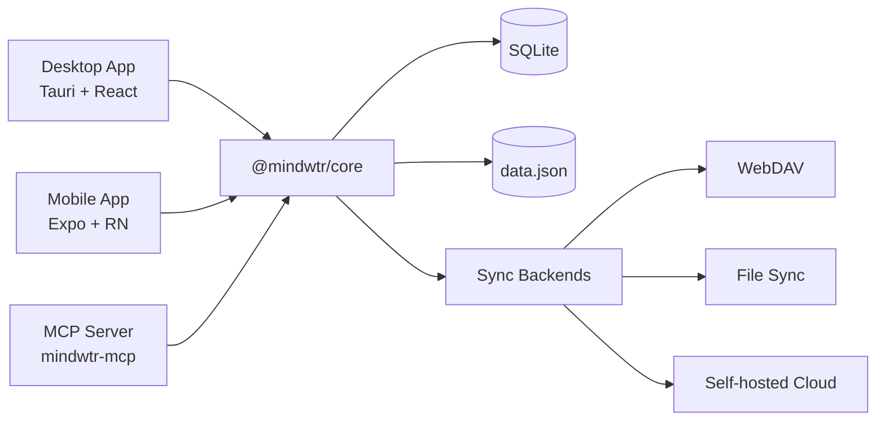

# 架构

Mindwtr 的技术架构和设计决策。

---

## 概览

Mindwtr 是一款跨平台 GTD 应用，包含：

- **桌面应用** — Tauri v2（Rust + React）
- **移动应用** — React Native + Expo
- **MCP 服务器** — 面向 AI 工具的本地模型上下文协议桥接服务
- **云同步** — Node.js（Bun）同步服务器
- **共享核心** — TypeScript 业务逻辑包

```
┌─────────────────────────────────────────────────────────┐
│                       User Interface                      │
├─────────────────────────────┬───────────────────────────┤
│      Desktop (Tauri)        │      Mobile (Expo)        │
│   React + Vite + Tailwind   │  React Native + NativeWind│
├─────────────────────────────┴───────────────────────────┤
│                     @mindwtr/core                        │
│ Zustand Store · Types · i18n Loader/Locales · Sync Core │
├─────────────────────────────┬───────────────────────────┤
│    Tauri FS (Rust)          │   SQLite + JSON backup    │
│    SQLite + JSON backup     │     App storage           │
└──────────────┬──────────────┴───────────────────────────┘
               │
┌──────────────▼──────────────┐
│        Cloud / Sync         │
│   WebDAV / Local / Server   │
└─────────────────────────────┘
```

## 设计权衡

- **云同步基于文件**，并针对单机自托管进行了优化。
- **SQLite 外键约束已启用**，以保证有效记录的完整性；软删除/墓碑记录的修复仍由共享应用逻辑处理。
- **硬删除很少见，但确实存在**。`sections.projectId` 使用 `ON DELETE CASCADE`，而任务、项目和领域的引用大多使用 `ON DELETE SET NULL`。

### 系统图（Mermaid）



---

## Monorepo 结构

项目采用带有 Bun 工作区的 monorepo：

```
Mindwtr/
├── apps/
│   ├── cloud/           # Sync server (Bun)
│   ├── desktop/         # Tauri app
│   ├── mcp-server/      # Local MCP server
│   └── mobile/          # Expo app
├── packages/
│   └── core/            # Shared business logic
└── package.json         # Workspace root
```

### 优点

- 跨平台共享代码
- 依赖版本统一
- 测试和 CI 统一
- 更容易重构

---

## 核心包（`@mindwtr/core`）

核心包包含所有共享业务逻辑：

### 模块

| 模块 | 用途 |
| --- | --- |
| `store.ts` | 包含所有操作的 Zustand 状态存储 |
| `types.ts` | TypeScript 接口（Task、Project 等） |
| `i18n/i18n-loader.ts` | 延迟加载翻译 |
| `i18n/i18n-translate.ts` | 构建时翻译辅助函数 |
| `i18n/locales/*.ts` | 英文基础语言包及各语言覆盖项 |
| `contexts.ts` | 预设情境和标签 |
| `quick-add.ts` | 自然语言任务解析器 |
| `recurrence.ts` | 重复任务逻辑（部分支持 RFC 5545） |
| `sync.ts` + `sync-*.ts` | 同步合并核心及共享同步辅助函数；请参阅下方模块列表 |
| `date.ts` | 安全的日期解析工具 |
| `ai/` | AI 集成（Gemini/OpenAI/Anthropic） |
| `sqlite-adapter.ts` | 本地存储适配器接口 |
| `webdav.ts` | WebDAV 同步客户端 |

当前的同步子模块按职责拆分协议：`sync-run.ts` 是 `sync-run-ports.ts` 中各端口背后的共享同步周期状态机（阶段排序、无变化跳过检查、附件阶段、错误/重新排队处理）——桌面端和移动端提供传输、存储及通知适配器（ADR 0014）；`sync-orchestrator.ts` 串行执行同步周期并将后续周期加入队列，`sync-normalization.ts` 修复载荷形状，`sync-signatures.ts` 计算可比较的内容签名，`sync-merge-settings.ts` 合并设置组，`sync-tombstones.ts` 处理保留期清理，`sync-revision.ts` 标记修订版本，而 `sync-client-helpers.ts` / `sync-service-utils.ts` 则包含平台服务辅助函数。

### 设计原则

1. **平台无关** — 不包含平台专用代码
2. **存储适配器模式** — 在运行时注入存储
3. **纯函数** — 工具函数无状态
4. **类型安全** — 完整的 TypeScript 覆盖

### 状态分层

- **核心存储**保存规范数据（`all tasks/projects`）。
- **UI 存储**保存视图专用的筛选条件和 UI 状态。
- **可见列表**由核心数据和 UI 筛选条件派生，以免将持久化关注点与呈现混在一起。

---

## 桌面端架构（Tauri）

### 为什么选择 Tauri？

| 特性 | Tauri | Electron |
| --- | --- | --- |
| 二进制文件大小 | ~5 MB | ~150 MB |
| 内存占用 | ~50 MB | ~300 MB |
| 后端 | Rust | Node.js |
| Webview | 系统自带 | 捆绑 Chromium |

### 结构

```
apps/desktop/
├── src/                         # React frontend
│   ├── App.tsx                  # Root component and app shell wiring
│   ├── main.tsx                 # Vite/Tauri webview entry
│   ├── components/
│   │   ├── Task/                # Task form, field, and editor components
│   │   ├── ui/                  # Shared primitive UI components
│   │   └── views/               # Feature views
│   │       ├── agenda/
│   │       ├── calendar/
│   │       ├── inbox/
│   │       ├── list/
│   │       ├── projects/
│   │       ├── review/
│   │       └── settings/
│   ├── config/                  # Desktop app constants/config
│   ├── contexts/                # React contexts
│   ├── hooks/                   # Shared React hooks
│   ├── lib/                     # Desktop services and Tauri bridges
│   ├── store/                   # UI-specific state
│   ├── test/                    # Desktop test utilities
│   └── utils/                   # Small shared utilities
│
├── src-tauri/                  # Rust backend
│   ├── src/main.rs             # Entry point
│   ├── src/platform.rs         # Native commands and path validation
│   ├── capabilities/           # Tauri command/plugin permissions
│   ├── Cargo.toml              # Rust dependencies
│   └── tauri.conf.json         # Tauri config
│
└── package.json
```

### 数据流

```
User Action → React Component → Zustand Store (@mindwtr/core) → Storage Adapter → SQLite + data.json
```

### Tauri 命令

Rust 后端提供以下命令：
- 打开许可列表中的文件，以及执行附件/存储操作
- 原生对话框
- 系统通知

---

## 移动端架构（Expo）

### 为什么选择 Expo？

- 托管工作流简化开发
- 支持 OTA 更新
- 使用 Expo Router 实现基于文件的导航
- 构建过程简单（EAS）

### 结构

```
apps/mobile/
├── app/                   # Expo Router pages
│   ├── (drawer)/         # Drawer navigation
│   │   ├── (tabs)/       # Tab navigation
│   │   │   ├── calendar-tab.tsx
│   │   │   ├── capture-quick.tsx
│   │   │   ├── inbox.tsx
│   │   │   ├── focus.tsx
│   │   │   ├── capture.tsx
│   │   │   ├── contexts-tab.tsx
│   │   │   ├── projects.tsx
│   │   │   ├── review-tab.tsx
│   │   │   └── menu.tsx
│   │   ├── calendar.tsx
│   │   ├── contexts.tsx
│   │   ├── saved-search/[id].tsx
│   │   ├── board.tsx
│   │   ├── waiting.tsx
│   │   ├── someday.tsx
│   │   ├── done.tsx
│   │   ├── trash.tsx
│   │   ├── archived.tsx
│   │   ├── reference.tsx
│   │   ├── projects-screen.tsx
│   │   └── settings.tsx
│   └── _layout.tsx       # Root layout
│
├── components/           # Shared components
├── contexts/             # Theme, Language
├── lib/                  # Storage, sync utilities
└── package.json
```

### 导航

```
Drawer/Stack Layout
├── Tab Navigator
│   ├── Inbox
│   ├── Agenda
│   ├── Next Actions
│   ├── Projects
│   └── Menu (links to other views)
├── Other Screens (Stack)
│   ├── Board
│   ├── Calendar
│   ├── Review
│   ├── Contexts
│   ├── Waiting For
│   ├── Someday/Maybe
│   ├── Archived
│   └── Settings
```

---

## 状态管理

### Zustand 存储

中央存储（`@mindwtr/core/src/store.ts`）管理所有应用状态：

```typescript
interface TaskStore {
    tasks: Task[];
    projects: Project[];
    areas: Area[];
    settings: AppData['settings'];

    // Actions
    fetchData: () => Promise<void>;
    addTask: (title: string, props?: Partial<Task>) => Promise<void>;
    updateTask: (id: string, updates: Partial<Task>) => Promise<void>;
    deleteTask: (id: string) => Promise<void>;
    // ... projects, areas, and settings actions
}
```

### 存储适配器模式

存储使用注入的存储适配器：

```typescript
// Desktop: Tauri file system
setStorageAdapter(tauriStorage);

// Mobile: SQLite (with JSON backup fallback)
setStorageAdapter(mobileStorage);
```

### 持久化

- **写入合并** — 更改会立即加入队列，重叠的写入会合并到下一次刷新中
- **退出时刷新** — 应用进入后台时刷新待处理的保存操作
- **软删除** — 条目会通过 `deletedAt` 标记，以便同步

---

## 数据模型

规范类型接口位于[核心 API](/zh-Hans/developers/core-api) 和 `packages/core/src/types.ts`。

- 请使用[核心 API](/zh-Hans/developers/core-api) 查看 `Task`、`Project`、`Section`、`Area`、`Person`、`Attachment` 和 `AppData` 当前的字段级文档。
- `rev`、`revBy`、`purgedAt`、`orderNum`、`mimeType`、`size`、`cloudKey` 和 `localStatus` 等同步敏感字段的演进通常比本架构概览更频繁。
- 将详细类型清单集中在一个页面中，可以避免架构文档与代码发生偏差。

---

## 同步策略

### 支持修订版本的 LWW 与墓碑记录

数据同步依赖支持修订版本、并具有确定性平局决胜规则的最后写入胜出机制。

### 合并逻辑

1. **冲突解决**：
    - 如果两端都有修订版本，则先以较高的 `rev` 胜出，再以时间戳决胜。
    - `rev` 是每个实体的编辑计数器，而非向量时钟，因此一端进行较多次离线编辑后，可能胜过另一设备上时间更新但只有一次的编辑。
    - 如果修订版本相同，则比较 `updatedAt`。
    - 如果时间戳仍相同，则比较确定性的规范化内容签名，确保每台设备选择同一胜者。
    - 对于没有修订元数据的旧版实体，在 5 分钟时钟偏差阈值内的 `updatedAt` 值会被视为确定性平局；超出该窗口时，较新的 `updatedAt` 胜出。
2. **墓碑记录**：
    - 已删除条目会保留其记录，并设置 `deletedAt`。
    - 防止条目在同步时复活。
    - 支持在设备间正确合并。
    - 删除与有效记录的冲突使用操作时间（墓碑记录采用 `max(updatedAt, deletedAt)`）。
    - 如果删除操作与有效记录操作发生在 30 秒的歧义窗口内，Mindwtr 会保留有效条目，而不是急于删除它。
3. **冲突**：
    - 元数据级冲突会自动解决。
    - 设置按同步组（`appearance`、`language`、`gtd`、`externalCalendars`、`ai`、`savedFilters`）合并，而不是使用一个庞大对象的时间戳。
    - 已保存筛选条件之间的有效记录冲突严格使用各筛选条件自身的 `updatedAt`；仅当时间戳相同或不可用时，才使用确定性回退规则。
    - 当合并偏差超过当前的 5 分钟阈值时，会触发较大时钟偏差警告。

### 同步周期

```
1. Read Local Data
2. Read Remote Data (Cloud/WebDAV/File)
3. Merge (Memory) -> Generate Stats (conflicts, updates)
4. Write Local with pending-remote-write marker
5. Write Remote
6. Clear pending-remote-write marker locally
```

如果在本地持久化后远程写入失败，Mindwtr 会存储重试元数据，并以从 5 秒到 5 分钟的退避间隔重试。

### 快照传输

Mindwtr 的同步机制目前有意传输完整快照。这并不是尚未实现增量系统的临时替代方案。

- ADR 0003 和 ADR 0007 定义了在这些快照上运行的、支持修订版本的合并规则。
- ADR 0008 记录了当前的传输决策：保留快照合并，暂不添加增量日志。
- 对于当前的个人 GTD 工作负载，快照同步使实现更简单，保留完整文件的原子性，并避免额外的重放和压缩状态。
- 如果未来改变这一点，增量设计应扩展现有的 `rev` 和 `revBy` 模型，而不是用新的序列系统取代它。

仅当快照文件经常超过 5 MB、典型网络上的同步往返时间超过 5 秒，或产品需要实时多设备流式同步时，才应重新评估增量日志决策。

测试覆盖和发布门禁在[测试策略](/zh-Hans/developers/testing-strategy)中单独跟踪，以便本页面专注于运行时架构。

---

## 国际化

### 结构

翻译分布在 `packages/core/src/i18n/` 文件夹中：

```typescript
// packages/core/src/i18n/i18n-loader.ts
// packages/core/src/i18n/i18n-translations.ts
// packages/core/src/i18n/locales/*.ts
```

### 用法

每个应用都有一个语言上下文，用于提供 `t()` 函数。
