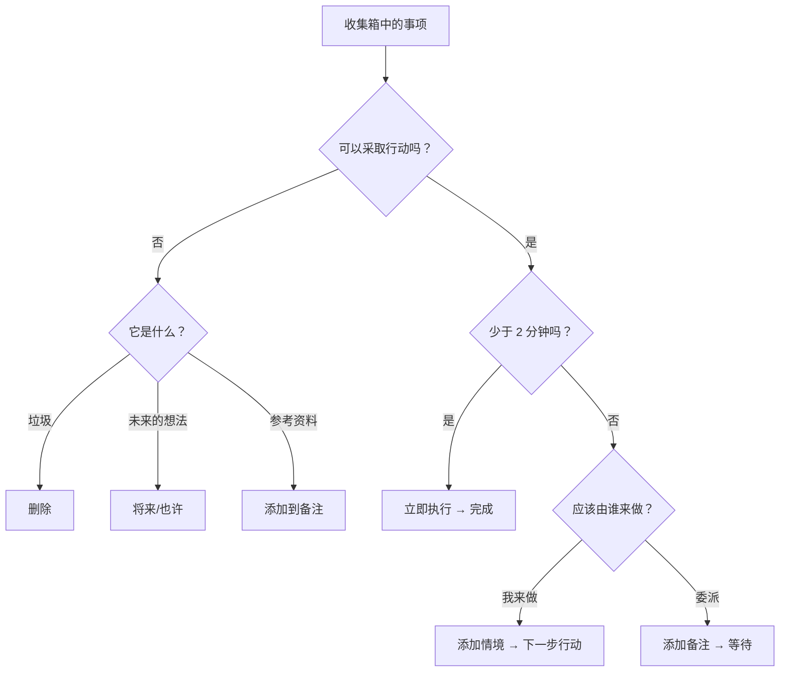

# 如水中的 GTD 工作流

本指南介绍如何使用如水的功能实践 GTD 方法。

---

## 概览

如水与 GTD 概念直接对应：

| GTD 概念     | 如水功能                               |
| ------------ | -------------------------------------- |
| 收集箱       | 收集箱视图                             |
| 明确意义     | 处理向导                               |
| 下一步行动   | 用焦点视图查看可执行的行动；用情境/项目/搜索查看完整清单 |
| 项目         | 项目视图                               |
| 等待         | 等待视图（状态：`waiting`）            |
| 将来/也许    | 将来/也许视图（状态：`someday`）       |
| 日历         | 日历视图（含截止日期的任务）           |
| 每周回顾     | 回顾向导                               |

---

## 实践模式

使用以下模式，让系统保持轻量：

- 将下一步行动写成看得见的具体动作：“致电保险公司”优于“处理保险事宜”。
- 将项目支持材料放在项目备注中。不要让尚且无法执行的未来行动充斥焦点视图。
- 将大型任务拆分成小块或时间盒，例如“花 30 分钟整理照片”。
- 使用情境表示工具、地点、精力和人员：`@phone`、`@errands`、`#focused`、`@Alex`。
- 将已委派的工作放入等待视图，并添加跟进日期或人员情境。
- 只把硬性日程放入日历：约会、截止期限和指定时间的承诺。
- 每周回顾时，当未来项目备注变得可执行，就将其转化为真正的下一步行动。
- 若想保持系统精简，每个项目只选一个下一步行动；只有行动确实可以并行时，才选择多个。

---

## 1. 收集（收集箱）

### 快速收集

- **桌面端：** 在底部输入框中输入，或在应用获得焦点时使用快捷键 `a`。`o` 也可以打开添加任务界面。
- **移动端：** 点击收集箱标签页中的输入框
- **思绪清理：** 当你需要收集工作、家庭、人员、跑腿事务和将来想法等各方面尚未闭合的事项时，使用引导提示。

### 快速添加语法

收集时立即添加情境：
```
Call plumber @phone @home
Buy groceries @errands /due:saturday
Research topic #focused +WorkProject
Sort receipts /energy:low
```

### 规则

收集一切。不要筛选、评判或整理。把它们从脑中清空。

---

## 2. 明确意义（处理向导）

### 开始处理

- **桌面端：** 点击“处理收集箱”按钮
- **移动端：** 点击“处理收集箱”按钮

### 工作流



### 决策点

**可以采取行动吗？**
- 否 → 删除、移至将来/也许，或添加为参考资料
- 是 → 继续

**不止一个步骤吗？**
- 是 → 将收集的事项转化为项目：为其命名并定义下一步行动。根据需要添加任意数量的后续行动。它们会回到收集箱，并且已关联该项目，因此每项行动都会单独经过一次明确意义流程
- 否 → 继续将其作为单个行动处理

**能在 2 分钟内完成吗？**
- 是 → 立即执行，标记为完成
- 否 → 继续

**应该由谁来做？**
- 我来做 → 选择情境，移至下一步行动
- 委派 → 添加等待备注，移至等待

**分配到项目？**（可选）
- 将相关任务关联到一个项目

---

## 3. 组织整理

### 任务状态

| 状态       | 含义               | 视图       |
| ---------- | ------------------ | ---------- |
| `inbox`    | 尚未处理           | 收集箱     |
| `next`     | 已准备好接下来执行 | 焦点       |
| `waiting`  | 已委派/受阻        | 等待       |
| `someday`  | 未来/也许          | 将来/也许  |
| `done`     | 最近完成           | 完成       |
| `archived` | 已完成并归档       | 已归档     |

完成和已归档都是关闭状态，但用途不同：

- **完成**是近期的完成记录。将其用于你可能想在每日或每周回顾时查看的任务。
- **已归档**是归档的历史记录。已归档任务不会显示在普通任务列表中，但仍可在已归档视图中搜索、恢复或永久删除。
- **自动归档**可在设定的天数后将完成任务移至已归档。若希望完成视图无限期保留所有已完成任务，请将其设为**永不**。

### 情境和标签

添加情境，以便按可以执行任务的地点筛选：

**地点情境 (@)：**
- `@home`、`@work`、`@errands`、`@anywhere`
- `@computer`、`@phone`、`@agendas`

**标签 (#)：**
- `#focused`：深度工作
- `#lowenergy`：简单任务
- `#creative`：头脑风暴
- `#routine`：重复性任务

### 人员

使用人员功能管理已委派或以人为中心的工作。任务的受理人会为等待列表、建议和 `assigned:` 搜索提供支持；人员管理器让你可以保存可重复使用的姓名、备注和参考链接，而无需把每个人都变成情境标签。删除人员时，其任务会被保留并清除受理人，而不是删除这些工作。

可以通过**分配给**字段或**设置 -> 管理 -> 人员**创建人员。可以通过**领域**选择器或**设置 -> 管理 -> 领域**创建领域。确切路径参见[领域和人员](/zh-Hans/use/areas-people)。

### 项目

为需要多个步骤才能实现的结果创建项目：

1. 前往项目视图
2. 添加一个具有名称的新项目，并可选择直接在创建表单中选取其领域（默认为你当前用于筛选的领域）
3. 向项目添加任务
4. （可选）创建**分区**，按阶段或子结果对任务进行分组
5. 切换顺序/并行模式：
   - **顺序：** 焦点视图中只显示第一个任务
   - **并行：** 焦点视图中显示所有任务

删除项目或领域时，其任务会被保留。如水会解除这些工作与原项目或领域的关联，使其变为未分配状态，而不会级联删除。

#### 项目分区

项目分区是单个项目内部的细分。当项目具有自然的阶段、里程碑或工作流，而扁平任务列表难以浏览时，请使用分区。

示例：**发布网站**可以包含**设计**、**开发**和**内容**等分区。它们既不是独立项目，也不是子任务，而是同一个项目结果内部的组织标题。

任务的**项目分区**字段可将该任务分配到所属项目的某个分区。只有当任务已属于一个设有分区的项目时，该字段才有用。对于未分配的任务或没有分区的项目，请将该字段留空。

顺序项目可以使用项目范围或分区范围。当一个项目包含相互独立的阶段或工作流时，请使用分区范围：如水会显示每个分区中第一个可执行的任务，而不是让整个项目都被一个任务阻塞。

### 截止日期和提醒

- 为截止期限设置**截止日期**
- 为开始执行的时间设置**开始日期**
- 为定期检查设置**回顾日期**（备忘）

### 日期与状态

如水将任务状态与任务日期分开处理。状态是你选择的 GTD 状态，例如 `inbox`、`next`、`waiting` 或 `someday`。日期控制任务何时出现以及为何出现；日期到来绝不会自行改变任务的状态。

编辑时有一个特意设计的快捷方式：为**收集箱**事项指定开始日期，就表示已经明确了该事项的意义——你已决定何时可以着手处理——因此，如水会在你设定日期时立即将其移至 `next`，这与为收集箱事项加星的效果相同。如果你在同一次编辑中选择了状态，则以你的选择为准；而 `someday` 或 `waiting` 任务在设置日期后始终保留原状态：设置了日期的将来任务是备忘事项，设置了日期的等待任务是跟进提醒。

- **开始日期**是推迟/可执行时间的门槛。默认情况下，未来的开始日期会让任务不显示在焦点视图中。日期到来时，任务会以原有状态重新出现。
- **回顾日期**是备忘日期。日期到来时，如水会在支持待回顾事项的视图中显示该任务，供你重新考虑；在你作出决定之前，任何内容都不会改变。
- **截止日期**是截止期限。当它临近或已经过去时，如水会通过显示效果、提醒和排序权重来强调任务的截止期限；状态保持不变。

有些处理操作会同时设置状态和日期——处理收集箱时选择**稍后**，会将事项移至 `next` 并设定开始日期；直接为收集箱事项设定开始日期，也会产生相同效果。此后，日期只控制可见性；绝不会再次改变状态。

### 相对开始提前时间

当开始日期应该始终与截止日期关联时，请使用**开始提前时间**。例如，一项周五截止的任务可以从截止前两天开始，或者一项下午 5:00 截止的任务可以从截止前三小时开始。提前时间为 **0** 表示任务在截止日期当天开始，这适合那些直到到期当天才应出现的重复性杂务。

当任务同时具有截止日期和开始提前时间时，如水会将偏移量视为真实数据来源。移动截止日期时，会根据相同的偏移量重新计算开始日期；生成下一个重复任务实例时，也会保留相同的提前时间。

如果无论截止期限如何变动，工作都应在某个具体日历日期开始，请改用固定的开始日期。

---

## 4. 回顾（每周回顾）

### 开始回顾

- **桌面端：** 前往侧边栏中的每周回顾
- **移动端：** 点击底部栏中的回顾标签页

### 步骤

1. **处理收集箱**
   - 清空所有收集箱事项
   - 目标：清空收集箱
   - 使用回顾中的处理收集箱操作，在每周回顾内部运行常规的明确意义工作流

2. **回顾日历**
   - 回顾过去 2 周，检查遗漏的跟进事项
   - 展望未来 2 周，检查需要准备的事项

3. **等待**
   - 回顾已委派的事项
   - 必要时发送提醒

4. **回顾项目**
   - 确保每个项目都有下一步行动
   - 将已完成的项目标记为完成

5. **将来/也许**
   - 回顾暂时搁置的想法
   - 激活或删除事项

### 最佳实践

每周安排 30-90 分钟，在相同的时间、相同的地点进行回顾。

---

### 执行

### 选择要做的工作

使用**焦点**视图查看：
- 今日焦点任务（已加星的事项）
- 下一步行动（按情境筛选或全部）
- 已逾期事项
- 今日截止事项

焦点并非完整的清单视图。它会隐藏未来才开始的任务，以及顺序项目中靠后的任务，从而让列表只呈现当前可执行的行动。如需检查所有下一步行动（包括已推迟或受阻的事项），请使用**情境**、**项目**或**搜索**。

### 焦点如何对可执行行动排序

焦点会先判断任务是否可执行，然后对可见的行动进行排序：

1. **今日焦点**显示你明确设为今日焦点的任务。你可以手动将它们排列成计划执行的顺序——在桌面端拖动抓取手柄，或在移动端使用分区标题上的重新排序开关。当焦点排序采用默认设置时，会应用这个手动顺序；该顺序会在设备间同步，并且任务在离开焦点前会一直保持其位置。
2. **今天/日程**显示已逾期、今日截止或今日开始的可执行 `next` 任务。它们先按最早的截止/开始时间排序，然后在启用优先级时按优先级排序，最后按最早创建日期排序。
3. **下一步行动**显示其余可执行的 `next` 任务。默认顺序为：
   - 即将截止的任务优先，截止日期越早越靠前（目前指未来 30 天内截止）
   - 无日期的行动其次
   - 距离截止日期较远的行动最后，截止日期越早越靠前
   - 在同一组内：启用优先级时先按优先级，然后依次按开始时间、最早创建日期、标题和 id 排序
4. **待回顾**显示回顾日期已到的任务。查看某个事项后，可以清除其回顾日期（**标记为已回顾**），或使用**一周后回顾**将其推迟；桌面端可从任务的快捷操作菜单执行，移动端可长按该行执行。

开始日期是如水的推迟/计划日期字段。焦点始终隐藏未来开始的任务，直到其开始日；下一步行动列表会在“已隐藏（未来开始）”提示中统计这些任务，并提供**显示**开关，让你可以提前查看。顺序项目还会限制焦点只显示该项目或分区中第一个可执行的行动，因此在前一步不再造成阻塞之前，后续行动不会显示在焦点中。

时间估算和精力是焦点的筛选及分组选项，而不是默认排序键。按情境、项目、领域、精力或优先级分组会改变视觉分组；这些组内的任务仍采用相同的可执行性判断和下一步行动排序。

### 情境筛选

1. 前往**焦点**或**情境**视图
2. 选择一个情境标签（例如 @home）
3. 只查看该情境下的任务

### 今日焦点

为任务加星，将其设为今日优先事项，数量不超过你配置的焦点上限：
- **桌面端：** 点击星形图标
- **移动端：** 点击星形徽章

---

## 每日工作流

### 早晨

1. 打开**焦点**视图，查看今日优先事项
2. 设定当天的焦点任务，数量不超过你配置的焦点上限
3. 开始处理第一个任务（标记为焦点）

### 一天之中

1. 将新事项收集到收集箱
2. 切换地点时，查看按情境筛选的列表
3. 将已完成的任务标记为完成

### 一天结束时

1. 快速浏览收集箱（有时间就处理）
2. 查看明天的日历
3. 更新所有进行中的任务

---

## 重复任务

通过任务编辑器的**重复**字段设置重复任务。选择每天、每周、每月或每年重复，然后选择任务是按固定日程重复，还是完成后再重复。

如水只保留一个处于活跃状态的重复任务实例。未来的任务不会预先生成为真实任务；完成当前任务时，下一项任务才会出现。如需规划预览，可以启用**在日历中显示下一次重复**。

**重复任务示例：**
- 每周：“回顾项目状态”
- 每天：“检查电子邮件 @computer”
- 每月：“查看订阅”

设置步骤和选项详情参见[重复任务](/zh-Hans/use/recurring-tasks)。

---

## 成功秘诀

### 信任你的系统

- 立即收集一切
- 定期处理
- 不要跳过每周回顾

### 保持简单

- 不要过度组织
- 一开始少量使用情境
- 只在需要时增加复杂性

### 培养习惯

- 在固定时间进行每周回顾
- 定期处理收集箱
- 使用一致的收集方式

---

## 另请参阅

- [GTD 概览](/zh-Hans/use/gtd-overview)
- [情境和标签](/zh-Hans/use/contexts-tags)
- [每周回顾](/zh-Hans/use/weekly-review)
