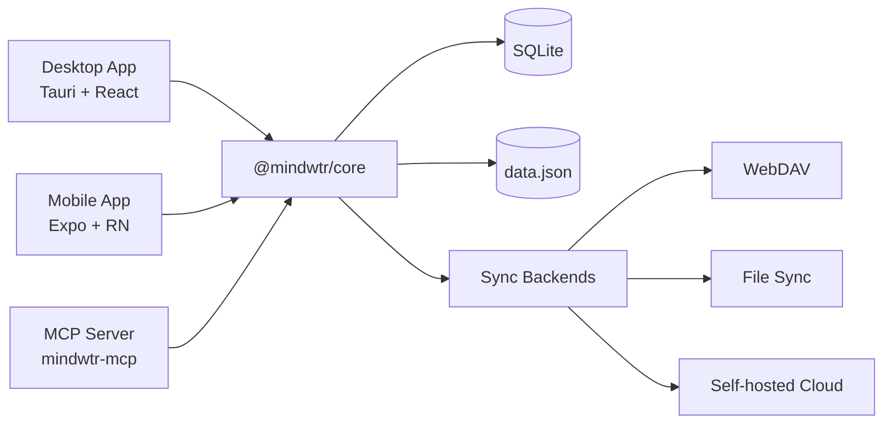

# 架構

如水的技術架構與設計決策。

---

## 概覽

如水是一款跨平台 GTD 應用程式，包含：

- **桌面應用程式** — Tauri v2（Rust + React）
- **行動應用程式** — React Native + Expo
- **MCP 伺服器** — 供 AI 工具使用的本機 Model Context Protocol 橋接器
- **雲端同步** — Node.js（Bun）同步伺服器
- **共用核心** — TypeScript 商業邏輯套件

```
┌─────────────────────────────────────────────────────────┐
│                       User Interface                      │
├─────────────────────────────┬───────────────────────────┤
│      Desktop (Tauri)        │      Mobile (Expo)        │
│   React + Vite + Tailwind   │  React Native + NativeWind│
├─────────────────────────────┴───────────────────────────┤
│                     @mindwtr/core                        │
│ Zustand Store · Types · i18n Loader/Locales · Sync Core │
├─────────────────────────────┬───────────────────────────┤
│    Tauri FS (Rust)          │   SQLite + JSON backup    │
│    SQLite + JSON backup     │     App storage           │
└──────────────┬──────────────┴───────────────────────────┘
               │
┌──────────────▼──────────────┐
│        Cloud / Sync         │
│   WebDAV / Local / Server   │
└─────────────────────────────┘
```

## 設計取捨

- **雲端同步以檔案為基礎**，並針對單機自行託管最佳化。
- **強制執行 SQLite 外部索引鍵**以確保有效記錄完整性；軟刪除／墓碑修復仍在共用應用程式邏輯中進行。
- **永久刪除雖少見但確實存在**。`sections.projectId` 使用 `ON DELETE CASCADE`，任務／專案／領域參照則大多使用 `ON DELETE SET NULL`。

### 系統圖（Mermaid）



---

## Monorepo 結構

本專案採用含 Bun 工作區的 monorepo：

```
Mindwtr/
├── apps/
│   ├── cloud/           # Sync server (Bun)
│   ├── desktop/         # Tauri app
│   ├── mcp-server/      # Local MCP server
│   └── mobile/          # Expo app
├── packages/
│   └── core/            # Shared business logic
└── package.json         # Workspace root
```

### 優點

- 跨平台共用程式碼
- 使用單一版本的相依套件
- 統一測試與 CI
- 更容易重構

---

## 核心套件（`@mindwtr/core`）

核心套件包含所有共用商業邏輯：

### 模組

| 模組 | 用途 |
| --- | --- |
| `store.ts` | 含所有動作的 Zustand 狀態儲存區 |
| `types.ts` | TypeScript 介面（Task、Project 等） |
| `i18n/i18n-loader.ts` | 延遲載入翻譯 |
| `i18n/i18n-translate.ts` | 建置時翻譯輔助函式 |
| `i18n/locales/*.ts` | 英文基礎語系與各語言覆寫 |
| `contexts.ts` | 預設情境與標籤 |
| `quick-add.ts` | 自然語言任務解析器 |
| `recurrence.ts` | 重複任務邏輯（部分 RFC 5545） |
| `sync.ts` + `sync-*.ts` | 同步合併核心及共用同步輔助函式；請參閱下方模組清單 |
| `date.ts` | 安全的日期解析工具 |
| `ai/` | AI 整合（Gemini/OpenAI/Anthropic） |
| `sqlite-adapter.ts` | 本機儲存配接器介面 |
| `webdav.ts` | WebDAV 同步用戶端 |

目前的同步子模組依職責拆分協定：`sync-run.ts` 是 `sync-run-ports.ts` 中連接埠背後的共用同步週期狀態機（階段排序、未變更略過檢查、附件階段、錯誤／重新排入處理）——桌面版與行動版提供傳輸、儲存及通知配接器（ADR 0014）；`sync-orchestrator.ts` 將週期序列化並將後續工作排入佇列，`sync-normalization.ts` 修復承載資料形狀，`sync-signatures.ts` 計算可比較的內容簽章，`sync-merge-settings.ts` 合併設定群組，`sync-tombstones.ts` 處理保留期限清理，`sync-revision.ts` 標記修訂版，而 `sync-client-helpers.ts`／`sync-service-utils.ts` 則提供平台服務輔助函式。

### 設計原則

1. **平台無關** — 不含平台特有程式碼
2. **儲存配接器模式** — 在執行階段注入儲存機制
3. **純函式** — 工具不保留狀態
4. **型別安全** — 完整的 TypeScript 涵蓋

### 狀態分層

- **核心儲存區**保存標準資料（`all tasks/projects`）。
- **介面儲存區**保存檢視專用的篩選條件與介面狀態。
- **可見清單**由核心資料與介面篩選條件衍生，避免將持久保存考量與呈現混在一起。

---

## 桌面版架構（Tauri）

### 為何使用 Tauri？

| 功能 | Tauri | Electron |
| --- | --- | --- |
| 二進位檔大小 | ~5 MB | ~150 MB |
| 記憶體用量 | ~50 MB | ~300 MB |
| 後端 | Rust | Node.js |
| Webview | 系統提供 | 內含 Chromium |

### 結構

```
apps/desktop/
├── src/                         # React frontend
│   ├── App.tsx                  # Root component and app shell wiring
│   ├── main.tsx                 # Vite/Tauri webview entry
│   ├── components/
│   │   ├── Task/                # Task form, field, and editor components
│   │   ├── ui/                  # Shared primitive UI components
│   │   └── views/               # Feature views
│   │       ├── agenda/
│   │       ├── calendar/
│   │       ├── inbox/
│   │       ├── list/
│   │       ├── projects/
│   │       ├── review/
│   │       └── settings/
│   ├── config/                  # Desktop app constants/config
│   ├── contexts/                # React contexts
│   ├── hooks/                   # Shared React hooks
│   ├── lib/                     # Desktop services and Tauri bridges
│   ├── store/                   # UI-specific state
│   ├── test/                    # Desktop test utilities
│   └── utils/                   # Small shared utilities
│
├── src-tauri/                  # Rust backend
│   ├── src/main.rs             # Entry point
│   ├── src/platform.rs         # Native commands and path validation
│   ├── capabilities/           # Tauri command/plugin permissions
│   ├── Cargo.toml              # Rust dependencies
│   └── tauri.conf.json         # Tauri config
│
└── package.json
```

### 資料流

```
User Action → React Component → Zustand Store (@mindwtr/core) → Storage Adapter → SQLite + data.json
```

### Tauri 命令

Rust 後端公開下列命令：

- 白名單允許的檔案開啟及附件／儲存操作
- 原生對話方塊
- 系統通知

---

## 行動版架構（Expo）

### 為何使用 Expo？

- 受管理工作流程可簡化開發
- 支援 OTA 更新
- 使用 Expo Router 進行以檔案為基礎的導覽
- 透過 EAS 輕鬆建置

### 結構

```
apps/mobile/
├── app/                   # Expo Router pages
│   ├── (drawer)/         # Drawer navigation
│   │   ├── (tabs)/       # Tab navigation
│   │   │   ├── calendar-tab.tsx
│   │   │   ├── capture-quick.tsx
│   │   │   ├── inbox.tsx
│   │   │   ├── focus.tsx
│   │   │   ├── capture.tsx
│   │   │   ├── contexts-tab.tsx
│   │   │   ├── projects.tsx
│   │   │   ├── review-tab.tsx
│   │   │   └── menu.tsx
│   │   ├── calendar.tsx
│   │   ├── contexts.tsx
│   │   ├── saved-search/[id].tsx
│   │   ├── board.tsx
│   │   ├── waiting.tsx
│   │   ├── someday.tsx
│   │   ├── done.tsx
│   │   ├── trash.tsx
│   │   ├── archived.tsx
│   │   ├── reference.tsx
│   │   ├── projects-screen.tsx
│   │   └── settings.tsx
│   └── _layout.tsx       # Root layout
│
├── components/           # Shared components
├── contexts/             # Theme, Language
├── lib/                  # Storage, sync utilities
└── package.json
```

### 導覽

```
Drawer/Stack Layout
├── Tab Navigator
│   ├── Inbox
│   ├── Agenda
│   ├── Next Actions
│   ├── Projects
│   └── Menu (links to other views)
├── Other Screens (Stack)
│   ├── Board
│   ├── Calendar
│   ├── Review
│   ├── Contexts
│   ├── Waiting For
│   ├── Someday/Maybe
│   ├── Archived
│   └── Settings
```

---

## 狀態管理

### Zustand 儲存區

中央儲存區（`@mindwtr/core/src/store.ts`）管理所有應用程式狀態：

```typescript
interface TaskStore {
    tasks: Task[];
    projects: Project[];
    areas: Area[];
    settings: AppData['settings'];

    // Actions
    fetchData: () => Promise<void>;
    addTask: (title: string, props?: Partial<Task>) => Promise<void>;
    updateTask: (id: string, updates: Partial<Task>) => Promise<void>;
    deleteTask: (id: string) => Promise<void>;
    // ... projects, areas, and settings actions
}
```

### 儲存配接器模式

儲存區使用注入的儲存配接器：

```typescript
// Desktop: Tauri file system
setStorageAdapter(tauriStorage);

// Mobile: SQLite (with JSON backup fallback)
setStorageAdapter(mobileStorage);
```

### 持久保存

- **寫入合併** — 變更會立即排入佇列，重疊的寫入則合併到下一次排清
- **結束時排清** — 應用程式進入背景時排清待處理的儲存
- **軟刪除** — 項目以 `deletedAt` 標記，以供同步

---

## 資料模型

標準型別介面位於[核心 API](/zh-Hant/developers/core-api) 與 `packages/core/src/types.ts`。

- 使用[核心 API](/zh-Hant/developers/core-api)查看 `Task`、`Project`、`Section`、`Area`、`Person`、`Attachment` 與 `AppData` 目前的欄位層級文件。
- `rev`、`revBy`、`purgedAt`、`orderNum`、`mimeType`、`size`、`cloudKey` 與 `localStatus` 等同步敏感欄位，比本架構概覽更常變動。
- 將詳細型別列表集中在單一頁面，可避免架構文件與程式碼脫節。

---

## 同步策略

### 可識別修訂版且使用墓碑的 LWW

資料同步採用可識別修訂版的後寫入者優先策略，並使用具決定性的同值判定規則。

### 合併邏輯

1. **解決方式**：
    - 若兩端都有修訂版，先由較高的 `rev` 勝出，再以時間戳記判定同值。
    - `rev` 是各實體的編輯計數器，不是向量時鐘，因此一端較多次的離線編輯可能勝過另一部裝置較新的一次編輯。
    - 若修訂版相同，比較 `updatedAt`。
    - 若時間戳記仍相同，比較具決定性的正規化內容簽章，確保每部裝置選出相同結果。
    - 沒有修訂版中繼資料的舊版實體，若 `updatedAt` 值在 5 分鐘時鐘偏移門檻內，視為具決定性的同值；超出該範圍則由較新的 `updatedAt` 勝出。
2. **墓碑**：
    - 已刪除項目保留記錄，並設定 `deletedAt`。
    - 防止同步時復活。
    - 讓裝置間能正確合併。
    - 刪除與有效記錄的衝突使用操作時間（墓碑使用 `max(updatedAt, deletedAt)`）。
    - 若刪除與有效記錄操作落在 30 秒模糊時間範圍內，如水會保留有效項目，而不會立即刪除。
3. **衝突**：
    - 中繼資料層級的衝突會自動解決。
    - 設定依同步群組（`appearance`、`language`、`gtd`、`externalCalendars`、`ai`、`savedFilters`）合併，不採用整個大型物件的單一時間戳記。
    - 已儲存篩選條件的有效／有效衝突嚴格使用各篩選條件的 `updatedAt`，只有時間戳記相同或無法使用時才採用具決定性的備援方式。
    - 合併偏移超出目前 5 分鐘門檻時，會發出大幅時鐘偏移警告。

### 同步週期

```
1. Read Local Data
2. Read Remote Data (Cloud/WebDAV/File)
3. Merge (Memory) -> Generate Stats (conflicts, updates)
4. Write Local with pending-remote-write marker
5. Write Remote
6. Clear pending-remote-write marker locally
```

若本機持久保存後遠端寫入失敗，如水會儲存重試中繼資料，並以從 5 秒到最多 5 分鐘的退避時間重試。

### 快照傳輸

如水目前刻意以完整快照進行同步傳輸。這不是缺少差異系統的暫時替代品。

- ADR 0003 與 ADR 0007 定義在這些快照上運作、可識別修訂版的合併規則。
- ADR 0008 記錄目前的傳輸決策：維持快照合併，暫不加入差異日誌。
- 對目前的個人 GTD 工作負載而言，快照同步可使實作更簡單、保留完整檔案不可分割性，並避免額外的重播與壓縮狀態。
- 若日後變更，差異設計應延伸既有 `rev` 與 `revBy` 模型，而不是以新的序列系統取代。

只有在快照檔案經常超過 5 MB、一般網路的同步往返時間超過 5 秒，或產品需要即時多裝置串流時，才應重新評估差異日誌決策。

測試涵蓋與發行關卡另於[測試策略](/zh-Hant/developers/testing-strategy)追蹤，讓本頁能聚焦於執行階段架構。

---

## 國際化

### 結構

翻譯分布於 `packages/core/src/i18n/` 資料夾：

```typescript
// packages/core/src/i18n/i18n-loader.ts
// packages/core/src/i18n/i18n-translations.ts
// packages/core/src/i18n/locales/*.ts
```

### 使用方式

每個應用程式都有一個提供 `t()` 函式的語言 context。
