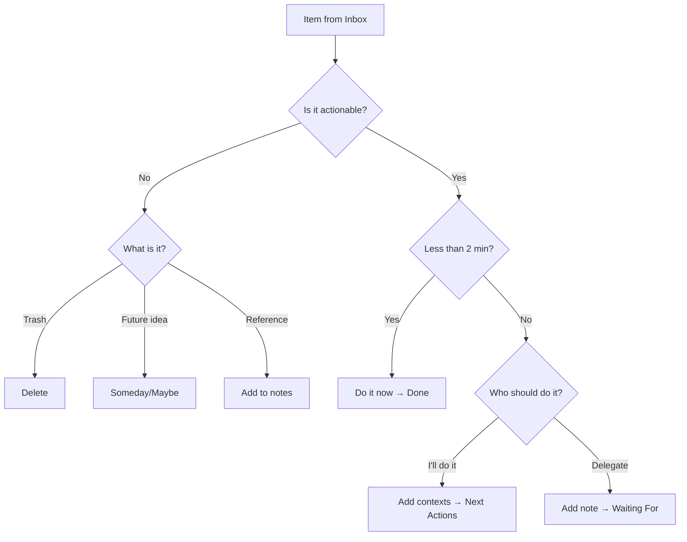

# Mindwtr 的 GTD 工作流程

本指南說明如何使用 Mindwtr 的功能實行 GTD 方法。

---

## 概覽

Mindwtr 直接對應 GTD 概念：

| GTD 概念     | Mindwtr 功能                                                       |
| ------------ | -------------------------------------------------------------- |
| 收集箱       | 收集箱檢視                                                     |
| 釐清         | 處理精靈                                                       |
| 下一步行動   | 「專注」顯示可用行動；「情境」／「專案」／「搜尋」顯示完整清單 |
| 專案         | 專案檢視                                                       |
| 等待中       | 等待中檢視（狀態：`waiting`）                                  |
| 將來/也許    | 將來/也許檢視（狀態：`someday`）                               |
| 行事曆       | 行事曆檢視（有截止日期的任務）                                 |
| 每週回顧     | 回顧精靈                                                       |

---

## 實用模式

以下模式能讓系統保持輕巧：

- 將下一步行動寫成可見的具體動作：「打電話給保險公司」比「處理保險」好。
- 將專案支援資料放在專案筆記中。不要讓目前還無法執行的未來行動塞滿「專注」。
- 將大型任務拆成小塊或限定時段，例如「花 30 分鐘整理照片」。
- 以情境表示工具、地點、精力與人物：`@phone`、`@errands`、`#focused`、`@Alex`。
- 將已委派工作放入「等待中」，並設定跟進日期或人物情境。
- 讓行事曆只保留硬性時程：約會、截止期限與特定時間的承諾。
- 在每週回顧中，將已可執行的未來專案筆記提升為真正的下一步行動。
- 想讓系統精簡，每個專案只選一項下一步行動；只有行動確實可平行進行時，才同時選擇多項。

---

## 1. 收集（收集箱）

### 快速收集

- **桌面版：**在底部輸入欄輸入，或在應用程式取得焦點時按 `a`。`o` 也能開啟新增任務。
- **行動版：**點選「收集箱」分頁的輸入欄
- **思緒清理：**需要收集工作、家庭、人物、跑腿及將來想法等未完成事項時，使用引導式提示

### 快速新增語法

收集時立即加入情境：
```
Call plumber @phone @home
Buy groceries @errands /due:saturday
Research topic #focused +WorkProject
Sort receipts /energy:low
```

### 原則

收集所有事情。不要篩選、評斷或整理，先讓它離開你的腦袋。

---

## 2. 釐清（處理精靈）

### 開始處理

- **桌面版：**按一下「處理收集箱」按鈕
- **行動版：**點選「處理收集箱」按鈕

### 工作流程



### 決策點

**可以採取行動嗎？**
- 不行 → 刪除、移至「將來/也許」，或加入為參考資料
- 可以 → 繼續

**需要多個步驟嗎？**
- 是 → 將收集項目轉為專案：命名並定義下一步行動，再視需要加入更多後續行動。這些行動會在已連結專案的狀態下回到收集箱，讓每一項都能各自經過釐清流程
- 否 → 繼續作為單一行動

**能在 2 分鐘內完成嗎？**
- 是 → 立刻去做，標示為「已完成」
- 否 → 繼續

**該由誰執行？**
- 我來做 → 選擇情境，移至「下一步行動」
- 委派 → 加入等待筆記，移至「等待中」

**指派專案？**（選用）
- 將相關任務連結至專案

---

## 3. 整理

### 任務狀態

| 狀態       | 意義               | 檢視       |
| ---------- | ------------------ | ---------- |
| `inbox`    | 尚未處理           | 收集箱     |
| `next`     | 已可接著執行       | 專注       |
| `waiting`  | 已委派／受阻       | 等待中     |
| `someday`  | 未來／也許         | 將來/也許  |
| `done`     | 最近完成           | 已完成     |
| `archived` | 已完成並歸檔       | 已歸檔     |

「已完成」與「已歸檔」都是關閉狀態，但用途不同：

- **已完成**是近期完成記錄，適合保留可能會在每日或每週回顧中查看的任務。
- **已歸檔**是已收存的歷史。已歸檔任務不會出現在一般任務清單中，但仍能在「已歸檔」檢視中搜尋、還原或永久刪除。「已歸檔」檢視也提供「任務 | 專案」切換，可檢視已歸檔專案並在其中還原或刪除。
- **自動歸檔**可在設定天數後，將已完成任務移至已歸檔。若想讓「已完成」永久保留所有完成項目，請設為**永不**。

### 情境與標籤

加入情境，依可執行任務的地點篩選：

**地點情境（@）：**
- `@home`、`@work`、`@errands`、`@anywhere`
- `@computer`、`@phone`、`@agendas`

**標籤（#）：**
- `#focused`：深度工作
- `#lowenergy`：簡單任務
- `#creative`：腦力激盪
- `#routine`：重複性任務

### 人員

以「人員」管理已委派或以人物為中心的工作。任務的受指派者會用於「等待中」清單、建議與 `assigned:` 搜尋；人員管理器則讓你保留可重複使用的姓名、筆記與參考連結，不必將每個人都變成情境標籤。刪除人員會保留其任務並清除受指派者，不會刪除工作。

從**指派給**欄位，或**設定 -> 管理 -> 人員**建立人員。從**領域**選擇器，或**設定 -> 管理 -> 領域**建立領域。確切路徑請參閱[領域與人員](/zh-Hant/use/areas-people)。

### 專案

為需要多個步驟的成果建立專案：

1. 前往「專案」檢視
2. 建立新專案並命名；也可直接在建立表單中選擇領域（預設為目前篩選中的領域）
3. 將任務加入專案
4. （選用）建立**分區**，依階段或子成果為任務分組
5. 切換循序／平行模式：
   - **循序：**只有第一項任務會顯示在「專注」檢視
   - **平行：**所有任務都會顯示在「專注」檢視

刪除專案或領域時，會保留其中的任務。Mindwtr 會將這些工作解除指派，而不會連帶刪除。

#### 專案分區

專案分區是單一專案內的細分區域。專案有自然階段、里程碑或工作流，而平面任務清單難以瀏覽時，可使用分區。

例如**推出網站**可設有**設計**、**開發**與**內容**等分區。它們不是獨立專案，也不是子任務，而是同一項專案成果內的整理標題。

任務的**專案分區**欄位會將任務指派至其專案的其中一個分區。任務必須先屬於設有分區的專案，此欄位才有作用。未指派的任務或沒有分區的專案，請將欄位留空。

循序專案可採用整個專案或分區範圍。若專案有互相獨立的階段或工作流，請使用分區範圍：Mindwtr 會顯示各分區中第一項可用任務，而不是讓整個專案都被一項任務擋住。

### 截止日期與提醒

- 以**截止日期**表示期限
- 以**開始日期**表示何時開始
- 以**回顧日期**（提醒）安排定期檢視

### 日期與狀態的差異

Mindwtr 將任務狀態與任務日期分開。狀態是你選擇的 GTD 階段，例如 `inbox`、`next`、`waiting` 或 `someday`。日期控制任務在何時及因何原因出現；日期到來本身永遠不會改變任務狀態。

編輯時有一項刻意設計的捷徑：為**收集箱**項目設定開始日期，代表你已經釐清它——你已決定何時可以行動——因此 Mindwtr 會在設定日期時將它移至 `next`，如同為收集箱項目加上星號。如果在同一次編輯中選擇狀態，則以你的選擇為準；`someday` 或 `waiting` 任務設定日期後，一律保持原有狀態：有日期的「將來」項目是提醒，有日期的「等待中」項目是跟進提醒。

- **開始日期**是延後／可用性的門檻。未來的開始日期預設會在「專注」中隱藏任務。日期到來時，任務會以原有狀態再次出現。
- **回顧日期**是提醒。日期到來時，Mindwtr 會在支援待回顧項目的檢視中顯示任務，供你重新考慮；在你作出決定前，不會改變任何內容。
- **截止日期**是期限。隨著日期接近或過期，Mindwtr 會透過顯示、提醒與排序壓力強調期限，但狀態維持不變。

部分處理動作會同時設定狀態與日期——處理收集箱時選擇**稍後**，會將項目移至 `next` 並設定開始日期；直接為收集箱項目設定開始日期也是如此。此後日期只控制可見性，永遠不會再次改變狀態。

### 相對開始提前時間

開始日期應與截止日期保持連動時，請使用**開始提前時間**。例如，星期五截止的任務可以提前兩天開始；下午 5:00 截止的任務可以提前三小時開始。提前時間為 **0** 代表任務在截止日當天開始，適合在到期前不應出現的重複例行工作。

任務設有截止日期與開始提前時間時，Mindwtr 會將偏移量視為單一真實來源。移動截止日期會以相同偏移量重新計算開始日期；產生下一個重複任務時也會保留相同的提前時間。

如果工作必須在特定行事曆日期開始，不應隨期限移動，請改用固定開始日期。

---

## 4. 回顧（每週回顧）

### 開始回顧

- **桌面版：**前往側邊欄中的「每週回顧」
- **行動版：**點選底部列的「回顧」分頁

### 步驟

1. **處理收集箱**
   - 清除所有收集箱項目
   - 目標：收集箱歸零
   - 使用回顧中的「處理收集箱」動作，在每週回顧中執行一般釐清工作流程

2. **回顧行事曆**
   - 回顧過去 2 週，尋找遺漏的跟進事項
   - 查看未來 2 週，確認準備需求

3. **等待中**
   - 檢視已委派項目
   - 視需要傳送提醒

4. **回顧專案**
   - 確認每個專案都有下一步行動
   - 將完成的專案標示為「已完成」

5. **將來/也許**
   - 回顧孵化中的想法
   - 啟用或刪除項目

### 最佳做法

每週在相同時間與地點安排 30 至 90 分鐘。

---

### 執行

### 選擇要處理的工作

使用**專注**檢視查看：
- 今日的專注任務（加上星號的項目）
- 下一步行動（依情境篩選或一般清單）
- 逾期項目
- 今日到期項目

「專注」不是完整清單檢視。它會隱藏未來才開始的任務，以及循序專案中較後面的任務，讓清單反映目前可執行的行動。若要檢查所有下一步行動，包括延後或受阻的項目，請使用**情境**、**專案**或**搜尋**。

### 「專注」如何排序可用行動

「專注」會先判斷任務是否可用，再排序可見行動：

1. **今日專注**顯示你明確選為今天要做的任務。你可以手動依計畫的執行順序排列：桌面版拖曳把手；行動版使用區段標題上的重新排序切換鈕。手動順序會在「專注」採用預設排序時生效、跨裝置同步，且任務離開「專注」前會保留位置。
2. **今日／排程**顯示逾期、今天到期或今天開始的可用 `next` 任務。順序依次為最早的截止／開始時間、啟用優先順序時的優先順序，再來是最早建立日期。
3. **下一步行動**顯示其餘可用的 `next` 任務。預設順序為：
   - 即將到期者優先，並以最早截止日期優先（目前指未來 30 天內到期）
   - 接著是沒有日期的行動
   - 最後是距離較遠的未來到期行動，並以最早截止日期優先
   - 同一組內依次比較：啟用時的優先順序、開始時間、最早建立日期、標題及 id
4. **待回顧**顯示回顧日期已到的任務。檢視後，可以清除回顧日期（**標示為已回顧**），或選擇**一週後回顧**延後；桌面版從任務的快速動作選單操作，行動版則長按該列。

開始日期是 Mindwtr 用來延後／規劃日期的欄位。「專注」與「下一步行動」清單一定會隱藏未來才開始的任務，直到開始日；想提前查看時，請使用**專案**或**搜尋**。循序專案也會限制「專注」只顯示該專案或分區中第一項可用行動，讓後續行動在前一步不再阻擋前，都不會進入「專注」。

預估時間與精力是「專注」的篩選與分組選項，不是預設排序鍵。依情境、專案、領域、精力或優先順序分組，只會改變視覺群組；群組內的任務仍採用相同的可用性與下一步行動順序。

### 情境篩選

1. 前往**專注**或**情境**檢視
2. 選擇情境方塊（例如 @home）
3. 只查看該情境的任務

### 今日專注

將任務標上星號，作為今日優先事項，數量不超過設定的專注上限：
- **桌面版：**按一下星號圖示
- **行動版：**點選星號徽章

---

## 每日工作流程

### 早上

1. 開啟**專注**檢視，查看今日優先事項
2. 設定當日專注任務，數量不超過設定的專注上限
3. 開始處理第一項（標示為「專注」）

### 一天之中

1. 將新項目收進收集箱
2. 更換地點時，查看依情境篩選的清單
3. 將完成的任務標示為「已完成」

### 一天結束時

1. 快速查看收集箱（有時間就處理）
2. 回顧明天的行事曆
3. 更新任何進行中的任務

---

## 重複任務

從任務編輯器的**重複**欄位設定重複任務。選擇每天、每週、每月或每年重複，再選擇保持固定排程，或於完成後重複。

Mindwtr 只會保留一個使用中的重複任務。未來發生時間不會預先建立為真正的任務；完成目前任務後，才會出現下一項。若需要規劃預覽，可開啟**在行事曆顯示下一次發生時間**。

**重複任務範例：**
- 每週：「檢視專案狀態」
- 每天：「Check email @computer」
- 每月：「檢視訂閱」

設定步驟與選項詳情，請參閱[重複任務](/zh-Hant/use/recurring-tasks)。

---

## 成功使用的技巧

### 信任你的系統

- 立即收集所有事情
- 定期處理
- 不要略過每週回顧

### 保持簡單

- 不要過度整理
- 一開始少量使用情境
- 只在需要時增加複雜度

### 建立習慣

- 每週在相同時間回顧
- 定期處理收集箱
- 採用一致的收集方式

---

## 另請參閱

- [GTD 概覽](/zh-Hant/use/gtd-overview)
- [情境與標籤](/zh-Hant/use/contexts-tags)
- [每週回顧](/zh-Hant/use/weekly-review)
